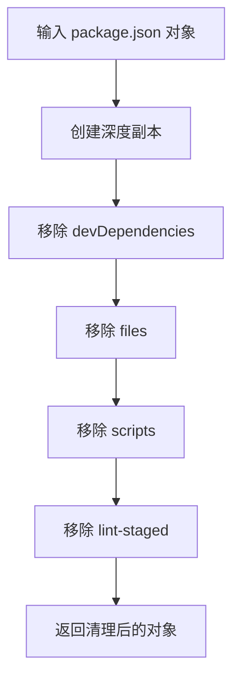

# package_clean : 清理 package.json 以供发布

## 功能介绍

从 package.json 对象中移除开发专用字段，为发布做准备。删除 devDependencies、files、scripts 和 lint-staged 属性，同时保留生产环境必需的元数据。

## 使用演示

安装为依赖项：

```bash
npm install @1-/package_clean
```

在代码中使用：

```javascript
import clean from "@1-/package_clean";

const originalPackage = {
  name: "my-package",
  version: "1.0.0",
  devDependencies: { jest: "^29.0.0" },
  scripts: { test: "jest" },
  main: "./index.js"
};

const cleanedPackage = clean(originalPackage);
// 结果仅包含生产环境相关字段
console.log(cleanedPackage);
```

## 设计思路

清理函数创建输入 package 对象的深度副本，并有选择地移除仅用于开发的属性。确保原始对象保持不变，同时生成最小化且适合发布的 package 配置。



## 技术栈

- JavaScript（ES 模块）
- Node.js 运行时
- 无外部依赖

## 代码结构

```
src/
├── _.js          # 主清理函数导出
knip.js           # Knip 配置文件
test/
└── _.test.js     # 清理功能测试套件
```

## 历史故事

package.json 清理工具随着 npm 生态系统的演进而出现。随着 JavaScript 打包技术的发展，开发者需要区分开发依赖和生产依赖。"精简" package 配置的概念早于现代打包器，在早期 Node.js 工具链中就已存在，旨在确保不同环境中发布行为的一致性。
