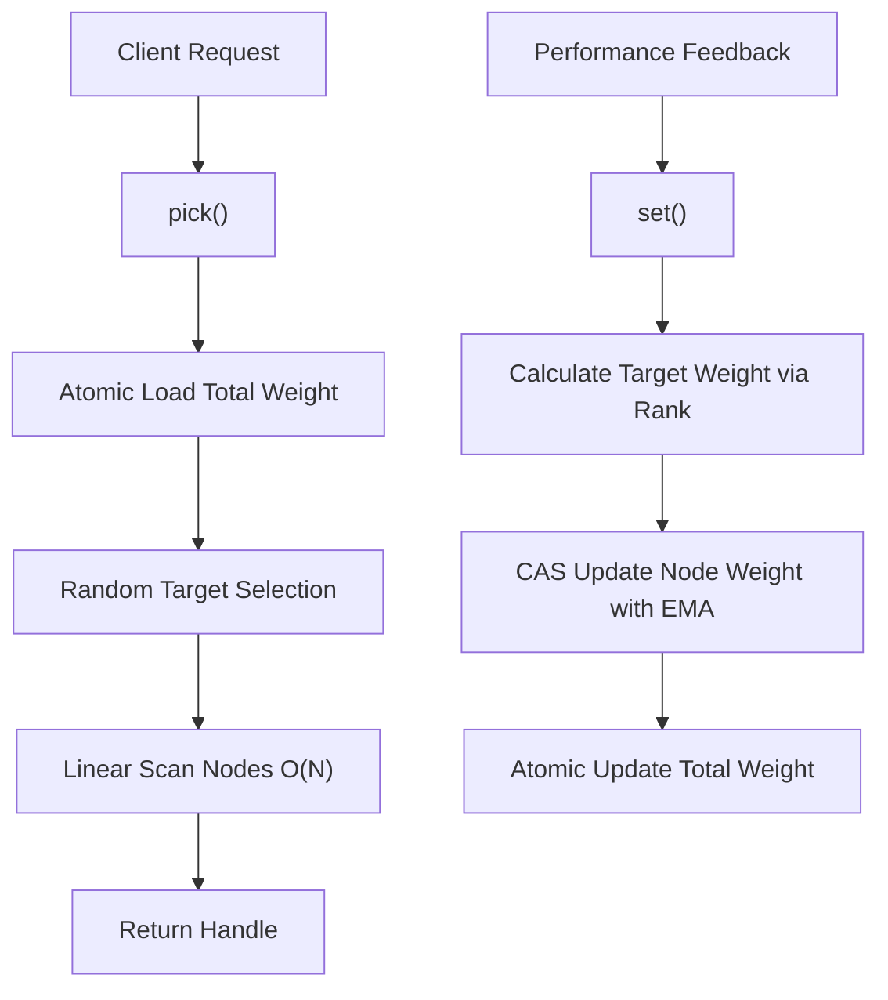
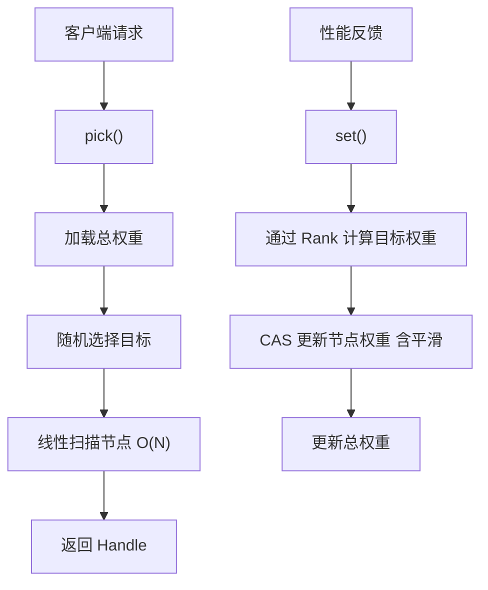

[English](#en) | [中文](#zh)

---

<a id="en"></a>

# PickFast : Lock-Free Weighted Load Balancer for Low-Latency Selection

- [PickFast : Lock-Free Weighted Load Balancer for Low-Latency Selection](#pickfast-lock-free-weighted-load-balancer-for-low-latency-selection)
  - [Navigation](#navigation)
  - [Features](#features)
  - [Usage Demonstration](#usage-demonstration)
  - [Real DNS Resolution Example](#real-dns-resolution-example)
  - [Custom Rank Strategy](#custom-rank-strategy)
  - [Design Rationale](#design-rationale)
    - [Call Flow](#call-flow)
    - [EMA Smoothing](#ema-smoothing)
  - [API Reference](#api-reference)
    - [Core Types](#core-types)
    - [Key Methods](#key-methods)
    - [Other Types](#other-types)
  - [Tech Stack](#tech-stack)
  - [Directory Structure](#directory-structure)
  - [Historical Anecdote](#historical-anecdote)
  - [About](#about)

High-performance weighted random selection library with atomic EMA weight updates. Designed for load balancing, A/B testing, resource scheduling, and scenarios requiring probability-based selection with dynamic weight adjustment.

## Navigation

- [Features](#features)
- [Usage Demonstration](#usage-demonstration)
- [Real DNS Resolution Example](#real-dns-resolution-example)
- [Custom Rank Strategy](#custom-rank-strategy)
- [Design Rationale](#design-rationale)
- [API Reference](#api-reference)
- [Tech Stack](#tech-stack)
- [Directory Structure](#directory-structure)
- [Historical Anecdote](#historical-anecdote)

## Features

- **Lock-Free Updates**: Uses `AtomicU32` and Compare-And-Swap (CAS) for thread-safe weight updates without locks
- **Adaptive Weighting**: Implements Exponential Moving Average (EMA) with 32-sample half-life to smooth latency fluctuations
- **Dynamic Base Value**: Auto-calculates `base` from node count, no node limit
- **Failure Handling**: Provides `failed()` method to quickly penalize underperforming nodes
- **Weight Floor Protection**: Ensures minimum weight of 1 to prevent nodes from being completely excluded
- **Cache Friendly**: Struct alignment prevents false sharing in multi-core environments
- **Flexible Strategies**: Supports custom ranking strategies via the `Rank` trait
- **Zero Allocation**: All operations are allocation-free after initialization

## Usage Demonstration


## Real DNS Resolution Example

Using `hickory-resolver` to perform actual DNS queries through specified DNS servers, combined with `race` crate for staggered resolution with automatic failover.

```rust
use std::{sync::Arc, time::Duration};
use futures::StreamExt;
use hickory_resolver::{
  Resolver,
  config::{NameServerConfig, ResolverConfig},
  proto::xfer::Protocol,
};
use pick_fast::PickFast;
use race::Race;

use std::net::{IpAddr, Ipv4Addr};

#[derive(Debug, Clone, Copy)]
struct DnsServer { ip: IpAddr }

const fn ip(a: u8, b: u8, c: u8, d: u8) -> DnsServer {
  DnsServer { ip: IpAddr::V4(Ipv4Addr::new(a, b, c, d)) }
}

const DNS_SERVER_LI: [DnsServer; 8] = [
  ip(8, 8, 8, 8),         // Google
  ip(1, 1, 1, 1),         // Cloudflare
  ip(223, 5, 5, 5),       // AliDNS
  ip(208, 67, 222, 222),  // OpenDNS
  ip(9, 9, 9, 9),         // Quad9
  ip(1, 0, 0, 1),         // Cloudflare
  ip(114, 114, 114, 114), // 114DNS
  ip(180, 76, 76, 76),    // Baidu
];

/// Task struct for tracking DNS resolution
struct Task {
  pub index: usize,
  pub start: u64,
}

// Create resolver with specific DNS server
fn create_resolver(server: &DnsServer) -> Resolver<hickory_resolver::name_server::TokioConnectionProvider> {
  let ns = NameServerConfig::new(
    std::net::SocketAddr::new(server.ip, 53),
    Protocol::Udp,
  );
  let mut config = ResolverConfig::new();
  config.add_name_server(ns);

  let provider = hickory_resolver::name_server::TokioConnectionProvider::default();
  Resolver::builder_with_config(config, provider).build()
}

#[tokio::main]
async fn main() {
  let lb = Arc::new(PickFast::<DnsServer>::new(DNS_SERVER_LI));
  const HOST: &str = "example.com";

  // Create Race with Task struct for latency tracking
  let mut race = Race::new(
    Duration::from_millis(500),
    |task: &Task| {
      let index = task.index;
      let start = task.start;
      let lb = lb.clone();
      let resolver = create_resolver(&lb.li[index].data);
      let server_ip = lb.li[index].data.ip;

      async move {
        match resolver.lookup_ip(HOST).await {
          Ok(response) => {
            if let Some(addr) = response.iter().next() {
              let latency = (ts_::milli() - start) as u32;
              // Successful: update latency weight
              lb.set(index, latency);
              println!("✅ {HOST} via {server_ip} -> {addr} ({latency}ms)");
              Ok(addr)
            } else {
              lb.failed(index);
              Err(std::io::Error::new(std::io::ErrorKind::NotFound, "No address"))
            }
          }
          Err(e) => {
            // Network error: reduce weight
            lb.failed(index);
            Err(std::io::Error::new(std::io::ErrorKind::Other, e.to_string()))
          }
        }
      }
    },
    lb.iter().map(|i| Task {
      index: i.0,
      start: ts_::milli(),
    }),
  );

  // Wait for first successful result
  while let Some((_task, result)) = race.next().await {
    match result {
      Ok(addr) => {
        println!("🎯 Resolved: {addr}");
        // Mark remaining tasks as failed to reduce their weight
        for (t, _) in race.ing {
          lb.failed(t.index);
        }
        break;
      }
      Err(_) => {
        // Already called lb.failed(index) in the async closure
      }
    }
  }
}
```

## Custom Rank Strategy

The `Rank` trait defines how observed values (e.g., latency) convert to selection weights.

```rust
use pick_fast::Rank;

/// Priority-based ranking: higher priority = higher weight
pub struct Priority;

impl Rank for Priority {
  fn calc(base: u32, priority: u32) -> u32 {
    priority // Direct mapping: priority value becomes weight
  }
}

// Usage
let lb = PickFast::<Task, Priority>::new(tasks);
lb.set(index, 100); // Set priority to 100
```

Built-in `Inverse` strategy suits latency-based selection:

```text
Weight = base / Latency
base = u32::MAX / NodeCount / 32
Initial Weight = base / NodeCount
```

Design choice: `base` is auto-calculated from node count. Division by 32 reserves headroom for EMA formula `old * 31` to prevent overflow, supporting any number of nodes.

## Design Rationale

Architecture focuses on minimizing synchronization overhead and maximizing throughput.

### Call Flow



### EMA Smoothing

```text
New Weight = (Old Weight * 31 + Target Weight) / 32
```

32-sample half-life smoothing makes weight changes more gradual, preventing drastic fluctuations from transient spikes.

## API Reference

### Core Types

| Type             | Description                                                                     |
| ---------------- | ------------------------------------------------------------------------------- |
| `PickFast<T, M>` | Main load balancer struct. `T`: node data, `M`: rank model (default: `Inverse`) |
| `PickFast.li`    | `Vec<Node<T>>` - Node list                                                      |
| `PickFast.total` | `AtomicU32` - Cached total weight                                               |
| `PickFast.base`  | `u32` - Base value, auto-calculated from node count                             |
| `Node<T>`        | Node struct containing data and weight                                          |
| `Node.data`      | `T` - Node data                                                                 |
| `Node.weight`    | `AtomicU32` - Node weight                                                       |

### Key Methods

| Method                                           | Description                                                                            |
| ------------------------------------------------ | -------------------------------------------------------------------------------------- |
| `new(data: impl IntoIterator<Item = T>) -> Self` | Create instance from iterator                                                          |
| `len(&self) -> usize`                            | Get node count                                                                         |
| `is_empty(&self) -> bool`                        | Check if empty                                                                         |
| `pick(&self) -> Handle<'_, T>`                   | Select node based on current weights. O(1) weight load + O(N) scan                     |
| `set(&self, index: usize, val: u32)`             | Update node observation with EMA smoothing (minimum weight: 1)                         |
| `failed(&self, index: usize)`                    | Mark node as failed, halving its weight (minimum weight: 1)                            |
| `iter(&self) -> CIter<'_, Node<T>>`              | Create circular iterator with weighted random start position (requires `iter` feature) |

### Other Types

| Type            | Description                                                            |
| --------------- | ---------------------------------------------------------------------- |
| `Handle<'a, T>` | Smart pointer to selected node, contains `index` and `node` reference  |
| `Rank`          | Trait for custom weight calculation logic, `calc(base, val) -> weight` |
| `Inverse`       | Default strategy: `weight = base / latency`                            |

## Tech Stack

| Category              | Technology          |
| --------------------- | ------------------- |
| Language              | Rust (Edition 2024) |
| Randomness            | `fastrand`          |
| Concurrency           | `std::sync::atomic` |
| Testing/Visualization | `plotters`, `svg`   |

## Directory Structure

```text
.
├── Cargo.toml          # Project configuration
├── src/
│   └── lib.rs          # Core implementation
├── tests/
│   ├── main.rs         # Integration tests and chart generation
│   ├── dns.rs          # Real DNS resolution test
│   └── dns_server.rs   # DNS server definitions
└── readme/
    ├── en.md           # English documentation
    ├── zh.md           # Chinese documentation
    ├── rank-en.svg     # English performance chart
    └── rank-zh.svg     # Chinese performance chart
```

## Historical Anecdote

Weighted load balancing has roots in network packet scheduling. The "Weighted Round Robin" (WRR) concept was formalized in 1991 for ATM (Asynchronous Transfer Mode) networks, where heterogeneous link speeds required differential treatment.

The evolution from WRR to modern weighted random selection represents a paradigm shift: instead of deterministic slot allocation, probabilistic approaches like `pick_fast` offer natural load distribution. Combined with EMA smoothing—a technique borrowed from stock market technical analysis dating back to the 1960s—the algorithm adapts gracefully to varying network conditions.

Interestingly, the Compare-And-Swap primitive used here traces back to IBM System/370 in 1970, making lock-free programming concepts over 50 years old—yet they remain the cornerstone of modern high-performance concurrent systems.

## About

This library is developed by [WebC.site](https://webc.site).

[WebC.site](https://webc.site): A new paradigm of web development for AI

---

<a id="zh"></a>

# PickFast : 无锁加权负载均衡，优选低延迟节点

- [PickFast : 无锁加权负载均衡，优选低延迟节点](#pickfast-无锁加权负载均衡优选低延迟节点)
  - [目录](#目录)
  - [项目特性](#项目特性)
  - [使用演示](#使用演示)
  - [真实 DNS 解析示例](#真实-dns-解析示例)
  - [自定义权重计算](#自定义权重计算)
  - [设计思路](#设计思路)
    - [调用流程](#调用流程)
    - [指数移动平均](#指数移动平均)
  - [API 介绍](#api-介绍)
    - [核心类型](#核心类型)
    - [关键方法](#关键方法)
    - [其他类型](#其他类型)
  - [技术堆栈](#技术堆栈)
  - [目录结构](#目录结构)
  - [历史小故事](#历史小故事)
  - [关于](#关于)

高性能加权随机选择库，支持权重平滑更新。专为负载均衡、A/B 测试、资源调度，以及需要基于概率选择与动态权重调整的场景设计。

## 目录

- [项目特性](#项目特性)
- [使用演示](#使用演示)
- [真实 DNS 解析示例](#真实-dns-解析示例)
- [自定义权重计算](#自定义权重计算)
- [设计思路](#设计思路)
- [API 介绍](#api-介绍)
- [技术堆栈](#技术堆栈)
- [目录结构](#目录结构)
- [历史小故事](#历史小故事)

## 项目特性

- **无锁更新**：基于 `AtomicU32` 和 CAS 实现线程安全的权重更新，无需互斥锁
- **自适应权重**：集成指数移动平均算法，32 次半衰期平滑延时波动
- **动态基准值**：根据节点数自动计算 `base`，无节点数量限制
- **故障处理**：提供 `failed()` 方法快速惩罚性能不佳的节点
- **权重下限保护**：确保最小权重为 1，防止节点被完全排除
- **缓存友好**：结构对齐避免多核环境下的伪共享
- **灵活策略**：通过 `Rank` 特性支持自定义权重计算逻辑
- **零分配**：初始化后所有操作无内存分配

## 使用演示


## 真实 DNS 解析示例

使用 `hickory-resolver` 通过指定 DNS 服务器进行真实 DNS 查询，结合 `race` crate 实现阶梯式解析与自动故障转移。

```rust
use std::{sync::Arc, time::Duration};
use futures::StreamExt;
use hickory_resolver::{
  Resolver,
  config::{NameServerConfig, ResolverConfig},
  proto::xfer::Protocol,
};
use pick_fast::PickFast;
use race::Race;

use std::net::{IpAddr, Ipv4Addr};

#[derive(Debug, Clone, Copy)]
struct DnsServer { ip: IpAddr }

const fn ip(a: u8, b: u8, c: u8, d: u8) -> DnsServer {
  DnsServer { ip: IpAddr::V4(Ipv4Addr::new(a, b, c, d)) }
}

const DNS_SERVER_LI: [DnsServer; 8] = [
  ip(8, 8, 8, 8),         // Google
  ip(1, 1, 1, 1),         // Cloudflare
  ip(223, 5, 5, 5),       // 阿里DNS
  ip(208, 67, 222, 222),  // OpenDNS
  ip(9, 9, 9, 9),         // Quad9
  ip(1, 0, 0, 1),         // Cloudflare
  ip(114, 114, 114, 114), // 114DNS
  ip(180, 76, 76, 76),    // 百度DNS
];

/// 用于跟踪 DNS 解析的任务结构体
struct Task {
  pub index: usize,
  pub start: u64,
}

// 使用指定 DNS 服务器创建解析器
fn create_resolver(server: &DnsServer) -> Resolver<hickory_resolver::name_server::TokioConnectionProvider> {
  let ns = NameServerConfig::new(
    std::net::SocketAddr::new(server.ip, 53),
    Protocol::Udp,
  );
  let mut config = ResolverConfig::new();
  config.add_name_server(ns);

  let provider = hickory_resolver::name_server::TokioConnectionProvider::default();
  Resolver::builder_with_config(config, provider).build()
}

#[tokio::main]
async fn main() {
  let lb = Arc::new(PickFast::<DnsServer>::new(DNS_SERVER_LI));
  const HOST: &str = "example.com";

  // 使用 Task 结构体创建 Race，用于延时跟踪
  let mut race = Race::new(
    Duration::from_millis(500),
    |task: &Task| {
      let index = task.index;
      let start = task.start;
      let lb = lb.clone();
      let resolver = create_resolver(&lb.li[index].data);
      let server_ip = lb.li[index].data.ip;

      async move {
        match resolver.lookup_ip(HOST).await {
          Ok(response) => {
            if let Some(addr) = response.iter().next() {
              let latency = (ts_::milli() - start) as u32;
              // 成功：更新延时权重
              lb.set(index, latency);
              println!("✅ {HOST} 通过 {server_ip} -> {addr} ({latency}ms)");
              Ok(addr)
            } else {
              lb.failed(index);
              Err(std::io::Error::new(std::io::ErrorKind::NotFound, "无地址"))
            }
          }
          Err(e) => {
            // 网络错误：降低权重
            lb.failed(index);
            Err(std::io::Error::new(std::io::ErrorKind::Other, e.to_string()))
          }
        }
      }
    },
    lb.iter().map(|i| Task {
      index: i.0,
      start: ts_::milli(),
    }),
  );

  // 等待第一个成功结果
  while let Some((_task, result)) = race.next().await {
    match result {
      Ok(addr) => {
        println!("🎯 解析成功: {addr}");
        // 将剩余任务标记为失败，降低其权重
        for (t, _) in race.ing {
          lb.failed(t.index);
        }
        break;
      }
      Err(_) => {
        // 已在异步闭包中调用 lb.failed(index)
      }
    }
  }
}
```

## 自定义权重计算

`Rank` 特性定义观测值（如延时）如何转换为选择权重。

```rust
use pick_fast::Rank;

/// 优先级排序：优先级越高，权重越大
pub struct Priority;

impl Rank for Priority {
  fn calc(base: u32, priority: u32) -> u32 {
    priority // 直接映射：优先级值即权重
  }
}

// 使用示例
let lb = PickFast::<Task, Priority>::new(tasks);
lb.set(index, 100); // 设置优先级为 100
```

内置 `Inverse` 策略适用于基于延时的选择：

```text
权重 = base / 延时
base = u32::MAX / 节点数 / 32
初始权重 = base / 节点数
```

设计考量：`base` 根据节点数自动计算，除以 32 是为平滑公式 `old * 31` 预留空间防止溢出，支持任意数量节点。

## 设计思路

架构核心：最小化同步开销，最大化吞吐量。

### 调用流程



### 指数移动平均

```text
新权重 = (旧权重 * 31 + 目标权重) / 32
```

32 次半衰期的平滑机制，使权重变化更平缓，防止瞬时尖峰导致权重剧烈波动。

## API 介绍

### 核心类型

| 类型             | 说明                                                           |
| ---------------- | -------------------------------------------------------------- |
| `PickFast<T, M>` | 负载均衡器主体。`T`: 节点数据，`M`: 权重模型（默认 `Inverse`） |
| `PickFast.li`    | `Vec<Node<T>>` - 节点列表                                      |
| `PickFast.total` | `AtomicU32` - 缓存的总权重                                     |
| `PickFast.base`  | `u32` - 基准值，根据节点数自动计算                             |
| `Node<T>`        | 节点结构，包含数据和权重                                       |
| `Node.data`      | `T` - 节点数据                                                 |
| `Node.weight`    | `AtomicU32` - 节点权重                                         |

### 关键方法

| 方法                                             | 说明                                                 |
| ------------------------------------------------ | ---------------------------------------------------- |
| `new(data: impl IntoIterator<Item = T>) -> Self` | 从迭代器创建实例                                     |
| `len(&self) -> usize`                            | 获取节点数量                                         |
| `is_empty(&self) -> bool`                        | 检查是否为空                                         |
| `pick(&self) -> Handle<'_, T>`                   | 基于当前权重选择节点。O(1) 权重加载 + O(N) 扫描      |
| `set(&self, index: usize, val: u32)`             | 更新节点观测值，平滑更新权重（最小权重：1）          |
| `failed(&self, index: usize)`                    | 标记节点失败，权重减半（最小权重：1）                |
| `iter(&self) -> CIter<'_, Node<T>>`              | 创建循环迭代器，加权随机起始位置（需要 `iter` 特性） |

### 其他类型

| 类型            | 说明                                                  |
| --------------- | ----------------------------------------------------- |
| `Handle<'a, T>` | 选中节点的智能指针，包含 `index` 和 `node` 引用       |
| `Rank`          | 自定义权重计算逻辑的特性，`calc(base, val) -> weight` |
| `Inverse`       | 默认策略：`weight = base / latency`                   |

## 技术堆栈

| 分类         | 技术                |
| ------------ | ------------------- |
| 编程语言     | Rust (Edition 2024) |
| 随机算法     | `fastrand`          |
| 并发控制     | `std::sync::atomic` |
| 测试与可视化 | `plotters`, `svg`   |

## 目录结构

```text
.
├── Cargo.toml          # 项目配置
├── src/
│   └── lib.rs          # 核心实现
├── tests/
│   ├── main.rs         # 集成测试与图表生成
│   ├── dns.rs          # 真实 DNS 解析测试
│   └── dns_server.rs   # DNS 服务器定义
└── readme/
    ├── en.md           # 英文文档
    ├── zh.md           # 中文文档
    ├── rank-en.svg     # 英文性能图表
    └── rank-zh.svg     # 中文性能图表
```

## 历史小故事

加权负载均衡起源于网络数据包调度。1991 年，"加权轮询" (Weighted Round Robin, WRR) 概念在 ATM (异步传输模式) 网络中被正式提出，用于处理异构链路速度的差异化调度需求。

从 WRR 到现代加权随机选择，代表着范式转变：从确定性槽位分配，转向概率方法实现自然的负载分布。结合指数平滑——该技术源自 1960 年代的股票市场技术分析——算法能优雅地适应网络条件变化。

有趣的是，这里使用的 CAS (Compare-And-Swap) 原语可追溯至 1970 年的 IBM System/370，使得无锁编程概念已有 50 余年历史——但它仍是现代高性能并发系统的基石。

## 关于

本库由 [WebC.site](https://webc.site) 开发。

[WebC.site](https://webc.site) : 面向人工智能的网站开发新范式
