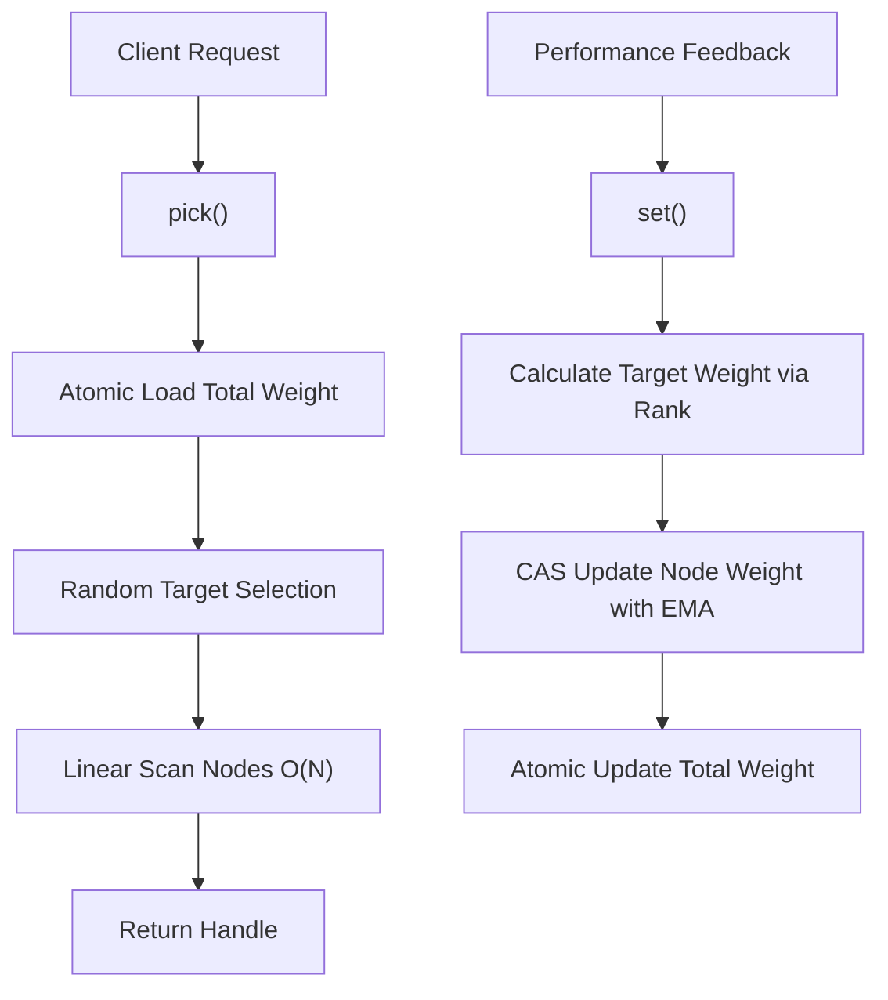

# PickFast : Lock-Free Weighted Load Balancer for Low-Latency Selection

High-performance weighted random selection library with atomic EMA weight updates. Designed for load balancing, A/B testing, resource scheduling, and scenarios requiring probability-based selection with dynamic weight adjustment.

## Navigation

- [Features](#features)
- [Usage Demonstration](#usage-demonstration)
- [Real DNS Resolution Example](#real-dns-resolution-example)
- [Custom Rank Strategy](#custom-rank-strategy)
- [Design Rationale](#design-rationale)
- [API Reference](#api-reference)
- [Tech Stack](#tech-stack)
- [Directory Structure](#directory-structure)
- [Historical Anecdote](#historical-anecdote)

## Features

- **Lock-Free Updates**: Uses `AtomicU32` and Compare-And-Swap (CAS) for thread-safe weight updates without locks
- **Adaptive Weighting**: Implements Exponential Moving Average (EMA) with 32-sample half-life to smooth latency fluctuations
- **Dynamic Base Value**: Auto-calculates `base` from node count, no node limit
- **Failure Handling**: Provides `failed()` method to quickly penalize underperforming nodes
- **Weight Floor Protection**: Ensures minimum weight of 1 to prevent nodes from being completely excluded
- **Cache Friendly**: Struct alignment prevents false sharing in multi-core environments
- **Flexible Strategies**: Supports custom ranking strategies via the `Rank` trait
- **Zero Allocation**: All operations are allocation-free after initialization

## Usage Demonstration


## Real DNS Resolution Example

Using `hickory-resolver` to perform actual DNS queries through specified DNS servers, combined with `race` crate for staggered resolution with automatic failover.

```rust
use std::{sync::Arc, time::Duration};
use futures::StreamExt;
use hickory_resolver::{
  Resolver,
  config::{NameServerConfig, ResolverConfig},
  proto::xfer::Protocol,
};
use pick_fast::PickFast;
use race::Race;

use std::net::{IpAddr, Ipv4Addr};

#[derive(Debug, Clone, Copy)]
struct DnsServer { ip: IpAddr }

const fn ip(a: u8, b: u8, c: u8, d: u8) -> DnsServer {
  DnsServer { ip: IpAddr::V4(Ipv4Addr::new(a, b, c, d)) }
}

const DNS_SERVER_LI: [DnsServer; 8] = [
  ip(8, 8, 8, 8),         // Google
  ip(1, 1, 1, 1),         // Cloudflare
  ip(223, 5, 5, 5),       // AliDNS
  ip(208, 67, 222, 222),  // OpenDNS
  ip(9, 9, 9, 9),         // Quad9
  ip(1, 0, 0, 1),         // Cloudflare
  ip(114, 114, 114, 114), // 114DNS
  ip(180, 76, 76, 76),    // Baidu
];

/// Task struct for tracking DNS resolution
struct Task {
  pub index: usize,
  pub start: u64,
}

// Create resolver with specific DNS server
fn create_resolver(server: &DnsServer) -> Resolver<hickory_resolver::name_server::TokioConnectionProvider> {
  let ns = NameServerConfig::new(
    std::net::SocketAddr::new(server.ip, 53),
    Protocol::Udp,
  );
  let mut config = ResolverConfig::new();
  config.add_name_server(ns);

  let provider = hickory_resolver::name_server::TokioConnectionProvider::default();
  Resolver::builder_with_config(config, provider).build()
}

#[tokio::main]
async fn main() {
  let lb = Arc::new(PickFast::<DnsServer>::new(DNS_SERVER_LI));
  const HOST: &str = "example.com";

  // Create Race with Task struct for latency tracking
  let mut race = Race::new(
    Duration::from_millis(500),
    |task: &Task| {
      let index = task.index;
      let start = task.start;
      let lb = lb.clone();
      let resolver = create_resolver(&lb.li[index].data);
      let server_ip = lb.li[index].data.ip;

      async move {
        match resolver.lookup_ip(HOST).await {
          Ok(response) => {
            if let Some(addr) = response.iter().next() {
              let latency = (ts_::milli() - start) as u32;
              // Successful: update latency weight
              lb.set(index, latency);
              println!("✅ {HOST} via {server_ip} -> {addr} ({latency}ms)");
              Ok(addr)
            } else {
              lb.failed(index);
              Err(std::io::Error::new(std::io::ErrorKind::NotFound, "No address"))
            }
          }
          Err(e) => {
            // Network error: reduce weight
            lb.failed(index);
            Err(std::io::Error::new(std::io::ErrorKind::Other, e.to_string()))
          }
        }
      }
    },
    lb.iter().map(|i| Task {
      index: i.0,
      start: ts_::milli(),
    }),
  );

  // Wait for first successful result
  while let Some((_task, result)) = race.next().await {
    match result {
      Ok(addr) => {
        println!("🎯 Resolved: {addr}");
        // Mark remaining tasks as failed to reduce their weight
        for (t, _) in race.ing {
          lb.failed(t.index);
        }
        break;
      }
      Err(_) => {
        // Already called lb.failed(index) in the async closure
      }
    }
  }
}
```

## Custom Rank Strategy

The `Rank` trait defines how observed values (e.g., latency) convert to selection weights.

```rust
use pick_fast::Rank;

/// Priority-based ranking: higher priority = higher weight
pub struct Priority;

impl Rank for Priority {
  fn calc(base: u32, priority: u32) -> u32 {
    priority // Direct mapping: priority value becomes weight
  }
}

// Usage
let lb = PickFast::<Task, Priority>::new(tasks);
lb.set(index, 100); // Set priority to 100
```

Built-in `Inverse` strategy suits latency-based selection:

```text
Weight = base / Latency
base = u32::MAX / NodeCount / 32
Initial Weight = base / NodeCount
```

Design choice: `base` is auto-calculated from node count. Division by 32 reserves headroom for EMA formula `old * 31` to prevent overflow, supporting any number of nodes.

## Design Rationale

Architecture focuses on minimizing synchronization overhead and maximizing throughput.

### Call Flow



### EMA Smoothing

```text
New Weight = (Old Weight * 31 + Target Weight) / 32
```

32-sample half-life smoothing makes weight changes more gradual, preventing drastic fluctuations from transient spikes.

## API Reference

### Core Types

| Type             | Description                                                                     |
| ---------------- | ------------------------------------------------------------------------------- |
| `PickFast<T, M>` | Main load balancer struct. `T`: node data, `M`: rank model (default: `Inverse`) |
| `PickFast.li`    | `Vec<Node<T>>` - Node list                                                      |
| `PickFast.total` | `AtomicU32` - Cached total weight                                               |
| `PickFast.base`  | `u32` - Base value, auto-calculated from node count                             |
| `Node<T>`        | Node struct containing data and weight                                          |
| `Node.data`      | `T` - Node data                                                                 |
| `Node.weight`    | `AtomicU32` - Node weight                                                       |

### Key Methods

| Method                                           | Description                                                                            |
| ------------------------------------------------ | -------------------------------------------------------------------------------------- |
| `new(data: impl IntoIterator<Item = T>) -> Self` | Create instance from iterator                                                          |
| `len(&self) -> usize`                            | Get node count                                                                         |
| `is_empty(&self) -> bool`                        | Check if empty                                                                         |
| `pick(&self) -> Handle<'_, T>`                   | Select node based on current weights. O(1) weight load + O(N) scan                     |
| `set(&self, index: usize, val: u32)`             | Update node observation with EMA smoothing (minimum weight: 1)                         |
| `failed(&self, index: usize)`                    | Mark node as failed, halving its weight (minimum weight: 1)                            |
| `iter(&self) -> CIter<'_, Node<T>>`              | Create circular iterator with weighted random start position (requires `iter` feature) |

### Other Types

| Type            | Description                                                            |
| --------------- | ---------------------------------------------------------------------- |
| `Handle<'a, T>` | Smart pointer to selected node, contains `index` and `node` reference  |
| `Rank`          | Trait for custom weight calculation logic, `calc(base, val) -> weight` |
| `Inverse`       | Default strategy: `weight = base / latency`                            |

## Tech Stack

| Category              | Technology          |
| --------------------- | ------------------- |
| Language              | Rust (Edition 2024) |
| Randomness            | `fastrand`          |
| Concurrency           | `std::sync::atomic` |
| Testing/Visualization | `plotters`, `svg`   |

## Directory Structure

```text
.
├── Cargo.toml          # Project configuration
├── src/
│   └── lib.rs          # Core implementation
├── tests/
│   ├── main.rs         # Integration tests and chart generation
│   ├── dns.rs          # Real DNS resolution test
│   └── dns_server.rs   # DNS server definitions
└── readme/
    ├── en.md           # English documentation
    ├── zh.md           # Chinese documentation
    ├── rank-en.svg     # English performance chart
    └── rank-zh.svg     # Chinese performance chart
```

## Historical Anecdote

Weighted load balancing has roots in network packet scheduling. The "Weighted Round Robin" (WRR) concept was formalized in 1991 for ATM (Asynchronous Transfer Mode) networks, where heterogeneous link speeds required differential treatment.

The evolution from WRR to modern weighted random selection represents a paradigm shift: instead of deterministic slot allocation, probabilistic approaches like `pick_fast` offer natural load distribution. Combined with EMA smoothing—a technique borrowed from stock market technical analysis dating back to the 1960s—the algorithm adapts gracefully to varying network conditions.

Interestingly, the Compare-And-Swap primitive used here traces back to IBM System/370 in 1970, making lock-free programming concepts over 50 years old—yet they remain the cornerstone of modern high-performance concurrent systems.
