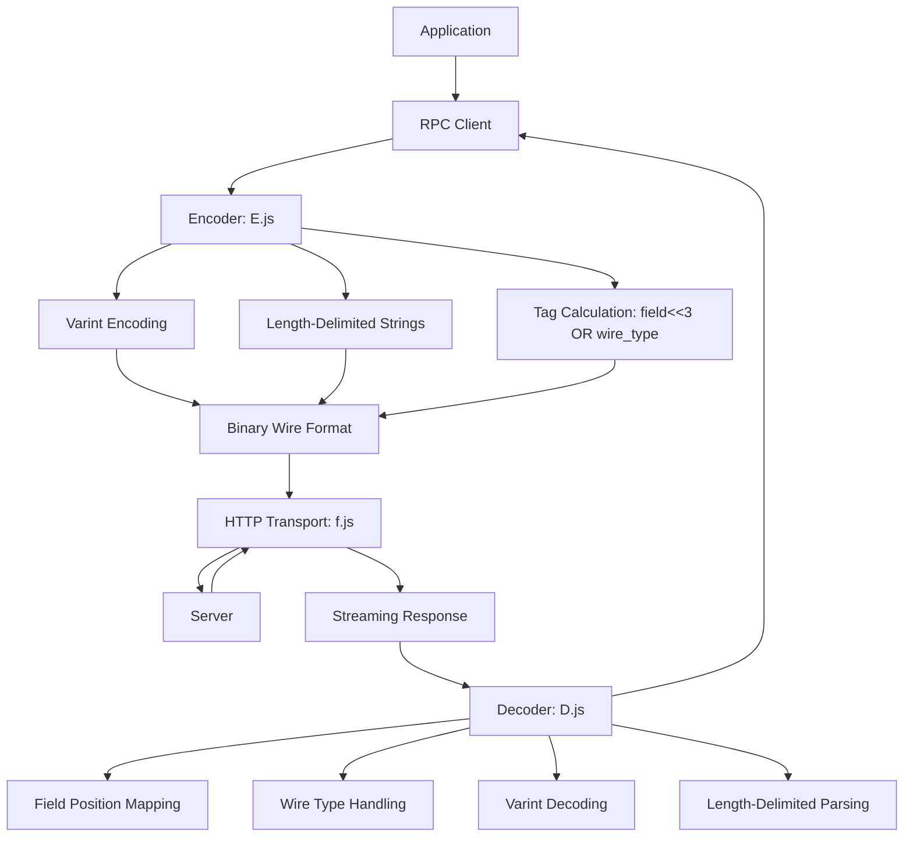

# ProtoRPC : Efficient Binary RPC for JavaScript

## Functionality

ProtoRPC provides a lightweight, zero-dependency RPC framework that implements Protocol Buffer wire format specifications for efficient binary communication. It enables high-performance remote procedure calls with automatic request batching, throttling, and streaming response handling. The library minimizes network payload size through compact binary encoding while maintaining full JavaScript compatibility.

## Usage Example

Configure and use the RPC client with Protocol Buffer-style encoding:

```javascript
import rpc from "./src/rpc.js";
import { uint32, string, $ } from "./src/E.js";
import { dUint32, string as dString, $ as d$ } from "./src/D.js";

// Set base URL for RPC endpoint
rpc.setBase("https://api.example.com/rpc");

// Define RPC method with Protocol Buffer-style encoding
// Field 1: user ID (varint), Field 2: username (length-delimited string)
const getUser = rpc(
  1, // function ID
  $([uint32, lengthDelimited(string)]), // encoder
  d$([dUint32, dString]) // decoder
);

// Call the RPC method
const result = await getUser([123, "Alice"]);
```

## Design Principles

The architecture implements Protocol Buffer wire format with precise specification compliance:



Key implementation details:

- Streaming response parsing using ReadableStream API with zero-copy operations
- Precise Protocol Buffer wire format compliance: varint encoding, tag calculation (field<<3|wire_type), length-delimited strings
- Automatic request batching with configurable throttle timeout (9ms default)
- Call ID management with 32-bit unsigned integer rollover (U32_MAX = 4294967295)
- Memory-efficient encoding with concat() utility for Uint8Array operations
- StructuredClone() for deep copying default values in decoders
- Zigzag encoding for signed integers (sint32/sint64)
- Special error code handling using U32_MAX as sentinel value

## Technology Stack

- Core runtime: Modern JavaScript (ES2020+) with BigInt support
- Binary encoding: Custom Protocol Buffer wire format implementation
- HTTP transport: Native fetch API with ReadableStream response handling
- Dependencies: utf8e/utf8d for UTF-8 encoding/decoding
- Build system: Standard JavaScript modules

## Code Structure

```
src/
├── rpc.js          # Main RPC client with batching, throttling, and streaming response handling
│   ├── PENDING queue for request batching
│   ├── CALLBACK Map for promise resolution
│   ├── run() throttle function (9ms timeout)
│   ├── Streaming response parsing with readN() helper
│   └── U32_MAX error code handling
├── E.js            # Encoding library with Protocol Buffer wire format implementation
│   ├── uint32/uint64/varint encoding with bit manipulation
│   ├── fixed-size number encoding (double, float, fixed32/64)
│   ├── string/bytes encoding with UTF-8 support
│   ├── packed repeated fields support
│   ├── zigzag encoding for signed integers
│   └── map encoding with proper tag handling
├── D.js            # Decoding library with field position mapping and wire type handling
│   ├── varint decoding with bit manipulation
│   ├── tag parsing for field identification
│   ├── wire type handling for different encoding formats
│   ├── structured unpacking with field position mapping
│   └── structuredClone() for default value initialization
├── f.js            # HTTP fetch wrapper with multiple response type handlers
│   ├── fT: text response handler
│   ├── fJ: JSON response handler
│   ├── fB: ArrayBuffer response handler
│   └── fS: streaming response handler (used by rpc.js)
└── throttle.js     # Simple throttle utility for request batching (9ms timeout)
```

## Historical Context

Protocol Buffers were developed by Google in 2001 to address the challenge of efficient data serialization across distributed systems. The original design focused on compact binary representation, language neutrality, and extensibility. ProtoRPC implements these core principles in JavaScript without external dependencies, bringing Protocol Buffer efficiency to web applications. Unlike traditional Protocol Buffer implementations that require code generation, ProtoRPC uses runtime encoding/decoding functions, making it ideal for dynamic JavaScript environments where compile-time code generation is impractical. The library's streaming response handling and memory-efficient Uint8Array operations represent modern JavaScript best practices for high-performance network communication.
