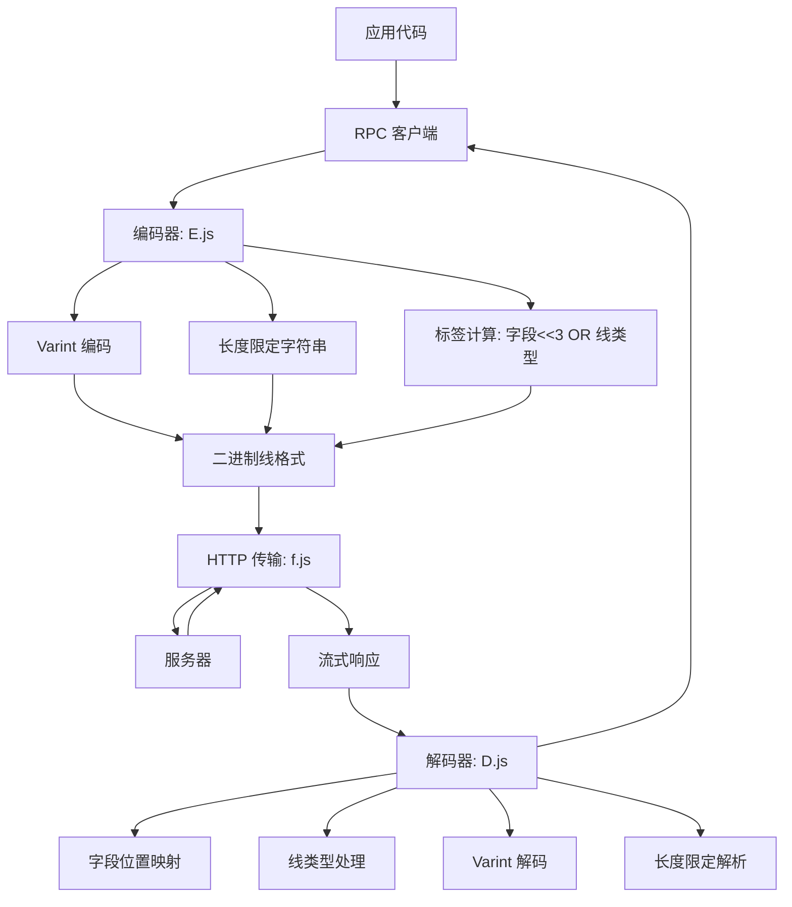

# ProtoRPC : 面向 JavaScript 的高效二进制 RPC

## 功能介绍

ProtoRPC 提供轻量级、零依赖的 RPC 框架，实现 Protocol Buffer 线格式规范，支持高效的二进制通信。该框架支持高性能远程过程调用，具备自动请求批处理、节流控制和流式响应处理能力。通过紧凑的二进制编码，最小化网络负载大小，同时保持完整的 JavaScript 兼容性。

## 使用演示

配置并使用遵循 Protocol Buffer 规范的 RPC 客户端：

```javascript
import rpc from "./src/rpc.js";
import { uint32, string, $ } from "./src/E.js";
import { dUint32, string as dString, $ as d$ } from "./src/D.js";

// 设置 RPC 端点基础 URL
rpc.setBase("https://api.example.com/rpc");

// 定义 RPC 方法（遵循 Protocol Buffer 编码规范）
// 字段 1：用户 ID（varint 编码），字段 2：用户名（长度限定字符串）
const getUser = rpc(
  1, // 函数 ID
  $([uint32, lengthDelimited(string)]), // 编码器
  d$([dUint32, dString]) // 解码器
);

// 调用 RPC 方法
const result = await getUser([123, "Alice"]);
```

## 设计思路

架构严格遵循 Protocol Buffer 线格式规范，实现精确的协议兼容：



关键实现细节：

- 流式响应解析，使用 ReadableStream API 实现零拷贝操作
- 严格遵循 Protocol Buffer 线格式规范：varint 编码、标签计算（字段<<3|线类型）、长度限定字符串
- 自动请求批处理，支持可配置的节流超时（默认 9 毫秒）
- 调用 ID 管理，支持 32 位无符号整数自动回绕（U32_MAX = 4294967295）
- 内存高效编码，使用 concat() 工具函数处理 Uint8Array 操作
- structuredClone() 用于解码器中默认值的深度复制
- Zigzag 编码用于有符号整数（sint32/sint64）
- 特殊错误码处理，使用 U32_MAX 作为哨兵值

## 技术栈

- 核心运行时：现代 JavaScript（ES2020+），支持 BigInt
- 二进制编码：自定义 Protocol Buffer 线格式实现
- HTTP 传输：原生 fetch API，支持 ReadableStream 响应处理
- 依赖项：utf8e/utf8d 用于 UTF-8 编码/解码
- 构建系统：标准 JavaScript 模块

## 代码结构

```
src/
├── rpc.js          # 主 RPC 客户端（含批处理、节流控制和流式响应处理）
│   ├── PENDING 队列用于请求批处理
│   ├── CALLBACK Map 用于 Promise 解析
│   ├── run() 节流函数（9 毫秒超时）
│   ├── 流式响应解析，使用 readN() 辅助函数
│   └── U32_MAX 错误码处理
├── E.js            # 编码库（Protocol Buffer 线格式实现）
│   ├── uint32/uint64/varint 编码（位操作）
│   ├── 定长数字编码（double、float、fixed32/64）
│   ├── 字符串/字节编码（UTF-8 支持）
│   ├── 打包重复字段支持
│   ├── 有符号整数的 zigzag 编码
│   └── 映射编码（带正确标签处理）
├── D.js            # 解码库（字段位置映射和线类型处理）
│   ├── varint 解码（位操作）
│   ├── 标签解析（字段识别）
│   ├── 线类型处理（不同编码格式）
│   ├── 结构化解包（字段位置映射）
│   └── structuredClone() 用于默认值初始化
├── f.js            # HTTP fetch 封装（多种响应类型处理器）
│   ├── fT：文本响应处理器
│   ├── fJ：JSON 响应处理器
│   ├── fB：ArrayBuffer 响应处理器
│   └── fS：流式响应处理器（rpc.js 使用）
└── throttle.js     # 简单节流工具（请求批处理，9 毫秒超时）
```

## 历史故事

Protocol Buffers 由 Google 于 2001 年开发，旨在解决分布式系统中结构化数据高效序列化的难题。原始设计聚焦于紧凑的二进制表示、语言无关性和可扩展性。ProtoRPC 在 JavaScript 中实现了这些核心原则，无需外部依赖，将 Protocol Buffer 效率优势带入 Web 应用。与需要代码生成的传统 Protocol Buffer 实现不同，ProtoRPC 使用运行时编码/解码函数，在动态 JavaScript 环境中无需编译时代码生成，更适合实际 Web 开发场景。该库的流式响应处理和内存高效的 Uint8Array 操作代表了现代 JavaScript 高性能网络通信的最佳实践。
