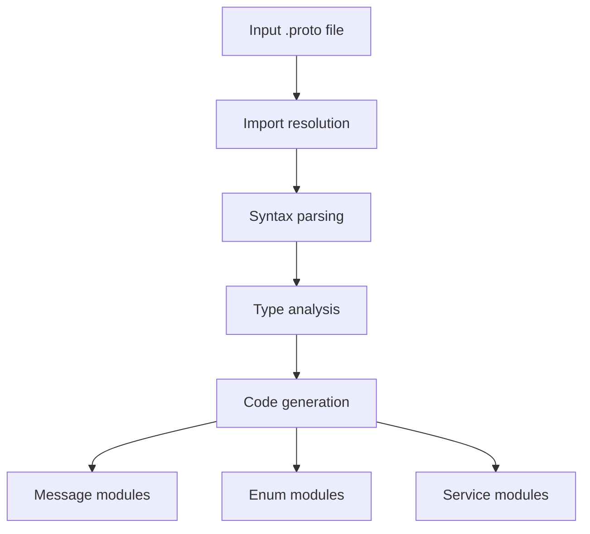
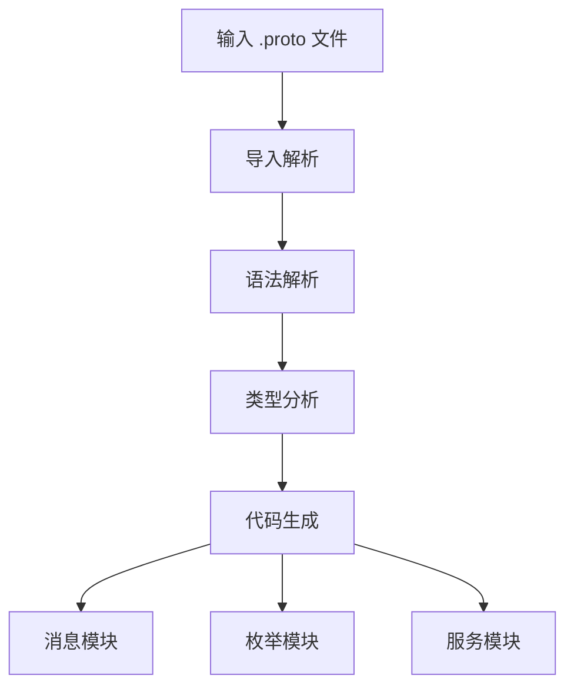

[English](#en) | [中文](#zh)

---

<a id="en"></a>
# proto2js : Generate JavaScript modules from Protocol Buffer definitions

- [proto2js : Generate JavaScript modules from Protocol Buffer definitions](#proto2js-generate-javascript-modules-from-protocol-buffer-definitions)
  - [Functionality](#functionality)
  - [Usage demonstration](#usage-demonstration)
  - [Design rationale](#design-rationale)
  - [Technology stack](#technology-stack)
  - [Code structure](#code-structure)
  - [Historical background](#historical-background)
  - [About](#about)

## Functionality
Converts Protocol Buffer (.proto) definition files into modular JavaScript code. Supports message types, enums, and service definitions with RPC client generation.

## Usage demonstration
Install as a CLI tool:
```bash
npm install -g proto2js
```

Generate JavaScript from a .proto file:
```bash
proto2js example.proto -o ./generated
```

Or use programmatically:
```javascript
import gen from 'proto2js/src/_.js';

// Generate JavaScript modules from proto file
const pkg = gen('./path/to/file.proto', './output/directory');
```

## Design rationale
The generator uses a dependency-aware parsing approach that resolves proto imports recursively before code generation. It separates concerns by generating distinct modules for different proto constructs:



## Technology stack
- Runtime: Node.js with Bun compatibility
- Core parser: proto-parser library
- File system: Node.js path and fs modules
- CLI framework: yargs
- Utility libraries: @3-/write, @3-/read, @3-/proto_remove_comment

## Code structure
```
src/
├── _.js          # Main entry point and orchestration
├── cli.js        # Command-line interface
├── gen.js        # Core code generation logic
├── findType.js   # Type resolution utility
├── merge.js      # Import merging and dependency resolution
└── importLi.js   # Import statement parsing
```

## Historical background
Protocol Buffers were developed by Google in 2001 as an efficient alternative to XML for serializing structured data. Initially designed for internal RPC systems, they evolved into an open standard supporting multiple languages. The proto2js tool continues this legacy by enabling seamless integration of Protocol Buffer schemas into modern JavaScript ecosystems.

## About

This library is developed by [WebC.site](https://webc.site).

[WebC.site](https://webc.site): A new paradigm of web development for AI


---

<a id="zh"></a>
# proto2js : 从 Protocol Buffer 定义生成 JavaScript 模块

- [proto2js : 从 Protocol Buffer 定义生成 JavaScript 模块](#proto2js-从-protocol-buffer-定义生成-javascript-模块)
  - [功能介绍](#功能介绍)
  - [使用演示](#使用演示)
  - [设计思路](#设计思路)
  - [技术栈](#技术栈)
  - [代码结构](#代码结构)
  - [历史故事](#历史故事)
  - [关于](#关于)

## 功能介绍
将 Protocol Buffer (.proto) 定义文件转换为模块化 JavaScript 代码。支持消息类型、枚举类型和服务定义，以及 RPC 客户端生成。

## 使用演示
安装为命令行工具：
```bash
npm install -g proto2js
```

从 .proto 文件生成 JavaScript：
```bash
proto2js example.proto -o ./generated
```

或以编程方式使用：
```javascript
import gen from 'proto2js/src/_.js';

// 从 proto 文件生成 JavaScript 模块
const pkg = gen('./path/to/file.proto', './output/directory');
```

## 设计思路
生成器采用依赖感知解析方法，在代码生成前递归解析 proto 导入。通过分离关注点，为不同 proto 构造生成独立模块：



## 技术栈
- 运行时：Node.js（兼容 Bun）
- 核心解析器：proto-parser 库
- 文件系统：Node.js path 和 fs 模块
- CLI 框架：yargs
- 工具库：@3-/write、@3-/read、@3-/proto_remove_comment

## 代码结构
```
src/
├── _.js          # 主入口点与协调逻辑
├── cli.js        # 命令行接口
├── gen.js        # 核心代码生成逻辑
├── findType.js   # 类型解析工具
├── merge.js      # 导入合并与依赖解析
└── importLi.js   # 导入语句解析
```

## 历史故事
Protocol Buffers 由 Google 于 2001 年开发，最初作为 XML 的高效替代方案用于序列化结构化数据。该技术最初设计用于内部 RPC 系统，后发展为支持多种语言的开放标准。proto2js 工具延续这一传统，使 Protocol Buffer 模式能够无缝集成到现代 JavaScript 生态系统中。

## 关于

本库由 [WebC.site](https://webc.site) 开发。

[WebC.site](https://webc.site) : 面向人工智能的网站开发新范式

