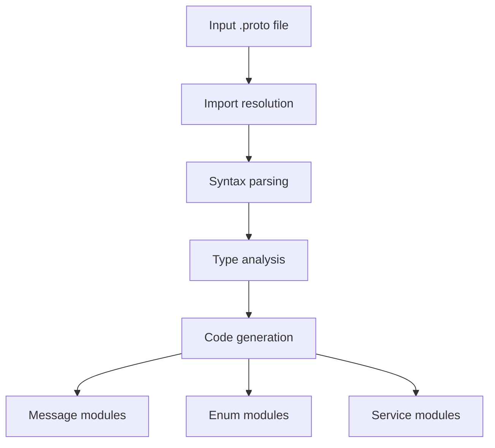

[English](#en) | [中文](#zh)

---

<a id="en"></a>

# @1-/proto2js : Convert Protocol Buffer definitions to JavaScript modules

- [@1-/proto2js : Convert Protocol Buffer definitions to JavaScript modules](#1-proto2js-convert-protocol-buffer-definitions-to-javascript-modules)
  - [Functionality](#functionality)
  - [Usage demonstration](#usage-demonstration)
  - [Design rationale](#design-rationale)
  - [Technology stack](#technology-stack)
  - [Code structure](#code-structure)
  - [Historical background](#historical-background)
  - [About](#about)

## Functionality

Convert Protocol Buffer (.proto) definition files into modular JavaScript code. Supports message types, enum types, and service definitions with RPC client generation. Implements dependency-aware parsing that recursively resolves proto imports before code generation.

## Usage demonstration

Install as a CLI tool:

```bash
npm install -g @1-/proto2js
```

Generate JavaScript from a .proto file:

```bash
proto2js example.proto -o ./generated
```

Or use programmatically:

```javascript
import gen from "@1-/proto2js/src/_.js";

// Generate JavaScript modules from proto file
const pkg = gen("./path/to/file.proto", "./output/directory");
```

## Design rationale

The generator uses a dependency-aware parsing approach that resolves proto imports recursively before code generation. It separates concerns by generating distinct modules for different proto constructs:



## Technology stack

- Runtime: Node.js (ESM modules)
- Core parser: proto-parser library
- File system: Node.js path and fs modules
- CLI framework: yargs
- Utility libraries: @3-/write, @3-/read, @3-/proto_remove_comment

## Code structure

```
src/
├── _.js          # Main entry point and orchestration logic
├── cli.js        # Command-line interface implementation
├── gen.js        # Core code generation logic for messages, enums, services
├── findType.js   # Type resolution utility for nested types
├── merge.js      # Import merging and dependency resolution
└── importLi.js   # Import statement parsing and package extraction
```

## Historical background

Protocol Buffers were developed by Google in 2001 as an efficient alternative to XML for serializing structured data. Initially designed for internal RPC systems, they evolved into an open standard supporting multiple languages. The @1-/proto2js tool continues this legacy by enabling seamless integration of Protocol Buffer schemas into modern JavaScript ecosystems.

## About

This library is developed by [WebC.site](https://webc.site).

[WebC.site](https://webc.site): A new paradigm of web development for AI

---

<a id="zh"></a>

# @1-/proto2js : Convert Protocol Buffer definitions to JavaScript modules

- [@1-/proto2js : Convert Protocol Buffer definitions to JavaScript modules](#1-proto2js-convert-protocol-buffer-definitions-to-javascript-modules)
  - [Functionality](#functionality)
  - [Usage demonstration](#usage-demonstration)
  - [Design rationale](#design-rationale)
  - [Technology stack](#technology-stack)
  - [Code structure](#code-structure)
  - [Historical background](#historical-background)
  - [关于](#关于)

## Functionality

Convert Protocol Buffer (.proto) definition files into modular JavaScript code. Supports message types, enum types, and service definitions with RPC client generation. Implements dependency-aware parsing that recursively resolves proto imports before code generation.

## Usage demonstration

Install as a CLI tool:

```bash
npm install -g @1-/proto2js
```

Generate JavaScript from a .proto file:

```bash
proto2js example.proto -o ./generated
```

Or use programmatically:

```javascript
import gen from "@1-/proto2js/src/_.js";

// Generate JavaScript modules from proto file
const pkg = gen("./path/to/file.proto", "./output/directory");
```

## Design rationale

The generator uses a dependency-aware parsing approach that resolves proto imports recursively before code generation. It separates concerns by generating distinct modules for different proto constructs:


## Technology stack

- Runtime: Node.js (ESM modules)
- Core parser: proto-parser library
- File system: Node.js path and fs modules
- CLI framework: yargs
- Utility libraries: @3-/write, @3-/read, @3-/proto_remove_comment

## Code structure

```
src/
├── _.js          # Main entry point and orchestration logic
├── cli.js        # Command-line interface implementation
├── gen.js        # Core code generation logic for messages, enums, services
├── findType.js   # Type resolution utility for nested types
├── merge.js      # Import merging and dependency resolution
└── importLi.js   # Import statement parsing and package extraction
```

## Historical background

Protocol Buffers were developed by Google in 2001 as an efficient alternative to XML for serializing structured data. Initially designed for internal RPC systems, they evolved into an open standard supporting multiple languages. The @1-/proto2js tool continues this legacy by enabling seamless integration of Protocol Buffer schemas into modern JavaScript ecosystems.

## 关于

本库由 [WebC.site](https://webc.site) 开发。

[WebC.site](https://webc.site) : 面向人工智能的网站开发新范式
