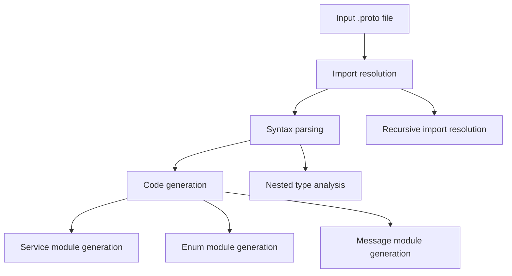
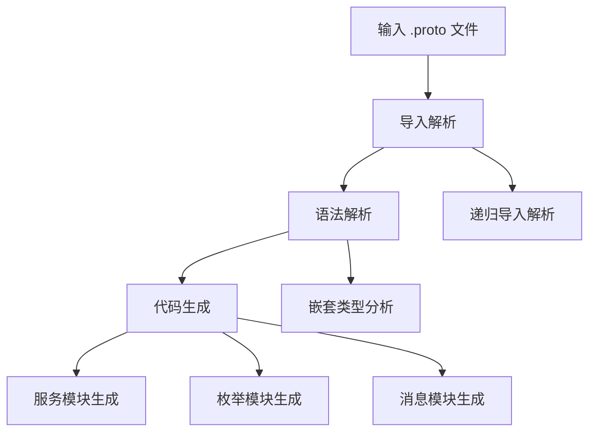

[English](#en) | [中文](#zh)

---

<a id="en"></a>
# @1-/proto2js : Convert Protocol Buffer definitions to JavaScript modules

- [@1-/proto2js : Convert Protocol Buffer definitions to JavaScript modules](#1-proto2js-convert-protocol-buffer-definitions-to-javascript-modules)
  - [Functionality](#functionality)
  - [Usage demonstration](#usage-demonstration)
  - [Design rationale](#design-rationale)
  - [Technology stack](#technology-stack)
  - [Code structure](#code-structure)
  - [Historical background](#historical-background)
  - [About](#about)

## Functionality

Convert Protocol Buffer (.proto) definition files into modular JavaScript code. Supports message, enum, and service definitions with RPC client generation. Implements dependency-aware parsing that recursively resolves proto imports before code generation. Generated JavaScript modules support ESM imports and work in modern JavaScript environments.

## Usage demonstration

Install as a CLI tool (Bun environment):

```bash
bun add -g @1-/proto2js
```

Generate JavaScript from a .proto file:

```bash
proto2js example.proto -o ./generated
```

Or use programmatically:

```javascript
import gen from "@1-/proto2js/src/_.js";

// Generate JavaScript modules from proto file
const pkg = gen("./path/to/file.proto", "./output/directory");
```

Supports directory batch processing and multi-level import paths:

```bash
proto2js ./protos/ -o ./generated -I ./protos/external -I ./protos/shared
```

## Design rationale

The generator uses a three-stage pipeline architecture:



Key implementation features:

- Dependency-aware: `merge.js` implements recursive import resolution, building complete dependency graphs
- Type resolution: `findType.js` provides nested type lookup capability for deep nested references
- Path intelligence: `gen.js` uses Node.js `relative()` to compute module paths, ensuring correct ESM import statements
- RPC clients: Service methods generate `$` function calls with automatic request/response type import handling
- Error localization: Parse errors include precise line numbers and context information
- Multi-level includes: Support multiple `-I` parameters for import search paths

## Technology stack

- Runtime: Bun (default) or Node.js (ESM modules)
- Core parser: proto-parser library (v0.0.9)
- File system: Node.js path and fs modules
- CLI framework: yargs (v18.1.0)
- Utility libraries: @3-/write, @3-/read, @3-/proto_remove_comment, @3-/walk
- Development dependencies: @1-/proto (RPC runtime)

## Code structure

```
src/
├── _.js          # Main entry point and orchestration logic, handles file/directory input, path resolution, error handling
├── cli.js        # Command-line interface implementation, yargs-based parameter parsing and command dispatch (Bun script)
├── gen.js        # Core code generation logic, handles messages, enums, services JavaScript generation
├── findType.js   # Nested type resolution utility, implements deep proto type lookup
├── merge.js      # Import merging and dependency resolution, recursively resolves all proto imports
└── importLi.js   # Import statement parsing and package extraction, handles package declarations and import statements
```

## Historical background

Protocol Buffers were developed by Google in 2001 as an efficient alternative to XML for serializing structured data. Initially designed for internal RPC systems, they evolved into an open standard supporting multiple languages. The @1-/proto2js tool continues this legacy by enabling seamless integration of Protocol Buffer schemas into modern JavaScript ecosystems, with specific optimizations for ESM module systems. The project uses the Mulan Permissive Software License v2 (MulanPSL-2.0) and is maintained by the WebC.site team.


## About

This library is developed by [WebC.site](https://webc.site).

[WebC.site](https://webc.site): A new paradigm of web development for AI


---

<a id="zh"></a>
# @1-/proto2js : Convert Protocol Buffer definitions to JavaScript modules

- [@1-/proto2js : Convert Protocol Buffer definitions to JavaScript modules](#1-proto2js-convert-protocol-buffer-definitions-to-javascript-modules)
  - [功能介绍](#功能介绍)
  - [使用演示](#使用演示)
  - [设计思路](#设计思路)
  - [技术栈](#技术栈)
  - [代码结构](#代码结构)
  - [历史故事](#历史故事)
  - [关于](#关于)

## 功能介绍

将 Protocol Buffer (.proto) 定义文件转换为模块化 JavaScript 代码。支持消息、枚举和服务定义，生成符合 ESM 规范的可直接导入模块。采用依赖感知解析策略，递归解析 proto 导入依赖后执行代码生成。生成的模块包含类型定义与 RPC 客户端函数，可在 Bun 或现代 Node.js 环境中直接使用。

## 使用演示

安装为命令行工具（Bun 环境）：

```bash
bun add -g @1-/proto2js
```

生成 JavaScript 从 .proto 文件：

```bash
proto2js example.proto -o ./generated
```

或以编程方式使用：

```javascript
import gen from "@1-/proto2js/src/_.js";

// 从 proto 文件生成 JavaScript 模块
const pkg = gen("./path/to/file.proto", "./output/directory");
```

支持目录批量处理与多级导入路径：

```bash
proto2js ./protos/ -o ./generated -I ./protos/external -I ./protos/shared
```

## 设计思路

生成器采用三阶段流水线架构：



关键实现特性：

- 依赖感知：`merge.js` 实现递归导入解析，构建完整的依赖图
- 类型解析：`findType.js` 提供嵌套类型查找能力，支持深度嵌套引用
- 路径智能：`gen.js` 使用 `relative()` 计算模块路径，确保正确的 ESM import 语句
- RPC 客户端：服务方法生成 `$` 函数调用，自动处理请求/响应类型导入
- 错误定位：解析错误包含精确的行号和上下文信息
- 多级 includes：支持多个 `-I` 参数指定导入搜索路径

## 技术栈

- 运行时：Bun（默认）或 Node.js（ESM 模块）
- 核心解析器：proto-parser 库（v0.0.9）
- 文件系统：Node.js path 和 fs 模块
- CLI 框架：yargs（v18.1.0）
- 工具库：@3-/write、@3-/read、@3-/proto_remove_comment、@3-/walk
- 开发依赖：@1-/proto（RPC 运行时）

## 代码结构

```
src/
├── _.js          # 主入口点与编排逻辑，处理文件/目录输入、路径解析、错误处理
├── cli.js        # 命令行接口实现，基于 yargs 的参数解析和命令分发（Bun 脚本）
├── gen.js        # 核心代码生成逻辑，处理消息、枚举、服务的 JavaScript 生成
├── findType.js   # 嵌套类型解析工具，实现 proto 类型的深度查找
├── merge.js      # 导入合并与依赖解析，递归解析所有 proto imports
└── importLi.js   # 导入语句解析与包提取，处理 package 声明和 import 语句
```

## 历史故事

Protocol Buffers 由 Google 于 2001 年开发，作为 XML 的高效替代方案用于结构化数据序列化。最初设计用于内部 RPC 系统，后演变为支持多种语言的开放标准。@1-/proto2js 工具延续这一传统，实现 Protocol Buffer 模式与现代 JavaScript 生态系统的无缝集成，特别针对 ESM 模块系统进行了优化设计。项目采用木兰宽松许可证（MulanPSL-2.0），由 WebC.site 团队维护。


## 关于

本库由 [WebC.site](https://webc.site) 开发。

[WebC.site](https://webc.site) : 面向人工智能的网站开发新范式

