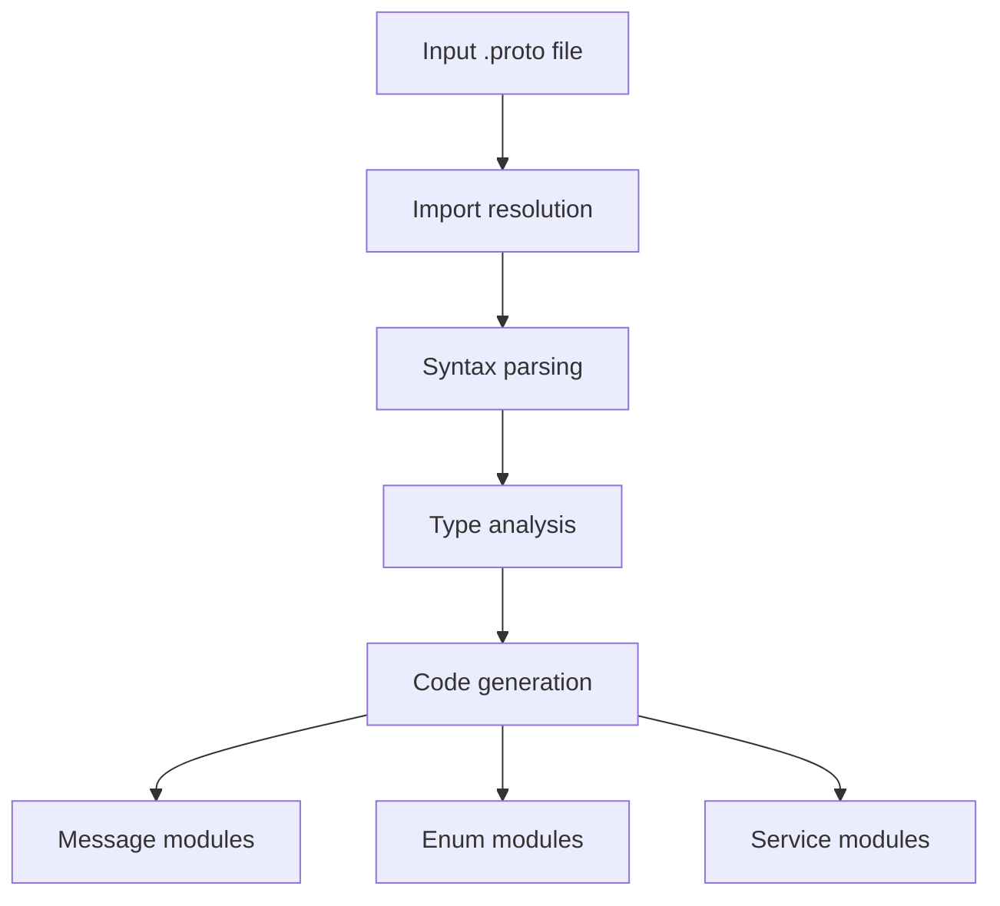

# proto2js : Generate JavaScript modules from Protocol Buffer definitions

## Functionality
Converts Protocol Buffer (.proto) definition files into modular JavaScript code. Supports message types, enums, and service definitions with RPC client generation.

## Usage demonstration
Install as a CLI tool:
```bash
npm install -g proto2js
```

Generate JavaScript from a .proto file:
```bash
proto2js example.proto -o ./generated
```

Or use programmatically:
```javascript
import gen from 'proto2js/src/_.js';

// Generate JavaScript modules from proto file
const pkg = gen('./path/to/file.proto', './output/directory');
```

## Design rationale
The generator uses a dependency-aware parsing approach that resolves proto imports recursively before code generation. It separates concerns by generating distinct modules for different proto constructs:



## Technology stack
- Runtime: Node.js with Bun compatibility
- Core parser: proto-parser library
- File system: Node.js path and fs modules
- CLI framework: yargs
- Utility libraries: @3-/write, @3-/read, @3-/proto_remove_comment

## Code structure
```
src/
├── _.js          # Main entry point and orchestration
├── cli.js        # Command-line interface
├── gen.js        # Core code generation logic
├── findType.js   # Type resolution utility
├── merge.js      # Import merging and dependency resolution
└── importLi.js   # Import statement parsing
```

## Historical background
Protocol Buffers were developed by Google in 2001 as an efficient alternative to XML for serializing structured data. Initially designed for internal RPC systems, they evolved into an open standard supporting multiple languages. The proto2js tool continues this legacy by enabling seamless integration of Protocol Buffer schemas into modern JavaScript ecosystems.