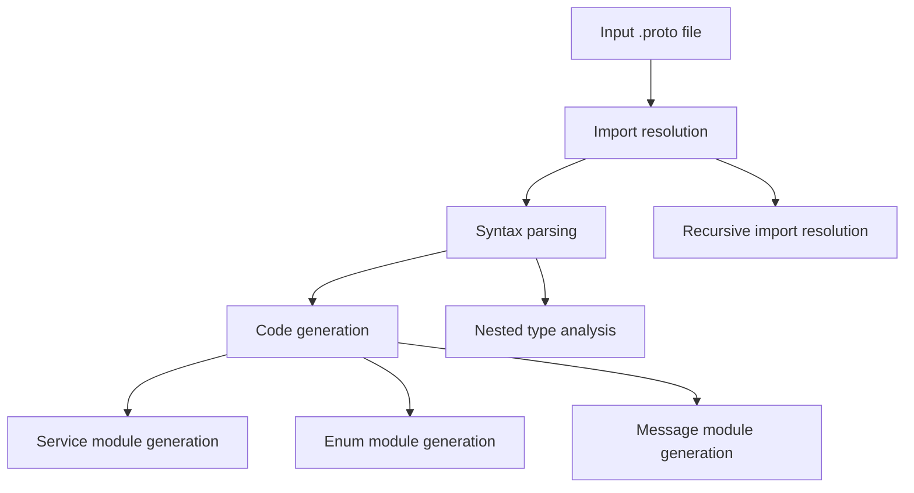

# @1-/proto2js : Convert Protocol Buffer definitions to JavaScript modules

## Functionality
Convert Protocol Buffer (.proto) definition files into modular JavaScript code. Supports message types, enum types, and service definitions with RPC client generation. Implements dependency-aware parsing that recursively resolves proto imports before code generation. Generated JavaScript modules support ESM imports and work in modern JavaScript environments.

## Usage demonstration
Install as a CLI tool:

```bash
npm install -g @1-/proto2js
```

Generate JavaScript from a .proto file:

```bash
proto2js example.proto -o ./generated
```

Or use programmatically:

```javascript
import gen from "@1-/proto2js/src/_.js";

// Generate JavaScript modules from proto file
const pkg = gen("./path/to/file.proto", "./output/directory");
```

Supports directory batch processing:

```bash
proto2js ./protos/ -o ./generated
```

## Design rationale
The generator uses a three-stage pipeline architecture:



Key implementation features:
- Dependency-aware: `merge.js` implements recursive import resolution, building complete dependency graphs
- Type resolution: `findType.js` provides nested type lookup capability for deep nested references
- Path intelligence: `gen.js` uses Node.js `relative()` to compute module paths, ensuring correct ESM import statements
- RPC clients: Service methods generate `$` function calls with automatic request/response type import handling
- Error localization: Parse errors include precise line numbers and context information

## Technology stack
- Runtime: Node.js (ESM modules)
- Core parser: proto-parser library
- File system: Node.js path and fs modules
- CLI framework: yargs
- Utility libraries: @3-/write, @3-/read, @3-/proto_remove_comment, @3-/walk
- Development dependencies: @1-/proto (RPC runtime), protobufjs (development-time validation)

## Code structure
```
src/
├── _.js          # Main entry point and orchestration logic, handles file/directory input, path resolution, error handling
├── cli.js        # Command-line interface implementation, yargs-based parameter parsing and command dispatch
├── gen.js        # Core code generation logic, handles messages, enums, services JavaScript generation
├── findType.js   # Nested type resolution utility, implements deep proto type lookup
├── merge.js      # Import merging and dependency resolution, recursively resolves all proto imports
└── importLi.js   # Import statement parsing and package extraction, handles package declarations and import statements
```

## Historical background
Protocol Buffers were developed by Google in 2001 as an efficient alternative to XML for serializing structured data. Initially designed for internal RPC systems, they evolved into an open standard supporting multiple languages. The @1-/proto2js tool continues this legacy by enabling seamless integration of Protocol Buffer schemas into modern JavaScript ecosystems, with specific optimizations for ESM module systems.