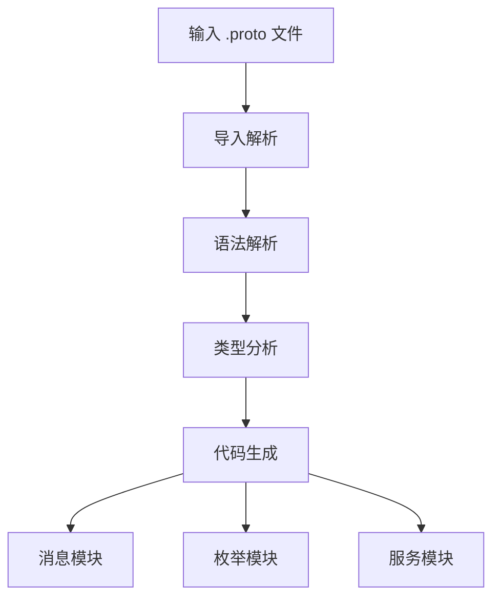

# proto2js : 从 Protocol Buffer 定义生成 JavaScript 模块

## 功能介绍
将 Protocol Buffer (.proto) 定义文件转换为模块化 JavaScript 代码。支持消息类型、枚举类型和服务定义，以及 RPC 客户端生成。

## 使用演示
安装为命令行工具：
```bash
npm install -g proto2js
```

从 .proto 文件生成 JavaScript：
```bash
proto2js example.proto -o ./generated
```

或以编程方式使用：
```javascript
import gen from 'proto2js/src/_.js';

// 从 proto 文件生成 JavaScript 模块
const pkg = gen('./path/to/file.proto', './output/directory');
```

## 设计思路
生成器采用依赖感知解析方法，在代码生成前递归解析 proto 导入。通过分离关注点，为不同 proto 构造生成独立模块：



## 技术栈
- 运行时：Node.js（兼容 Bun）
- 核心解析器：proto-parser 库
- 文件系统：Node.js path 和 fs 模块
- CLI 框架：yargs
- 工具库：@3-/write、@3-/read、@3-/proto_remove_comment

## 代码结构
```
src/
├── _.js          # 主入口点与协调逻辑
├── cli.js        # 命令行接口
├── gen.js        # 核心代码生成逻辑
├── findType.js   # 类型解析工具
├── merge.js      # 导入合并与依赖解析
└── importLi.js   # 导入语句解析
```

## 历史故事
Protocol Buffers 由 Google 于 2001 年开发，最初作为 XML 的高效替代方案用于序列化结构化数据。该技术最初设计用于内部 RPC 系统，后发展为支持多种语言的开放标准。proto2js 工具延续这一传统，使 Protocol Buffer 模式能够无缝集成到现代 JavaScript 生态系统中。