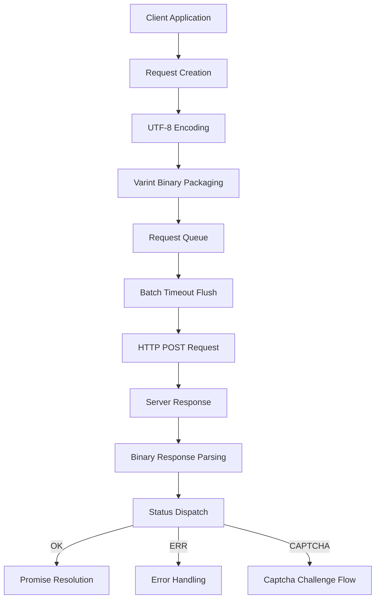
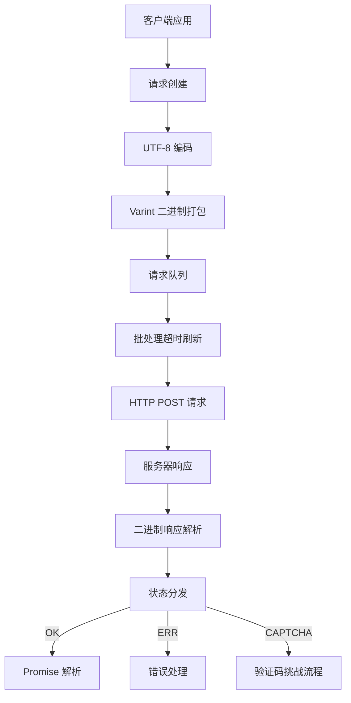

[English](#en) | [中文](#zh)

---

<a id="en"></a>
# @1-/protoapi : Lightweight binary protocol API client

- [@1-/protoapi : Lightweight binary protocol API client](#1-protoapi-lightweight-binary-protocol-api-client)
  - [Functionality](#functionality)
  - [Usage demonstration](#usage-demonstration)
  - [Design rationale](#design-rationale)
  - [Technology stack](#technology-stack)
  - [Code structure](#code-structure)
  - [Historical context](#historical-context)
  - [About](#about)

## Functionality

ProtoAPI implements a compact binary protocol for efficient client-server communication. It handles request batching, automatic captcha resolution, error management, and binary data serialization using protobuf-inspired varint encoding and UTF-8 string handling.

## Usage demonstration

```bash
npm install @1-/protoapi
```

```javascript
import { req, setApi, setOnCaptcha, setOnErr, setCaptcha } from "@1-/protoapi";

// Configure API endpoint
setApi("https://api.example.com/v1");

// Handle captcha challenges
setOnCaptcha(async () => {
  // Implement captcha resolution logic
  return await resolveCaptcha();
});

// Handle errors
setOnErr((error) => {
  console.error("API error:", error);
});

// Set precomputed captcha token (optional)
setCaptcha("precomputed-token");

// Create API module for 'user' service
const userApi = req("user");

// Define field 1 request with encode/decode functions
const getUser = userApi(
  1,
  (args) => new TextEncoder().encode(JSON.stringify(args)),
  (data) => JSON.parse(new TextDecoder().decode(data))
);

// Make request
const userData = await getUser({ id: 123 });
```

## Design rationale

The implementation optimizes for web performance through binary encoding and intelligent batching:



## Technology stack

- Core runtime: Modern JavaScript (ES modules, Uint8Array)
- Binary encoding: Custom varint implementation (@1-/proto/E.js and D.js)
- UTF-8 handling: @3-/utf8 library
- Network: Standard fetch API with custom headers
- Protocol foundation: Protobuf-inspired binary format

## Code structure

```
src/
├── _.js          # Main implementation (200+ lines)
│   ├── Binary encoding utilities
│   ├── Request batching system
│   ├── Response parsing generator
│   ├── Captcha challenge handler
│   └── Promise-based API interface
└── STATUS.js     # Status constants (OK, ERR, CAPTCHA)
```

## Historical context

Binary protocols like ProtoAPI continue the legacy of early network protocols such as IBM's SNA (1970s) and later Google's Protocol Buffers (2008), which demonstrated how compact binary representations could achieve 3-10x bandwidth savings over text-based alternatives like JSON/XML. ProtoAPI modernizes this approach for web environments with features like automatic batching and captcha integration.

## About

This library is developed by [WebC.site](https://webc.site).

[WebC.site](https://webc.site): A new paradigm of web development for AI


---

<a id="zh"></a>
# @1-/protoapi : 轻量级二进制协议 API 客户端

- [@1-/protoapi : 轻量级二进制协议 API 客户端](#1-protoapi-轻量级二进制协议-api-客户端)
  - [功能介绍](#功能介绍)
  - [使用演示](#使用演示)
  - [设计思路](#设计思路)
  - [技术栈](#技术栈)
  - [代码结构](#代码结构)
  - [历史故事](#历史故事)
  - [关于](#关于)

## 功能介绍

ProtoAPI 实现紧凑的二进制协议，用于高效的客户端-服务器通信。它支持请求批处理、自动验证码解析、错误管理及二进制数据序列化，采用类 Protocol Buffers 的 varint 编码和 UTF-8 字符串处理。

## 使用演示

```bash
npm install @1-/protoapi
```

```javascript
import { req, setApi, setOnCaptcha, setOnErr, setCaptcha } from "@1-/protoapi";

// 配置 API 端点
setApi("https://api.example.com/v1");

// 处理验证码挑战
setOnCaptcha(async () => {
  // 实现验证码解析逻辑
  return await resolveCaptcha();
});

// 处理错误
setOnErr((error) => {
  console.error("API 错误:", error);
});

// 设置预计算的验证码令牌（可选）
setCaptcha("precomputed-token");

// 创建 'user' 服务的 API 模块
const userApi = req("user");

// 定义字段 1 请求，包含编码/解码函数
const getUser = userApi(
  1,
  (args) => new TextEncoder().encode(JSON.stringify(args)),
  (data) => JSON.parse(new TextDecoder().decode(data))
);

// 发起请求
const userData = await getUser({ id: 123 });
```

## 设计思路

实现针对 Web 性能优化，采用二进制编码和智能批处理：



## 技术栈

- 核心运行时：现代 JavaScript（ES 模块，Uint8Array）
- 二进制编码：自定义 varint 实现（@1-/proto/E.js 和 D.js）
- UTF-8 处理：@3-/utf8 库
- 网络：标准 fetch API 与自定义头部
- 协议基础：类 Protocol Buffers 的二进制格式

## 代码结构

```
src/
├── _.js          # 主实现（200+ 行）
│   ├── 二进制编码工具
│   ├── 请求批处理系统
│   ├── 响应解析生成器
│   ├── 验证码挑战处理器
│   └── Promise 基础 API 接口
└── STATUS.js     # 状态常量（OK, ERR, CAPTCHA）
```

## 历史故事

二进制协议如 ProtoAPI 延续了早期网络协议（如 IBM SNA，1970 年代）和后来 Google Protocol Buffers（2008 年）的传统，证明紧凑的二进制表示相比 JSON/XML 等文本格式可节省 3-10 倍带宽。ProtoAPI 将此方法现代化，为 Web 环境添加了自动批处理和验证码集成等特性。

## 关于

本库由 [WebC.site](https://webc.site) 开发。

[WebC.site](https://webc.site) : 面向人工智能的网站开发新范式

