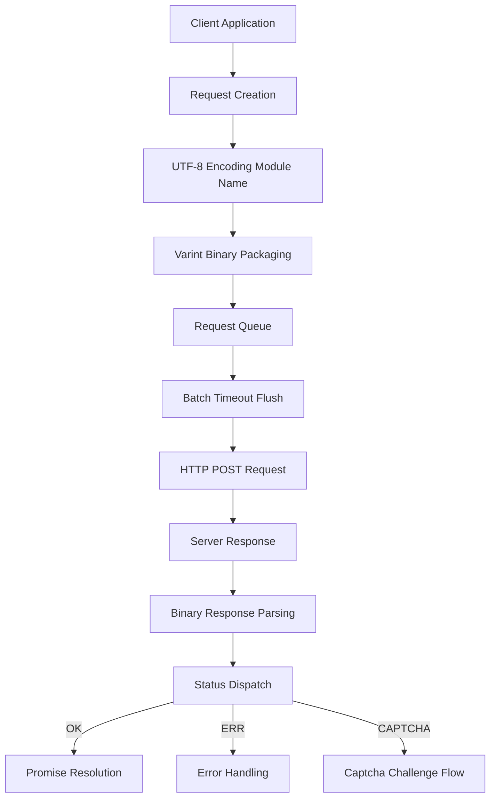
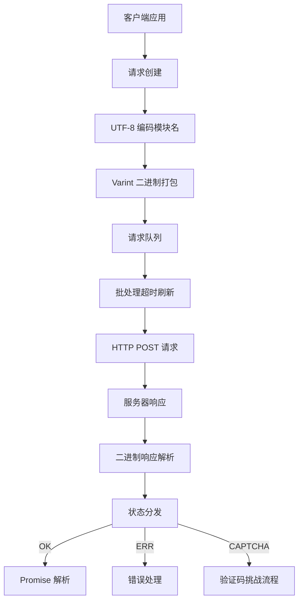

[English](#en) | [中文](#zh)

---

<a id="en"></a>
# @1-/protoapi : Lightweight binary protocol API client

- [@1-/protoapi : Lightweight binary protocol API client](#1-protoapi-lightweight-binary-protocol-api-client)
  - [Functionality](#functionality)
  - [Usage demonstration](#usage-demonstration)
  - [Design rationale](#design-rationale)
  - [Technology stack](#technology-stack)
  - [Code structure](#code-structure)
  - [Historical context](#historical-context)
  - [About](#about)

## Functionality

ProtoAPI provides a compact binary protocol client for efficient client-server communication. Core features include request batching, automatic captcha challenge handling, error status dispatch, and binary data serialization. The protocol uses Protocol Buffers-style varint encoding and UTF-8 string encoding to minimize network payload.

## Usage demonstration

```bash
npm install @1-/protoapi
```

```javascript
import { req, setApi, setOnCaptcha, setOnErr, setCaptcha, setFetch } from "@1-/protoapi";
import { string } from "@1-/proto/E.js";
import { uint64 } from "@1-/proto/D.js";

// Configure API endpoint
setApi("https://api.example.com/v1");

// Handle captcha challenges
setOnCaptcha(async () => {
  // Implement captcha resolution logic, return token
  return await resolveCaptcha();
});

// Handle error responses
setOnErr((error) => {
  console.error("API error:", error);
});

// Set precomputed captcha token (optional)
setCaptcha("precomputed-token");

// Replace fetch function (optional)
setFetch(customFetchFunction);

// Create API module for 'auth' service
const authApi = req("auth");

// Define field 1 request with proto encoding functions
const login = authApi(
  1,
  [string],
  [uint64],
  "test@mail.com"
);

// Make request
const userId = await login();
```

## Design rationale

ProtoAPI optimizes web performance via binary encoding and intelligent batching. All requests are buffered client-side and flushed as a single HTTP POST after a minimal timeout (1ms); responses are parsed by ID and status and dispatched to corresponding Promises.



## Technology stack

- Core runtime: Modern JavaScript (ES modules, Uint8Array)
- Binary encoding: `@1-/proto` library's `E.js` and `D.js` (Protocol Buffers style)
- UTF-8 handling: `@3-/utf8/utf8e.js` and `@3-/utf8/utf8d.js` library
- Network: Standard `fetch` API, supports custom replacement
- Protocol foundation: Protocol Buffers-style binary format

## Code structure

```
src/
├── _.js          # Main implementation (~130 lines)
│   ├── Binary encoding utilities (callBin, reqChunk)
│   ├── Request batching system (REQ_LI, send, TIMER)
│   ├── Response parsing generator (resIter)
│   ├── Captcha challenge handler (ON_CAPTCHA, CAPTCHA_TOKEN)
│   ├── Promise-based API interface (req, sendReq)
│   └── Global configuration (setApi, setOnCaptcha, setCaptcha, setFetch, setOnErr)
└── STATUS.js     # Status constants (OK=0, ERR=1, CAPTCHA=2)
```

## Historical context

Binary protocol design stems from a persistent pursuit of bandwidth efficiency. IBM SNA (1970s) first deployed compact binary frames at scale in enterprise networks, while Google Protocol Buffers (2008) popularized them in distributed systems, demonstrating 3–10x smaller payloads compared to JSON. ProtoAPI inherits this principle, optimized for modern web environments with integrated automatic batching and captcha workflows, balancing performance and security.

## About

This library is developed by [WebC.site](https://webc.site).

[WebC.site](https://webc.site): A new paradigm of web development for AI


---

<a id="zh"></a>
# @1-/protoapi : 轻量级二进制协议 API 客户端

- [@1-/protoapi : 轻量级二进制协议 API 客户端](#1-protoapi-轻量级二进制协议-api-客户端)
  - [功能介绍](#功能介绍)
  - [使用演示](#使用演示)
  - [设计思路](#设计思路)
  - [技术栈](#技术栈)
  - [代码结构](#代码结构)
  - [历史故事](#历史故事)
  - [关于](#关于)

## 功能介绍

ProtoAPI 提供紧凑的二进制协议客户端，实现高效客户端-服务器通信。核心功能包括请求批处理、自动验证码挑战处理、错误状态分发及二进制数据序列化。协议采用 Protocol Buffers 风格的 varint 编码与 UTF-8 字符串编码，最小化网络载荷。

## 使用演示

```bash
npm install @1-/protoapi
```

```javascript
import { req, setApi, setOnCaptcha, setOnErr, setCaptcha, setFetch } from "@1-/protoapi";
import { string } from "@1-/proto/E.js";
import { uint64 } from "@1-/proto/D.js";

// 配置 API 端点
setApi("https://api.example.com/v1");

// 处理验证码挑战
setOnCaptcha(async () => {
  // 实现验证码解析逻辑，返回令牌
  return await resolveCaptcha();
});

// 处理错误响应
setOnErr((error) => {
  console.error("API 错误:", error);
});

// 设置预计算的验证码令牌（可选）
setCaptcha("precomputed-token");

// 替换 fetch 函数（可选）
setFetch(customFetchFunction);

// 创建 'auth' 服务的 API 模块
const authApi = req("auth");

// 定义字段 1 请求，使用 proto 编码函数
const login = authApi(
  1,
  [string],
  [uint64],
  "test@mail.com"
);

// 发起请求
const userId = await login();
```

## 设计思路

ProtoAPI 通过二进制编码与智能批处理优化 Web 性能。所有请求在客户端缓冲，超时（1ms）后合并为单个 HTTP POST 请求；响应按 ID 与状态分发至对应 Promise。



## 技术栈

- 核心运行时：现代 JavaScript（ES 模块，Uint8Array）
- 二进制编码：`@1-/proto` 库的 `E.js` 和 `D.js`（Protocol Buffers 风格）
- UTF-8 处理：`@3-/utf8/utf8e.js` 和 `@3-/utf8/utf8d.js` 库
- 网络：标准 `fetch` API，支持自定义替换
- 协议基础：Protocol Buffers 风格二进制格式

## 代码结构

```
src/
├── _.js          # 主实现（约 130 行）
│   ├── 二进制编码工具（callBin, reqChunk）
│   ├── 请求批处理系统（REQ_LI, send, TIMER）
│   ├── 响应解析生成器（resIter）
│   ├── 验证码挑战处理器（ON_CAPTCHA, CAPTCHA_TOKEN）
│   ├── Promise 基础 API 接口（req, sendReq）
│   └── 全局配置（setApi, setOnCaptcha, setCaptcha, setFetch, setOnErr）
└── STATUS.js     # 状态常量（OK=0, ERR=1, CAPTCHA=2）
```

## 历史故事

二进制协议设计源于对带宽效率的持续追求。IBM SNA（1970 年代）首次在企业网络中大规模应用紧凑二进制帧，而 Google Protocol Buffers（2008）将其推广至分布式系统，证实二进制格式相比 JSON 可减少 3–10 倍传输体积。ProtoAPI 继承此理念，专为现代 Web 环境优化，集成自动批处理与验证码工作流，平衡性能与安全性。

## 关于

本库由 [WebC.site](https://webc.site) 开发。

[WebC.site](https://webc.site) : 面向人工智能的网站开发新范式

