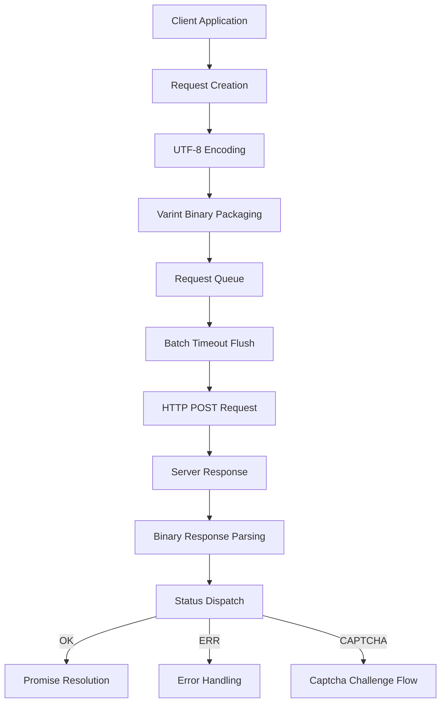

# @1-/protoapi : Lightweight binary protocol API client

## Functionality

ProtoAPI provides a compact binary protocol client for efficient client-server communication. Core features include request batching, automatic captcha challenge handling, error status dispatch, and binary data serialization. The protocol uses Protocol Buffers-style varint encoding and UTF-8 string encoding to minimize network payload.

## Usage demonstration

```bash
npm install @1-/protoapi
```

```javascript
import { req, setApi, setOnCaptcha, setOnErr, setCaptcha } from "@1-/protoapi";

// Configure API endpoint
setApi("https://api.example.com/v1");

// Handle captcha challenges
setOnCaptcha(async () => {
  // Implement captcha resolution logic, return token
  return await resolveCaptcha();
});

// Handle error responses
setOnErr((error) => {
  console.error("API error:", error);
});

// Set precomputed captcha token (optional)
setCaptcha("precomputed-token");

// Create API module for 'user' service
const userApi = req("user");

// Define field 1 request with encode and decode functions
const getUser = userApi(
  1,
  (args) => new TextEncoder().encode(JSON.stringify(args)),
  (data) => JSON.parse(new TextDecoder().decode(data))
);

// Make request
const userData = await getUser({ id: 123 });
```

## Design rationale

ProtoAPI optimizes web performance via binary encoding and intelligent batching. All requests are buffered client-side and flushed as a single HTTP POST after a minimal timeout (1ms); responses are parsed by ID and status and dispatched to corresponding Promises.



## Technology stack

- Core runtime: Modern JavaScript (ES modules, Uint8Array)
- Binary encoding: Custom varint implementation (`@1-/proto/E.js` and `@1-/proto/D.js`)
- UTF-8 handling: `@3-/utf8` library
- Network: Standard `fetch` API, supports custom replacement
- Protocol foundation: Protocol Buffers-style binary format

## Code structure

```
src/
├── _.js          # Main implementation (~130 lines)
│   ├── Binary encoding utilities (callBin, reqChunk)
│   ├── Request batching system (REQ_LI, send, TIMER)
│   ├── Response parsing generator (resIter)
│   ├── Captcha challenge handler (ON_CAPTCHA, CAPTCHA_TOKEN)
│   ├── Promise-based API interface (req, sendReq)
│   └── Global configuration (setApi, setOnCaptcha, etc.)
└── STATUS.js     # Status constants (OK=0, ERR=1, CAPTCHA=2)
```

## Historical context

Binary protocol design stems from a persistent pursuit of bandwidth efficiency. IBM SNA (1970s) first deployed compact binary frames at scale in enterprise networks, while Google Protocol Buffers (2008) popularized them in distributed systems, demonstrating 3–10x smaller payloads compared to JSON. ProtoAPI inherits this principle, optimized for modern web environments with integrated automatic batching and captcha workflows, balancing performance and security.
