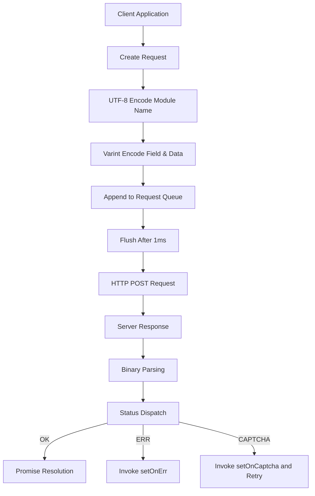

# @1-/protoapi : Lightweight binary protocol API client

## Functionality

ProtoAPI solves the problem of high-efficiency, low-overhead communication between web clients and backend services. Core features include: automatic request batching, automatic captcha challenge retry, unified error status dispatch, and binary data serialization/deserialization. The protocol is based on Protocol Buffers style, using varint encoding and UTF-8 string encoding to significantly reduce network payload.

## Usage demonstration

```bash
npm install @1-/protoapi
```

```javascript
import { req, setApi, setOnCaptcha, setOnErr, setCaptcha, setFetch } from "@1-/protoapi";
import { string } from "@1-/proto/E.js";
import { uint64 } from "@1-/proto/D.js";

// Configure API endpoint
setApi("https://api.example.com/v1");

// Handle captcha challenges
setOnCaptcha(async () => {
  // Implement captcha resolution logic, return token
  return await resolveCaptcha();
});

// Handle error responses
setOnErr((error) => {
  console.error("API error:", error);
});

// Set precomputed captcha token (optional)
setCaptcha("precomputed-token");

// Replace fetch function (optional)
setFetch(customFetchFunction);

// Create API module for 'auth' service
const authApi = req("auth");

// Define field 1 request with proto encoding functions
const login = authApi(1, [string], [uint64], "test@mail.com");

// Make request
const userId = await login();
```

## Design rationale

ProtoAPI implements request batching via client-side buffering and timer-based flushing. All requests are held in memory and merged into a single HTTP POST after a 1ms delay; server responses are parsed by ID and status code and dispatched to corresponding Promises.



## Technology stack

- Core runtime: Modern JavaScript (ES modules, Uint8Array)
- Binary codecs: `@1-/proto/E.js` (encoder) and `@1-/proto/D.js` (decoder)
- UTF-8 codecs: `@3-/utf8/utf8e.js` (encoder) and `@3-/utf8/utf8d.js` (decoder)
- Network layer: Standard `fetch` API, fully replaceable
- Protocol format: Protocol Buffers-style binary frames

## Code structure

```
src/
├── _.js          # Main implementation (~130 lines)
│   ├── Binary utilities: callBin (field packing), reqChunk (request chunking)
│   ├── Batching system: REQ_LI (request queue), send (flush function), TIMER (timeout control)
│   ├── Response parsing: resIter (generator for streaming response parsing)
│   ├── Captcha handling: ON_CAPTCHA (callback), CAPTCHA_TOKEN (token cache)
│   ├── API interface: req (module factory), sendReq (low-level request function)
│   └── Global configuration: setApi, setOnCaptcha, setOnErr, setCaptcha, setFetch
└── STATUS.js     # Status constants (OK=0, ERR=1, CAPTCHA=2)
```

## Historical context

Efficient binary protocol design traces back to IBM's Systems Network Architecture (SNA) in the 1970s, which first deployed compact binary frames at scale in enterprise networks. Google open-sourced Protocol Buffers in 2008, popularizing this paradigm in distributed systems and demonstrating 3–10x smaller payloads compared to JSON. ProtoAPI inherits this legacy, optimized for modern browser environments with integrated batching and captcha workflows, balancing performance and security.