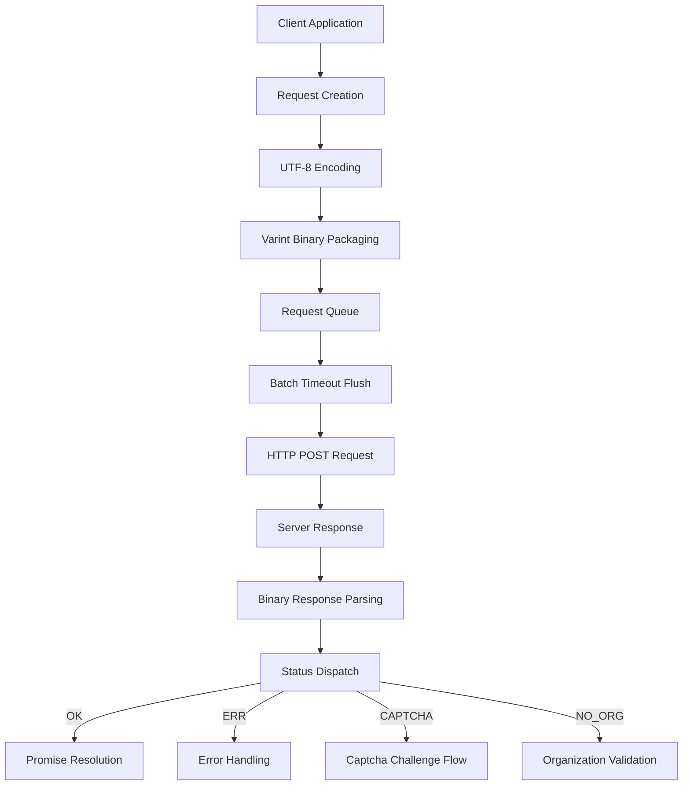

# @1-/protoapi : Lightweight binary protocol API client

## Functionality
ProtoAPI implements a compact binary protocol for efficient client-server communication. It handles request batching, automatic captcha resolution, error management, and binary data serialization using protobuf-inspired varint encoding and UTF-8 string handling.

## Usage demonstration
```bash
npm install @1-/protoapi
```

```javascript
import { req, setApi, setOnCaptcha, setOnErr } from '@1-/protoapi';

// Configure API endpoint
setApi('https://api.example.com/v1');

// Handle captcha challenges
setOnCaptcha(async () => {
  // Implement captcha resolution logic
  return await resolveCaptcha();
});

// Handle errors
setOnErr((error) => {
  console.error('API error:', error);
});

// Create API module for 'user' service
const userApi = req('user');

// Define field 1 request with encode/decode functions
const getUser = userApi(1, 
  (args) => new TextEncoder().encode(JSON.stringify(args)), 
  (data) => JSON.parse(new TextDecoder().decode(data))
);

// Make request
const userData = await getUser({ id: 123 });
```

## Design rationale
The implementation optimizes for web performance through binary encoding and intelligent batching:



## Technology stack
- Core runtime: Modern JavaScript (ES modules, Uint8Array)
- Binary encoding: Custom varint implementation (@1-/proto/E.js and D.js)
- UTF-8 handling: @3-/utf8 library
- Network: Standard fetch API with custom headers
- Protocol foundation: Protobuf-inspired binary format

## Code structure
```
src/
├── _.js          # Main implementation (200+ lines)
│   ├── Binary encoding utilities
│   ├── Request batching system
│   ├── Response parsing generator
│   ├── Captcha challenge handler
│   └── Promise-based API interface
└── STATUS.js     # Status constants (OK, ERR, CAPTCHA, NO_ORG)
```

## Historical context
Binary protocols like ProtoAPI continue the legacy of early network protocols such as IBM's SNA (1970s) and later Google's Protocol Buffers (2008), which demonstrated how compact binary representations could achieve 3-10x bandwidth savings over text-based alternatives like JSON/XML. ProtoAPI modernizes this approach for web environments with features like automatic batching and captcha integration.