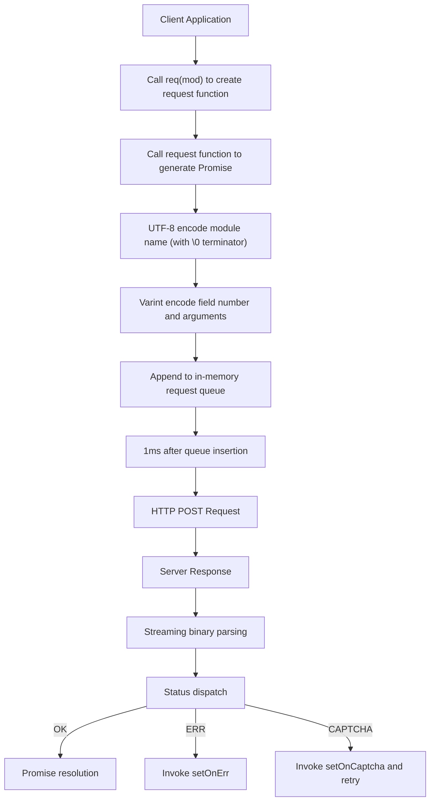

# @1-/protoapi : High-performance binary protocol for browsers

## Functionality

ProtoAPI enables efficient, low-overhead communication between web clients and backend services. Core mechanisms include: automatic request batching, automatic captcha challenge retry, unified error status dispatch, and binary data serialization/deserialization. The protocol is Protocol Buffers-style, using varint encoding and UTF-8 string encoding.

## Usage demonstration

```bash
npm install @1-/protoapi
```

```javascript
import { req, setApi, setOnCaptcha, setOnErr, setCaptcha, setFetch } from "@1-/protoapi";
import { string } from "@1-/proto/E.js";
import { uint64 } from "@1-/proto/D.js";

// Configure API endpoint
setApi("https://api.example.com/v1");

// Handle captcha challenges
setOnCaptcha(async () => {
  // Implement captcha resolution logic, return token
  return await resolveCaptcha();
});

// Handle error responses
setOnErr((error) => {
  console.error("API error:", error);
});

// Set precomputed captcha token (optional)
setCaptcha("precomputed-token");

// Replace fetch function (optional; must return Promise<Response>)
setFetch(customFetchFunction);

// Create request function for 'auth' service
const authReq = req("auth");

// Issue field 1 request with proto encoding and decoding functions
const login = authReq(1, [string], [uint64], "test@mail.com");

// Execute request
const userId = await login();
```

## Design rationale

ProtoAPI implements request batching via an in-memory queue and timer-based flushing. All requests are held in the queue and merged into a single HTTP POST after a 1ms delay. Server responses are parsed by ID and status code in a streaming fashion and dispatched to corresponding Promises.



## Technology stack

- Core runtime: Modern JavaScript (ES modules, `Uint8Array`)
- Binary codecs: `@1-/proto/E.js` (encoder), `@1-/proto/D.js` (decoder)
- UTF-8 codecs: `@3-/utf8/utf8e.js` (encoder), `@3-/utf8/utf8d.js` (decoder)
- Network layer: Standard `fetch` API, fully replaceable (must return `Promise<Response>`)
- Protocol format: Protocol Buffers-style binary frames

## Code structure

```
src/
├── _.js          # Main implementation (135 lines)
│   ├── Binary utilities: callBin (field packing), reqChunk (request frame construction)
│   ├── Batching system: REQ_LI (request queue), send (flush function), TIMER (setTimeout timer)
│   ├── Response parsing: resIter (generator for streaming response parsing)
│   ├── Captcha handling: ON_CAPTCHA (callback), CAPTCHA_TOKEN (Pragma header value)
│   ├── API interface: req (module name binding factory), sendReq (low-level request function)
│   └── Global configuration: setApi, setOnCaptcha, setOnErr, setCaptcha, setFetch
└── STATUS.js     # Status constants (OK=0, ERR=1, CAPTCHA=2)
```

## Historical context

Compact binary protocol design originated with IBM's Systems Network Architecture (SNA) in the 1970s, first deployed at scale in enterprise networks. Google open-sourced Protocol Buffers in 2008, establishing this paradigm in distributed systems and demonstrating 3–10x smaller payloads compared to JSON. ProtoAPI inherits this legacy, optimized for browser environments with integrated batching and captcha workflows.