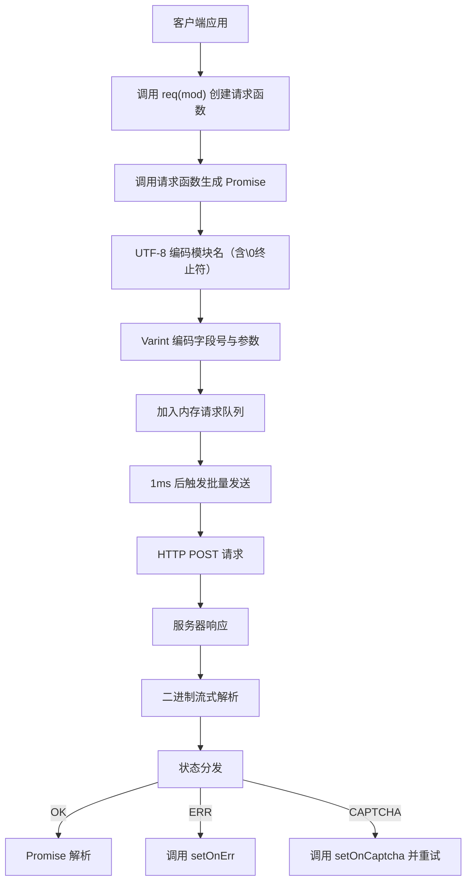

# @1-/protoapi : 浏览器端高效二进制协议

## 功能介绍

ProtoAPI 实现 Web 客户端与后端服务的高效、低开销通信。核心机制包括：请求自动批处理、验证码挑战自动重试、错误状态统一分发、二进制数据序列化与反序列化。协议采用 Protocol Buffers 风格，使用 varint 编码和 UTF-8 字符串编码。

## 使用演示

```bash
npm install @1-/protoapi
```

```javascript
import { req, setApi, setOnCaptcha, setOnErr, setCaptcha, setFetch } from "@1-/protoapi";
import { string } from "@1-/proto/E.js";
import { uint64 } from "@1-/proto/D.js";

// 配置 API 端点
setApi("https://api.example.com/v1");

// 处理验证码挑战
setOnCaptcha(async () => {
  // 实现验证码解析逻辑，返回令牌
  return await resolveCaptcha();
});

// 处理错误响应
setOnErr((error) => {
  console.error("API 错误:", error);
});

// 设置预计算的验证码令牌（可选）
setCaptcha("precomputed-token");

// 替换 fetch 函数（可选）
setFetch(customFetchFunction);

// 创建 'auth' 服务的请求函数
const authReq = req("auth");

// 发起字段 1 请求，使用 proto 编码与解码函数
const login = authReq(1, [string], [uint64], "test@mail.com");

// 执行请求
const userId = await login();
```

## 设计思路

ProtoAPI 通过内存队列与定时刷新实现请求批处理。所有请求暂存于队列，1 毫秒后合并为单个 HTTP POST 请求。服务器响应按 ID 和状态码流式解析，并分发至对应 Promise。



## 技术栈

- 核心运行时：现代 JavaScript（ES 模块，`Uint8Array`）
- 二进制编解码：`@1-/proto/E.js`（编码器）、`@1-/proto/D.js`（解码器）
- UTF-8 编解码：`@3-/utf8/utf8e.js`（编码器）、`@3-/utf8/utf8d.js`（解码器）
- 网络层：标准 `fetch` API，完全可替换（需返回 `Promise<Response>`）
- 协议格式：Protocol Buffers 风格二进制帧

## 代码结构

```
src/
├── _.js          # 主实现（135 行）
│   ├── 二进制工具：callBin（字段打包）、reqChunk（请求帧构造）
│   ├── 批处理系统：REQ_LI（请求队列）、send（刷新函数）、TIMER（`setTimeout` 定时器）
│   ├── 响应解析：resIter（生成器，流式解析响应）
│   ├── 验证码处理：ON_CAPTCHA（回调）、CAPTCHA_TOKEN（`Pragma` 请求头值）
│   ├── API 接口：req（模块名绑定工厂）、sendReq（底层请求函数）
│   └── 全局配置：setApi、setOnCaptcha、setOnErr、setCaptcha、setFetch
└── STATUS.js     # 状态常量（OK=0, ERR=1, CAPTCHA=2）
```

## 历史故事

紧凑二进制协议设计始于 1970 年代 IBM 的系统网络体系结构（SNA），首次在企业级网络中大规模部署。2008 年 Google 开源 Protocol Buffers，确立该范式在分布式系统中的地位，并证实其相比 JSON 可减少 3–10 倍传输体积。ProtoAPI 继承此传统，专为浏览器环境优化，集成批处理与验证码工作流。
