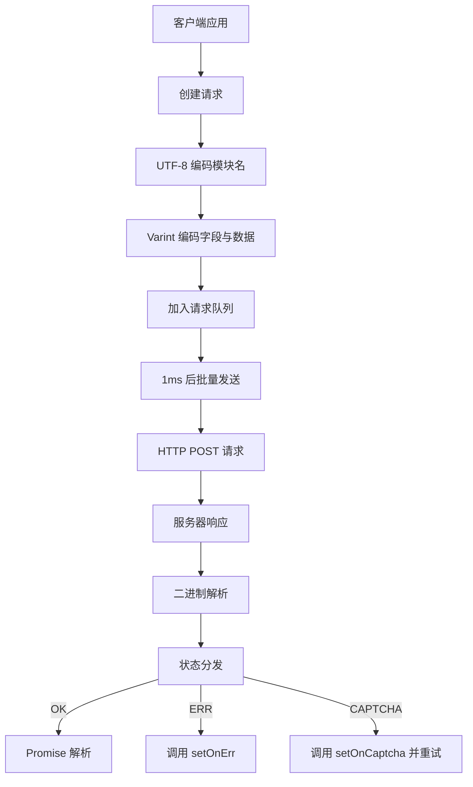

# @1-/protoapi : 轻量级二进制协议 API 客户端

## 功能介绍

ProtoAPI 解决 Web 客户端与后端服务间高效率、低开销通信问题。核心功能包括：请求自动批处理、验证码挑战自动重试、错误状态统一分发、二进制数据序列化与反序列化。协议基于 Protocol Buffers 风格设计，采用 varint 编码和 UTF-8 字符串编码，显著降低网络载荷。

## 使用演示

```bash
npm install @1-/protoapi
```

```javascript
import { req, setApi, setOnCaptcha, setOnErr, setCaptcha, setFetch } from "@1-/protoapi";
import { string } from "@1-/proto/E.js";
import { uint64 } from "@1-/proto/D.js";

// 配置 API 端点
setApi("https://api.example.com/v1");

// 处理验证码挑战
setOnCaptcha(async () => {
  // 实现验证码解析逻辑，返回令牌
  return await resolveCaptcha();
});

// 处理错误响应
setOnErr((error) => {
  console.error("API 错误:", error);
});

// 设置预计算的验证码令牌（可选）
setCaptcha("precomputed-token");

// 替换 fetch 函数（可选）
setFetch(customFetchFunction);

// 创建 'auth' 服务的 API 模块
const authApi = req("auth");

// 定义字段 1 请求，使用 proto 编码函数
const login = authApi(1, [string], [uint64], "test@mail.com");

// 发起请求
const userId = await login();
```

## 设计思路

ProtoAPI 通过客户端缓冲与定时刷新机制实现请求批处理。所有请求在内存中暂存，1 毫秒后合并为单个 HTTP POST 请求；服务器响应按 ID 和状态码解析，并分发至对应 Promise。



## 技术栈

- 核心运行时：现代 JavaScript（ES 模块，Uint8Array）
- 二进制编解码：`@1-/proto/E.js`（编码器）与 `@1-/proto/D.js`（解码器）
- UTF-8 编解码：`@3-/utf8/utf8e.js`（编码）与 `@3-/utf8/utf8d.js`（解码）
- 网络层：标准 `fetch` API，支持完全替换
- 协议格式：Protocol Buffers 风格二进制帧

## 代码结构

```
src/
├── _.js          # 主实现（约 130 行）
│   ├── 二进制工具：callBin（字段打包）、reqChunk（请求分块）
│   ├── 批处理系统：REQ_LI（请求队列）、send（发送函数）、TIMER（超时控制）
│   ├── 响应解析：resIter（生成器，流式解析响应）
│   ├── 验证码处理：ON_CAPTCHA（回调）、CAPTCHA_TOKEN（令牌缓存）
│   ├── API 接口：req（模块工厂）、sendReq（底层请求函数）
│   └── 全局配置：setApi、setOnCaptcha、setOnErr、setCaptcha、setFetch
└── STATUS.js     # 状态常量（OK=0, ERR=1, CAPTCHA=2）
```

## 历史故事

高效二进制协议的设计可追溯至 1970 年代 IBM 的系统网络体系结构（SNA），其首次在企业级网络中大规模部署紧凑二进制帧。2008 年 Google 开源 Protocol Buffers，将该范式推广至分布式系统，并证实其相比 JSON 可减少 3–10 倍传输体积。ProtoAPI 继承此传统，专为现代浏览器环境优化，集成批处理与验证码工作流，在性能与安全性之间取得平衡。