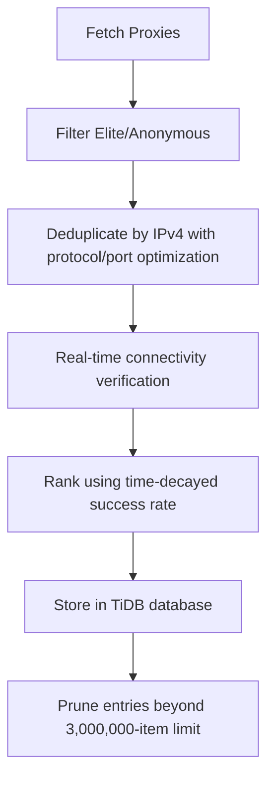
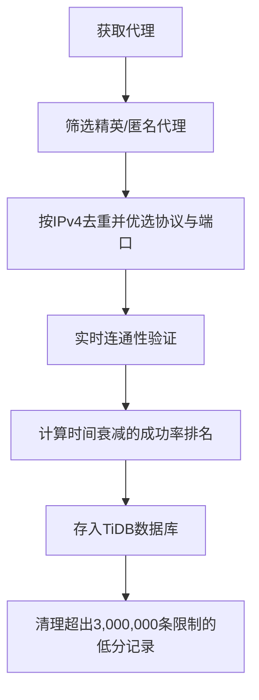

[English](#en) | [中文](#zh)

---

<a id="en"></a>
# proxy_fetch : Fetch, rank, and store high-anonymity proxies

- [proxy_fetch : Fetch, rank, and store high-anonymity proxies](#proxy_fetch-fetch-rank-and-store-high-anonymity-proxies)
  - [Functionality](#functionality)
  - [Usage demonstration](#usage-demonstration)
  - [Design rationale](#design-rationale)
  - [Technology stack](#technology-stack)
  - [Code structure](#code-structure)
  - [Historical context](#historical-context)
  - [About](#about)

## Functionality

Fetches elite and anonymous proxy servers from the proxyscrape.com API, deduplicates by IPv4 address (preserving protocol preference HTTP > SOCKS5 > SOCKS4 and highest port for same IPs), validates connectivity in real time, ranks using a time-decayed success-rate algorithm, and stores in TiDB Serverless database with automatic pruning of entries beyond the 3,000,000-item limit.

## Usage demonstration

Install as a dependency:

```bash
npm install @1-/proxy_fetch
```

Use programmatically:

```javascript
import run from "@1-/proxy_fetch/src/run.js";

// Connect to database and save proxies
await run("your-database-url");
```

Or run directly:

```bash
bun ./src/run.js your-database-url
```

## Design rationale

The system prioritizes proxy reliability, recency, and storage efficiency. IPv4-based deduplication ensures efficient storage while preserving protocol preference (HTTP > SOCKS5 > SOCKS4) and selecting the highest available port for each IP. All new proxies undergo real-time connectivity verification before insertion. The ranking score combines historical success rate with time decay. The database automatically maintains exactly 3,000,000 highest-scoring proxy entries.



## Technology stack

- Runtime: Bun
- Database: TiDB Serverless
- Dependencies: @1-/ipv4, @3-/int, @3-/req, @3-/split, cli-progress, http-proxy-agent, socks-proxy-agent

## Code structure

```
src/
├── ipFetch.js    # Fetch and deduplicate proxies from proxyscrape.com API
├── ping.js       # Proxy connectivity verification and geo-location detection logic
├── run.js        # Entry point to fetch and store proxies
├── save.js       # TiDB database storage, verification, and automatic pruning logic
└── dump.js       # Database schema export utility
```

## Historical context

Proxy functionality was integrated into the world's first web server, CERN httpd, developed by Tim Berners-Lee at CERN in 1991. Released in June 1991 and announced publicly in August, it ran on a NeXT Computer and served as both a web server and a proxy server — establishing the foundational role of proxy technology in the architecture of the World Wide Web.

## About

This library is developed by [WebC.site](https://webc.site).

[WebC.site](https://webc.site): A new paradigm of web development for AI


---

<a id="zh"></a>
# proxy_fetch : 获取、排序和存储高匿名代理服务器

- [proxy_fetch : 获取、排序和存储高匿名代理服务器](#proxy_fetch-获取排序和存储高匿名代理服务器)
  - [功能介绍](#功能介绍)
  - [使用演示](#使用演示)
  - [设计思路](#设计思路)
  - [技术栈](#技术栈)
  - [代码结构](#代码结构)
  - [历史故事](#历史故事)
  - [关于](#关于)

## 功能介绍

从 proxyscrape.com API 获取精英级和匿名代理服务器，按 IPv4 地址去重（同 IP 保留协议优先级 HTTP > SOCKS5 > SOCKS4 且端口最大者），通过实时连通性验证筛选有效代理，并依据成功率与时间衰减的算法计算排名分数，最终存储于 TiDB Serverless 数据库中，自动清理超出 3,000,000 条限制的低分条目。

## 使用演示

安装为依赖项：

```bash
npm install @1-/proxy_fetch
```

编程调用：

```javascript
import run from "@1-/proxy_fetch/src/run.js";

// 连接数据库并保存代理
await run("your-database-url");
```

或直接运行：

```bash
bun ./src/run.js your-database-url
```

## 设计思路

系统在代理可靠性、时效性与存储效率之间取得平衡。基于 IPv4 地址的去重机制确保高效存储，协议优先级（HTTP > SOCKS5 > SOCKS4）与最高可用端口策略保障连接质量。所有新代理均经实时连通性验证，仅有效代理进入数据库。排名分数由历史成功率与时间衰减共同决定，数据库自动维护最多 3,000,000 条最高分代理记录。



## 技术栈

- 运行时：Bun
- 数据库：TiDB Serverless
- 依赖项：@1-/ipv4, @3-/int, @3-/req, @3-/split, cli-progress, http-proxy-agent, socks-proxy-agent

## 代码结构

```
src/
├── ipFetch.js    # 从proxyscrape.com API获取代理，按IPv4去重并优选协议与端口
├── ping.js       # 代理连通性验证与地理信息检测逻辑
├── run.js        # 获取并存储代理的入口点
├── save.js       # TiDB数据库存储、验证与自动清理逻辑
└── dump.js       # 数据库表结构导出工具
```

## 历史故事

代理功能集成于世界上首个网页服务器 CERN httpd，由蒂姆·伯纳斯-李于 1991 年在欧洲核子研究中心（CERN）开发。该软件于 1991 年 6 月发布，8 月向公众宣布，运行于 NeXT 计算机之上，兼具网页服务器与代理服务器双重角色——印证代理技术自万维网诞生之初即为互联网基础设施的核心组件。

## 关于

本库由 [WebC.site](https://webc.site) 开发。

[WebC.site](https://webc.site) : 面向人工智能的网站开发新范式

