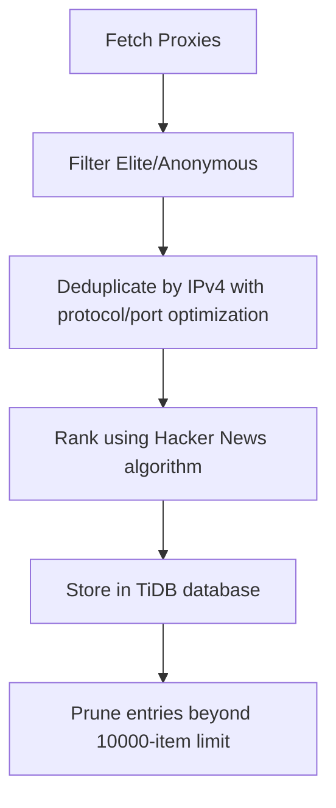
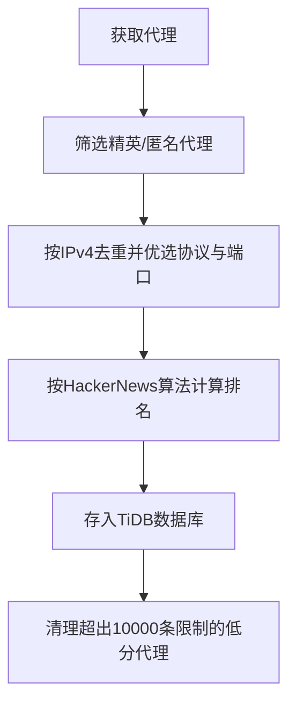

[English](#en) | [中文](#zh)

---

<a id="en"></a>
# proxy_fetch : Fetch, rank, and store high-anonymity proxies

- [proxy_fetch : Fetch, rank, and store high-anonymity proxies](#proxy_fetch-fetch-rank-and-store-high-anonymity-proxies)
  - [Functionality](#functionality)
  - [Usage demonstration](#usage-demonstration)
  - [Design rationale](#design-rationale)
  - [Technology stack](#technology-stack)
  - [Code structure](#code-structure)
  - [Historical context](#historical-context)
  - [About](#about)

## Functionality

Fetches elite and anonymous proxy servers from the proxyscrape.com API, deduplicates by IPv4 address (preserving protocol preference SOCKS5 > SOCKS4 > HTTP and highest port for same IPs), ranks using the Hacker News algorithm balancing success rate against age decay, and stores in TiDB Serverless database with automatic pruning of entries beyond the 10,000-item limit.

## Usage demonstration

Install as a dependency:

```bash
npm install @1-/proxy_fetch
```

Use programmatically:

```javascript
import run from "@1-/proxy_fetch/src/run.js";

// Connect to database and save proxies
await run("your-database-url");
```

Or run directly:

```bash
bun ./src/run.js your-database-url
```

## Design rationale

The system implements the Hacker News ranking algorithm to balance proxy reliability against recency. IPv4-based deduplication ensures efficient storage while preserving protocol preference (SOCKS5 > SOCKS4 > HTTP) and selecting the highest available port for each IP. The database automatically maintains exactly 10,000 highest-scoring proxy entries.



## Technology stack

- Runtime: Bun
- Database: TiDB Serverless
- Dependencies: @1-/ipv4, @3-/binset, @3-/int, @3-/nowts, @3-/req, @3-/split, @3-/vb, @tidbcloud/serverless

## Code structure

```
src/
├── ipFetch.js    # Fetch and deduplicate proxies from proxyscrape.com API
├── rank.js       # Implement Hacker News ranking algorithm
├── run.js        # Entry point to fetch and store proxies
├── save.js       # TiDB database storage with automatic pruning logic
└── dump.js       # Database schema export utility
```

## Historical context

Proxy servers emerged in the early 1990s as network intermediaries for caching and security. The first widely-used proxy, CERN httpd, was developed at CERN in 1991 alongside the World Wide Web itself, demonstrating how foundational proxy technology is to modern internet infrastructure.


## About

This library is developed by [WebC.site](https://webc.site).

[WebC.site](https://webc.site): A new paradigm of web development for AI


---

<a id="zh"></a>
# proxy_fetch : 获取、排序和存储高匿名代理服务器

- [proxy_fetch : 获取、排序和存储高匿名代理服务器](#proxy_fetch-获取排序和存储高匿名代理服务器)
  - [功能介绍](#功能介绍)
  - [使用演示](#使用演示)
  - [设计思路](#设计思路)
  - [技术栈](#技术栈)
  - [代码结构](#代码结构)
  - [历史故事](#历史故事)
  - [关于](#关于)

## 功能介绍

从 proxyscrape.com API 获取精英级和匿名代理服务器，按 IPv4 地址去重（同 IP 保留协议优先级 SOCKS5 > SOCKS4 > HTTP 且端口最大者），依据成功率与时间衰减的 Hacker News 算法计算排名分数，并存储于 TiDB Serverless 数据库中，自动清理超出 10,000 条限制的低分条目。

## 使用演示

安装为依赖项：

```bash
npm install @1-/proxy_fetch
```

编程调用：

```javascript
import run from "@1-/proxy_fetch/src/run.js";

// 连接数据库并保存代理列表
await run("your-database-url");
```

或直接运行：

```bash
bun ./src/run.js your-database-url
```

## 设计思路

系统采用 Hacker News 排名算法，在成功率与时间衰减之间取得平衡。基于 IPv4 地址的去重机制确保存储效率，同时保留协议优先级（SOCKS5 > SOCKS4 > HTTP）和最高可用端口。数据库自动维护最多 10,000 条最高分代理记录。



## 技术栈

- 运行时：Bun
- 数据库：TiDB Serverless
- 依赖项：@1-/ipv4, @3-/binset, @3-/int, @3-/nowts, @3-/req, @3-/split, @3-/vb, @tidbcloud/serverless

## 代码结构

```
src/
├── ipFetch.js    # 从proxyscrape.com API获取并按IPv4去重代理
├── rank.js       # 实现Hacker News排名算法计算代理分数
├── run.js        # 获取并存储代理的入口点
├── save.js       # TiDB数据库存储与自动清理逻辑
└── dump.js       # 数据库表结构导出工具
```

## 历史故事

代理服务器诞生于20世纪90年代初，作为网络中介用于缓存和安全。首个广泛使用的代理CERN httpd由欧洲核子研究中心（CERN）于1991年开发，与万维网同步问世，彰显代理技术对现代互联网基础设施的基础性作用。


## 关于

本库由 [WebC.site](https://webc.site) 开发。

[WebC.site](https://webc.site) : 面向人工智能的网站开发新范式

