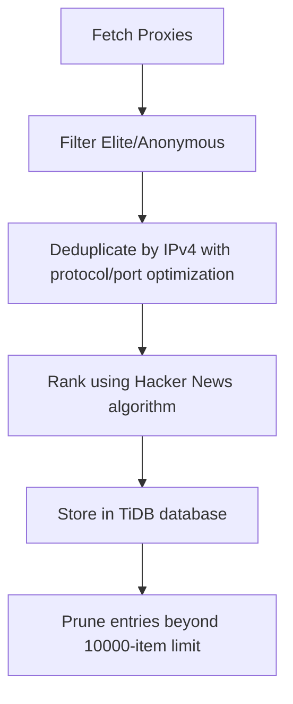

# proxy_fetch : Fetch, rank, and store high-anonymity proxies

## Functionality

Fetches elite and anonymous proxy servers from the proxyscrape.com API, deduplicates by IPv4 address (preserving protocol preference SOCKS5 > SOCKS4 > HTTP and highest port for same IPs), ranks using the Hacker News algorithm balancing success rate against age decay, and stores in TiDB Serverless database with automatic pruning of entries beyond the 10,000-item limit.

## Usage demonstration

Install as a dependency:

```bash
npm install @1-/proxy_fetch
```

Use programmatically:

```javascript
import run from "@1-/proxy_fetch/src/run.js";

// Connect to database and save proxies
await run("your-database-url");
```

Or run directly:

```bash
bun ./src/run.js your-database-url
```

## Design rationale

The system implements the Hacker News ranking algorithm to balance proxy reliability against recency. IPv4-based deduplication ensures efficient storage while preserving protocol preference (SOCKS5 > SOCKS4 > HTTP) and selecting the highest available port for each IP. The database automatically maintains exactly 10,000 highest-scoring proxy entries.



## Technology stack

- Runtime: Bun
- Database: TiDB Serverless
- Dependencies: @1-/ipv4, @3-/binset, @3-/int, @3-/nowts, @3-/req, @3-/split, @3-/vb, @tidbcloud/serverless

## Code structure

```
src/
├── ipFetch.js    # Fetch and deduplicate proxies from proxyscrape.com API
├── rank.js       # Implement Hacker News ranking algorithm
├── run.js        # Entry point to fetch and store proxies
├── save.js       # TiDB database storage with automatic pruning logic
└── dump.js       # Database schema export utility
```

## Historical context

Proxy servers emerged in the early 1990s as network intermediaries for caching and security. The first widely-used proxy, CERN httpd, was developed at CERN in 1991 alongside the World Wide Web itself, demonstrating how foundational proxy technology is to modern internet infrastructure.
