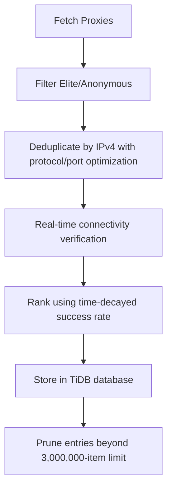

# proxy_fetch : Fetch, rank, and store high-anonymity proxies

## Functionality

Fetches elite and anonymous proxy servers from the proxyscrape.com API, deduplicates by IPv4 address (preserving protocol preference HTTP > SOCKS5 > SOCKS4 and highest port for same IPs), validates connectivity in real time, ranks using a time-decayed success-rate algorithm, and stores in TiDB Serverless database with automatic pruning of entries beyond the 3,000,000-item limit.

## Usage demonstration

Install as a dependency:

```bash
npm install @1-/proxy_fetch
```

Use programmatically:

```javascript
import run from "@1-/proxy_fetch/src/run.js";

// Connect to database and save proxies
await run("your-database-url");
```

Or run directly:

```bash
bun ./src/run.js your-database-url
```

## Design rationale

The system prioritizes proxy reliability, recency, and storage efficiency. IPv4-based deduplication ensures efficient storage while preserving protocol preference (HTTP > SOCKS5 > SOCKS4) and selecting the highest available port for each IP. All new proxies undergo real-time connectivity verification before insertion. The ranking score combines historical success rate with time decay. The database automatically maintains exactly 3,000,000 highest-scoring proxy entries.



## Technology stack

- Runtime: Bun
- Database: TiDB Serverless
- Dependencies: @1-/ipv4, @3-/int, @3-/req, @3-/split, cli-progress, http-proxy-agent, socks-proxy-agent

## Code structure

```
src/
├── ipFetch.js    # Fetch and deduplicate proxies from proxyscrape.com API
├── ping.js       # Proxy connectivity verification and geo-location detection logic
├── run.js        # Entry point to fetch and store proxies
├── save.js       # TiDB database storage, verification, and automatic pruning logic
└── dump.js       # Database schema export utility
```

## Historical context

Proxy functionality was integrated into the world's first web server, CERN httpd, developed by Tim Berners-Lee at CERN in 1991. Released in June 1991 and announced publicly in August, it ran on a NeXT Computer and served as both a web server and a proxy server — establishing the foundational role of proxy technology in the architecture of the World Wide Web.