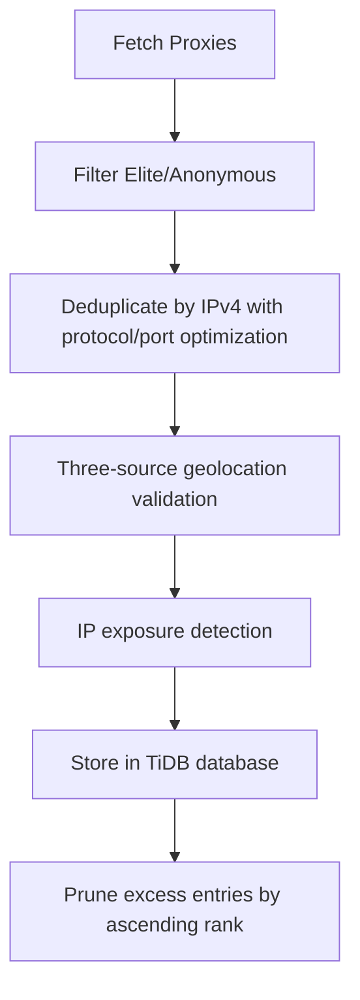

# proxy_fetch : Fetch, verify, and store high-anonymity proxies

## Functionality

Fetches elite and anonymous proxies from proxyscrape.com (v4 API) and pubproxy.com, deduplicates by IPv4 address (preserving protocol preference SOCKS5 > SOCKS4 > HTTP and selecting the highest port per IP), validates proxy functionality via three geolocation APIs (ip-api.com, ipapi.co, ipinfo.io), and detects IP exposure. Only verified proxies are stored in TiDB Serverless. The database automatically maintains exactly 3,000,000 highest-ranking entries, pruning excess entries by ascending `rank`.

## Usage demonstration

Install as a dependency:

```bash
npm install @1-/proxy_fetch
```

Use programmatically:

```javascript
import run from "@1-/proxy_fetch/src/run.js";

// Connect to database and save proxies
await run("your-database-url");
```

Or run directly:

```bash
bun ./src/run.js your-database-url
```

## Design rationale

The system balances proxy reliability and storage efficiency. IPv4-based deduplication ensures compact storage; protocol preference and port selection optimize connection quality; three-source geolocation validation and IP exposure detection jointly identify transparent proxies; all new proxies undergo real-time verification before insertion. Database pruning by `rank` maintains a fixed-size pool of high-quality proxies.



## Technology stack

- Runtime: Bun
- Database: TiDB Serverless
- Core dependencies: @1-/ipv4, @3-/int, @3-/req, @3-/split, cli-progress, http-proxy-agent, socks, socks-proxy-agent

## Code structure

```
src/
├── api/
│   ├── proxyscrape.js  # proxyscrape.com v4 API wrapper (supports pagination)
│   └── pubproxy.js     # pubproxy.com API wrapper (with 50 retry attempts)
├── dump.js             # Database schema export utility
├── ipFetch.js          # Main proxy fetching logic, integrates multiple APIs and IPv4 deduplication
├── ping.js             # Three-source geolocation validation, IP exposure detection, and result parsing
├── request.js          # Low-level HTTP/SOCKS request handling with SOCKS4/SOCKS5/HTTP proxy support
├── run.js              # Main entry point coordinating fetch and storage workflow
└── save.js             # TiDB storage logic with existence check, batch verification, and precise pruning
```

## Historical context

Proxy functionality was integrated into the world's first web server, CERN httpd, developed by Tim Berners-Lee at CERN in 1991. Released in June 1991 and announced publicly in August, it ran on a NeXT Computer and served as both a web server and a proxy server — establishing the foundational role of proxy technology in the architecture of the World Wide Web.
