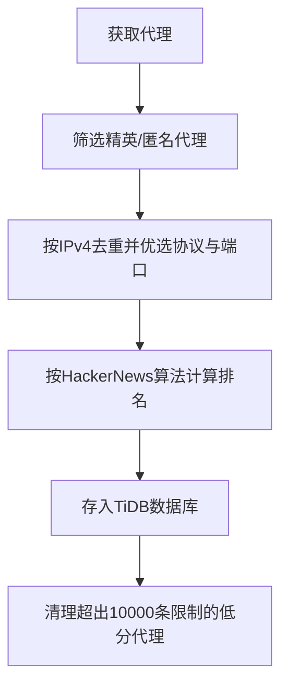

# proxy_fetch : 获取、排序和存储高匿名代理服务器

## 功能介绍

从 proxyscrape.com API 获取精英级和匿名代理服务器，按 IPv4 地址去重（同 IP 保留协议优先级 SOCKS5 > SOCKS4 > HTTP 且端口最大者），依据成功率与时间衰减的 Hacker News 算法计算排名分数，并存储于 TiDB Serverless 数据库中，自动清理超出 10,000 条限制的低分条目。

## 使用演示

安装为依赖项：

```bash
npm install @1-/proxy_fetch
```

编程调用：

```javascript
import run from "@1-/proxy_fetch/src/run.js";

// 连接数据库并保存代理列表
await run("your-database-url");
```

或直接运行：

```bash
bun ./src/run.js your-database-url
```

## 设计思路

系统采用 Hacker News 排名算法，在成功率与时间衰减之间取得平衡。基于 IPv4 地址的去重机制确保存储效率，同时保留协议优先级（SOCKS5 > SOCKS4 > HTTP）和最高可用端口。数据库自动维护最多 10,000 条最高分代理记录。



## 技术栈

- 运行时：Bun
- 数据库：TiDB Serverless
- 依赖项：@1-/ipv4, @3-/binset, @3-/int, @3-/nowts, @3-/req, @3-/split, @3-/vb, @tidbcloud/serverless

## 代码结构

```
src/
├── ipFetch.js    # 从proxyscrape.com API获取并按IPv4去重代理
├── rank.js       # 实现Hacker News排名算法计算代理分数
├── run.js        # 获取并存储代理的入口点
├── save.js       # TiDB数据库存储与自动清理逻辑
└── dump.js       # 数据库表结构导出工具
```

## 历史故事

代理服务器诞生于20世纪90年代初，作为网络中介用于缓存和安全。首个广泛使用的代理CERN httpd由欧洲核子研究中心（CERN）于1991年开发，与万维网同步问世，彰显代理技术对现代互联网基础设施的基础性作用。
