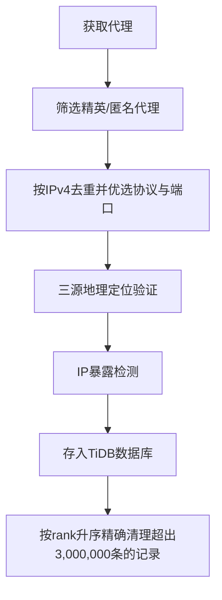

# proxy_fetch : 获取、验证与存储高匿名代理

## 功能介绍

从 proxyscrape.com（v4 API）和 pubproxy.com 获取精英级与匿名代理，按 IPv4 地址去重（同 IP 保留协议优先级 SOCKS5 > SOCKS4 > HTTP，端口取最大值），通过三源地理定位 API（ip-api.com、ipapi.co、ipinfo.io）验证代理功能并检测 IP 暴露，仅有效代理存入 TiDB Serverless 数据库。数据库自动维护恰好 3,000,000 条最高排名记录，超出部分按 rank 升序精确清理。

## 使用演示

安装为依赖项：

```bash
npm install @1-/proxy_fetch
```

编程调用：

```javascript
import run from "@1-/proxy_fetch/src/run.js";

// 连接数据库并保存代理
await run("your-database-url");
```

或直接运行：

```bash
bun ./src/run.js your-database-url
```

## 设计思路

系统在代理可靠性与存储效率之间取得平衡。IPv4 地址去重确保高效存储；协议优先级与端口优选策略保障连接质量；三源地理定位验证与 IP 暴露检测共同识别透明代理；所有新代理均经实时验证后才入库。数据库通过 rank 字段实现精确裁剪，维持固定规模的高质量代理池。



## 技术栈

- 运行时：Bun
- 数据库：TiDB Serverless
- 核心依赖：@1-/ipv4, @3-/int, @3-/req, @3-/split, cli-progress, http-proxy-agent, socks, socks-proxy-agent

## 代码结构

```
src/
├── api/
│   ├── proxyscrape.js  # proxyscrape.com v4 API 封装（支持分页）
│   └── pubproxy.js     # pubproxy.com API 封装（带50次重试机制）
├── dump.js             # 数据库表结构导出工具
├── ipFetch.js          # 代理获取主逻辑，整合多源API并执行IPv4去重
├── ping.js             # 三源地理定位验证、IP暴露检测与结果解析
├── request.js          # 底层HTTP/SOCKS请求封装，支持SOCKS4/SOCKS5/HTTP代理验证
├── run.js              # 主入口点，协调获取与存储流程
└── save.js             # TiDB存储逻辑，含存在性检查、批量验证与精确裁剪
```

## 历史故事

代理功能集成于世界上首个网页服务器 CERN httpd，由蒂姆·伯纳斯-李于 1991 年在欧洲核子研究中心（CERN）开发。该软件于 1991 年 6 月发布，8 月向公众宣布，运行于 NeXT 计算机之上，兼具网页服务器与代理服务器双重角色——印证代理技术自万维网诞生之初即为互联网基础设施的核心组件。
