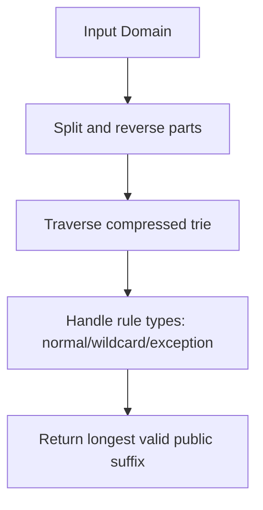
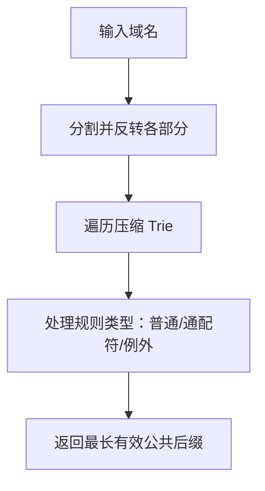

[English](#en) | [中文](#zh)

---

<a id="en"></a>
# @1-/psl : Domain public suffix extraction library

- [@1-/psl : Domain public suffix extraction library](#1-psl-domain-public-suffix-extraction-library)
  - [Functionality](#functionality)
  - [Usage demonstration](#usage-demonstration)
  - [Design rationale](#design-rationale)
  - [Technology stack](#technology-stack)
  - [Code structure](#code-structure)
  - [Historical background](#historical-background)
  - [About](#about)

## Functionality

Extract public suffixes from domain names using Mozilla's Public Suffix List specification. The library supports ICANN domains plus common private domains like github.io and pages.dev.

The implementation handles all PSL rule types: normal domains (com), wildcard rules (*.co.uk), and exception rules (!foo.co.uk) to ensure accurate registrable domain determination.

## Usage demonstration

Install the package:

```bash
npm install @1-/psl
```

Use in JavaScript:

```javascript
import psl from "@1-/psl";

// Extract public suffix
console.log(psl("www.github.com")); // 'github.com'
console.log(psl("blog.example.co.uk")); // 'example.co.uk'
console.log(psl("subdomain.google.com")); // 'google.com'
console.log(psl("user.github.io")); // 'github.io'
console.log(psl("app.vercel.app")); // 'vercel.app'
```

## Design rationale

The implementation uses a compressed reverse trie structure optimized for memory efficiency and fast lookup. The generation script (`gen.js`) downloads the official PSL data and compresses it into a compact format where:

- Leaf nodes store type codes (1=normal, 2=wildcard, 3=exception)
- Internal nodes use array format `[type, {children}]` when typed, object format `{children}` when untyped
- Domain parts are stored in reverse order for efficient right-to-left traversal



## Technology stack

- Pure JavaScript implementation
- ES Module format
- No external dependencies
- Generated from official Public Suffix List data
- Optimized for both Node.js and browser environments

## Code structure

```
src/
├── psl.js          # Compressed Public Suffix List trie data
└── _.js            # Lookup function implementing PSL specification

test/
├── _.test.js       # Functional tests with real domain examples
└── psl.test.js     # Structural validation tests

gen.js              # Data generation script (downloads and compresses PSL)
allow.js            # Configuration for private domains to include
```

## Historical background

The Public Suffix List originated at Mozilla in 2007 to solve cookie scoping vulnerabilities. Before PSL, browsers couldn't distinguish between domains controlled by registrars (like co.uk) versus end users (like example.co.uk), enabling malicious sites to set cookies on overly broad domains. This implementation follows the current PSL specification while adding support for modern hosting platforms like GitHub Pages and Vercel.

## About

This library is developed by [WebC.site](https://webc.site).

[WebC.site](https://webc.site): A new paradigm of web development for AI


---

<a id="zh"></a>
# @1-/psl : 域名公共后缀提取库

- [@1-/psl : 域名公共后缀提取库](#1-psl-域名公共后缀提取库)
  - [功能介绍](#功能介绍)
  - [使用演示](#使用演示)
  - [设计思路](#设计思路)
  - [技术栈](#技术栈)
  - [代码结构](#代码结构)
  - [历史故事](#历史故事)
  - [关于](#关于)

## 功能介绍

使用 Mozilla 公共后缀列表规范从域名中提取公共后缀。本库支持 ICANN 域名以及 github.io、pages.dev 等常见私有域名。

实现完整支持所有 PSL 规则类型：普通域名（com）、通配符规则（*.co.uk）和例外规则（!foo.co.uk），确保可注册域名判定准确。

## 使用演示

安装包：

```bash
npm install @1-/psl
```

JavaScript 中使用：

```javascript
import psl from "@1-/psl";

// 提取公共后缀
console.log(psl("www.github.com")); // 'github.com'
console.log(psl("blog.example.co.uk")); // 'example.co.uk'
console.log(psl("subdomain.google.com")); // 'google.com'
console.log(psl("user.github.io")); // 'github.io'
console.log(psl("app.vercel.app")); // 'vercel.app'
```

## 设计思路

实现采用压缩的反向 Trie 结构，针对内存效率和快速查找优化。生成脚本（`gen.js`）下载官方 PSL 数据并压缩为紧凑格式：

- 叶节点存储类型码（1=普通，2=通配符，3=例外）
- 内部节点在有类型时使用数组格式 `[类型, {子节点}]`，无类型时使用对象格式 `{子节点}`
- 域名部分按逆序存储，支持高效的从右向左遍历



## 技术栈

- 纯 JavaScript 实现
- ES 模块格式
- 无外部依赖
- 基于官方公共后缀列表数据生成
- 针对 Node.js 和浏览器环境优化

## 代码结构

```
src/
├── psl.js          # 压缩的公共后缀列表 Trie 数据
└── _.js            # 实现 PSL 规范的查找函数

test/
├── _.test.js       # 功能测试（含真实域名示例）
└── psl.test.js     # 结构验证测试

gen.js              # 数据生成脚本（下载并压缩 PSL）
allow.js            # 私有域名包含配置
```

## 历史故事

公共后缀列表起源于 Mozilla 2007 年，旨在解决 Cookie 范围漏洞问题。在 PSL 出现前，浏览器无法区分由注册商控制的域名（如 co.uk）与终端用户控制的域名（如 example.co.uk），导致恶意网站可在过于宽泛的域名上设置 Cookie。本实现遵循当前 PSL 规范，同时增加对 GitHub Pages、Vercel 等现代托管平台的支持。

## 关于

本库由 [WebC.site](https://webc.site) 开发。

[WebC.site](https://webc.site) : 面向人工智能的网站开发新范式

