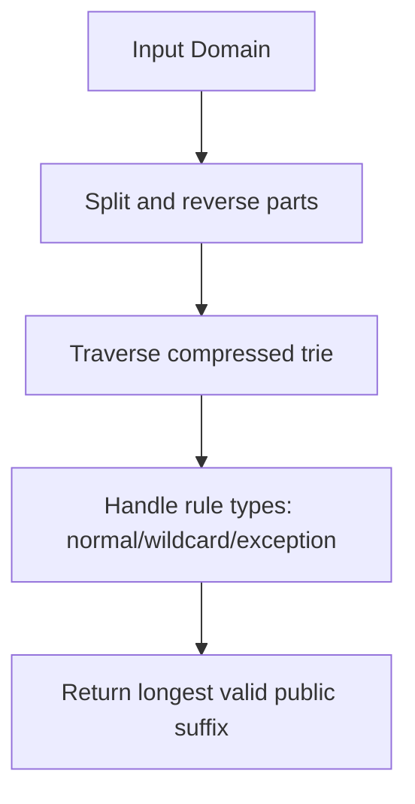

# @1-/psl : Domain public suffix extraction library

## Functionality

Extract public suffixes from domain names using Mozilla's Public Suffix List specification. Supports ICANN domains plus private domains like github.io, pages.dev, and vercel.app.

Accurately handle all PSL rule types: normal domains (com), wildcard rules (*.co.uk), and exception rules (!foo.co.uk) to ensure correct registrable domain determination.

## Usage demonstration

Install the package:

```bash
npm install @1-/psl
```

Use in JavaScript:

```javascript
import psl from "@1-/psl";

// Extract public suffix
console.log(psl("www.github.com")); // 'github.com'
console.log(psl("blog.example.co.uk")); // 'example.co.uk'
console.log(psl("subdomain.google.com")); // 'google.com'
console.log(psl("user.github.io")); // 'user.github.io'
console.log(psl("app.vercel.app")); // 'app.vercel.app'
```

## Design rationale

Uses a compressed reverse trie structure optimized for memory efficiency and fast lookup:

- Leaf nodes store type codes (1=normal, 2=wildcard, 3=exception)
- Internal nodes use array format `[type, {children}]` when typed, object format `{children}` when untyped
- Domain parts are stored in reverse order for efficient right-to-left traversal



## Technology stack

- Pure JavaScript implementation
- ES Module format
- No external dependencies
- Generated from official Public Suffix List data
- Optimized for both Node.js and browser environments

## Code structure

```
src/
├── psl.js          # Compressed Public Suffix List trie data
└── _.js            # Lookup function implementing PSL specification

test/
├── _.test.js       # Functional tests with real domain examples
└── psl.test.js     # Structural validation tests

gen.js              # Data generation script (downloads and compresses PSL)
allow.js            # Configuration for private domains to include
```

## Historical background

The Public Suffix List originated at Mozilla in 2007 to solve cookie scoping vulnerabilities. Before PSL, browsers couldn't distinguish between domains controlled by registrars (like co.uk) versus end users (like example.co.uk), enabling malicious sites to set cookies on overly broad domains. This implementation follows the current PSL specification while adding support for modern hosting platforms like GitHub Pages, Vercel, and Netlify.