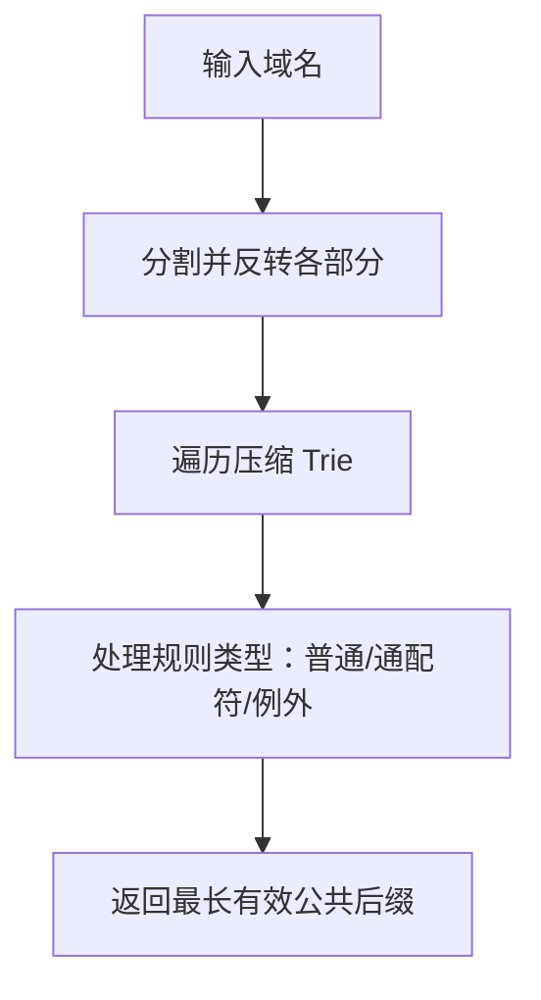

# @1-/psl : 域名公共后缀提取库

## 功能介绍

使用 Mozilla 公共后缀列表规范从域名中提取公共后缀。支持 ICANN 域名及 github.io、pages.dev、vercel.app 等现代托管平台的私有域名。

准确处理所有 PSL 规则类型：普通域名（com）、通配符规则（*.co.uk）和例外规则（!foo.co.uk），确保可注册域名判定正确。

## 使用演示

安装包：

```bash
npm install @1-/psl
```

JavaScript 中使用：

```javascript
import psl from "@1-/psl";

// 提取公共后缀
console.log(psl("www.github.com")); // 'github.com'
console.log(psl("blog.example.co.uk")); // 'example.co.uk'
console.log(psl("subdomain.google.com")); // 'google.com'
console.log(psl("user.github.io")); // 'user.github.io'
console.log(psl("app.vercel.app")); // 'app.vercel.app'
```

## 设计思路

采用压缩的反向 Trie 结构，针对内存效率和快速查找优化：

- 叶节点存储类型码（1=普通，2=通配符，3=例外）
- 内部节点在有类型时使用数组格式 `[类型, {子节点}]`，无类型时使用对象格式 `{子节点}`
- 域名部分按逆序存储，支持高效的从右向左遍历



## 技术栈

- 纯 JavaScript 实现
- ES 模块格式
- 无外部依赖
- 基于官方公共后缀列表数据生成
- 针对 Node.js 和浏览器环境优化

## 代码结构

```
src/
├── psl.js          # 压缩的公共后缀列表 Trie 数据
└── _.js            # 实现 PSL 规范的查找函数

test/
├── _.test.js       # 功能测试（含真实域名示例）
└── psl.test.js     # 结构验证测试

gen.js              # 数据生成脚本（下载并压缩 PSL）
allow.js            # 私有域名包含配置
```

## 历史故事

公共后缀列表起源于 Mozilla 2007 年，旨在解决 Cookie 范围漏洞问题。在 PSL 出现前，浏览器无法区分由注册商控制的域名（如 co.uk）与终端用户控制的域名（如 example.co.uk），导致恶意网站可在过于宽泛的域名上设置 Cookie。本实现遵循当前 PSL 规范，并增加对 GitHub Pages、Vercel、Netlify 等现代托管平台的支持。