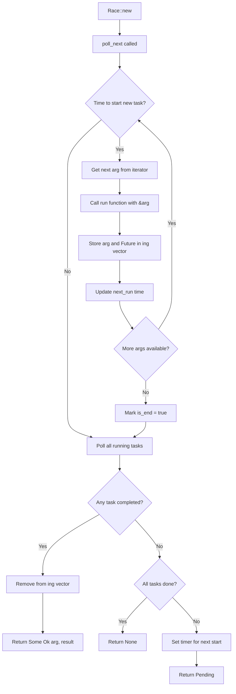

# race : Staggered Async Task Executor

## Table of Contents

- [Introduction](#introduction)
- [Features](#features)
- [Installation](#installation)
- [Usage](#usage)
  - [Basic Usage](#basic-usage)
  - [DNS Resolution with Staggered Requests](#dns-resolution-with-staggered-requests)
  - [Infinite Task Streams](#infinite-task-streams)
  - [Non-Copy Types](#non-copy-types)
- [Design](#design)
- [API Reference](#api-reference)
- [Performance](#performance)
- [Tech Stack](#tech-stack)
- [Project Structure](#project-structure)
- [History](#history)

## Introduction

`race` is a high-performance Rust library implementing staggered async task execution. Tasks start at fixed intervals and race to completion - fastest task wins regardless of start order.

> **Note**: "Staggered" means tasks are launched sequentially at fixed time intervals, not simultaneously. For example, with a 50ms interval: Task 1 starts at 0ms, Task 2 at 50ms, Task 3 at 100ms, etc. This creates a "staircase" or "ladder" pattern of task launches.

Key difference from `Promise.race()`: Instead of starting all tasks simultaneously, tasks launch sequentially at configurable intervals, enabling:

- **Rate-limited API calls** - Respect API quotas and avoid overwhelming servers
- **Graceful degradation** - Try primary servers first, fallbacks later
- **Hedged requests** - Reduce tail latency with redundant requests
- **Infinite task streams** - Handle unlimited iterators efficiently

## Features

- **Staggered execution** - Tasks start at configurable intervals
- **Race semantics** - Fastest task completes first regardless of start order
- **Stream-based API** - Implements `futures::Stream` for async iteration
- **Infinite iterator support** - Tasks started on-demand, not all at once
- **Non-Copy type support** - Works with String, Vec, custom structs without Clone requirement
- **High performance** - Zero `dyn` dispatch, `coarsetime` optimization
- **Memory efficient** - Pre-allocated vectors, immediate cleanup
- **No `'static` requirement** - Lifetime tied to Race instance

## Installation

```sh
cargo add race
```

Or add to your `Cargo.toml`:

```toml
[dependencies]
race = "0.1.3"
```

## Usage

### Basic Usage

```rust
use futures::StreamExt;
use race::Race;

#[tokio::main]
async fn main() {
  let mut race = Race::new(
    std::time::Duration::from_millis(50),  // Start new task every 50ms
    |url: &str| async move {
      // Simulate network request with different latencies
      let latency = match url {
        "server1" => 100,
        "server2" => 20,  // Fastest
        _ => 80,
      };
      tokio::time::sleep(std::time::Duration::from_millis(latency)).await;
      Ok::<(&str, String), &'static str>((url, format!("Response from {url}")))
    },
    vec!["server1", "server2", "server3"],
  );

  // Get first completed result (server2 completes first despite starting second)
  if let Some((url, Ok(data))) = race.next().await {
    println!("First response from {url}: {data}");
  }
}
```

### DNS Resolution with Staggered Requests

Query multiple hosts with 500ms staggered delay, return first successful result:

```rust
use std::net::IpAddr;
use futures::StreamExt;
use race::Race;
use tokio::net::lookup_host;

#[tokio::main]
async fn main() {
  let hosts = vec!["google.com:80", "cloudflare.com:80", "github.com:80"];

  let mut race = Race::new(
    std::time::Duration::from_millis(500),
    |host: &str| async move {
      let addr = lookup_host(host).await?.next().ok_or_else(|| {
        std::io::Error::new(std::io::ErrorKind::NotFound, "no address")
      })?;
      Ok::<(&str, IpAddr), std::io::Error>((host, addr.ip()))
    },
    hosts,
  );

  // Return first successful response
  while let Some((host, result)) = race.next().await {
    if let Ok(ip) = result {
      println!("Resolved {host}: {ip}");
      break;
    }
  }
}
```

Timeline:

- 0ms: Start resolving google.com
- 500ms: Start resolving cloudflare.com (if no response yet)
- 1000ms: Start resolving github.com (if still no response)

First completed response wins, remaining tasks continue until Race is dropped.

### Infinite Task Streams

Handle unlimited iterators efficiently - tasks are started on-demand:

```rust
use futures::StreamExt;
use race::Race;

#[tokio::main]
async fn main() {
  // Infinite iterator - only starts tasks as needed
  let infinite_numbers = 0u64..;

  let mut race = Race::new(
    std::time::Duration::from_millis(50),
    |n: &u64| {
      let n = *n;
      async move {
        tokio::time::sleep(std::time::Duration::from_millis(100)).await;
        Ok::<(u64, u64), &'static str>((n, n * n))
      }
    },
    infinite_numbers,
  );

  // Only consume what you need - no memory explosion
  for i in 0..5 {
    if let Some((n, Ok((n_val, square)))) = race.next().await {
      println!("Result {i}: {n_val}² = {square}");
    }
  }
  // Race is dropped here, remaining tasks are cancelled
}
```

### Non-Copy Types

Works seamlessly with non-Copy types like String, Vec, and custom structs:

```rust
use futures::StreamExt;
use race::Race;

#[derive(Debug, Clone)]
struct Task {
  id: u32,
  name: String,
  data: Vec<i32>,
}

#[tokio::main]
async fn main() {
  let tasks = vec![
    Task { id: 1, name: "process".to_string(), data: vec![1, 2, 3] },
    Task { id: 2, name: "analyze".to_string(), data: vec![4, 5, 6] },
  ];

  let mut race = Race::new(
    std::time::Duration::from_millis(100),
    |task: &Task| {
      let task = task.clone();
      async move {
        let sum: i32 = task.data.iter().sum();
        let result = format!("{}: sum={sum}", task.name);
        Ok::<String, &'static str>(result)
      }
    },
    tasks,
  );

  while let Some((original_task, Ok(result))) = race.next().await {
    println!("Task {}: {result}", original_task.id);
  }
}
```

## Design



### Execution Flow

1. **Initialization**: `Race::new` stores task generator function, step interval, and argument iterator
2. **Task Scheduling**: On each `poll_next`, check if current time >= `next_run` to start new tasks
3. **Task Creation**: Call `run(&arg)` to create Future, store both arg and Future in `ing` vector
4. **Concurrent Polling**: All running tasks polled simultaneously using reverse iteration for safe removal
5. **Result Handling**: First completed task returns `(original_arg, result)` tuple immediately
6. **Timer Management**: `tokio::time::Sleep` ensures proper wakeup for next task start
7. **Stream Completion**: Stream ends when all tasks complete and iterator exhausted

### Key Design Decisions

- **Reference-based API**: Task generator receives `&A` to avoid unnecessary moves
- **Move Semantics**: Arguments moved from iterator to task storage, then returned with results
- **No Clone Requirement**: Works with any type that implements `Send + Unpin`, including non-cloneable types
- **Reverse Polling**: Tasks polled in reverse order to safely remove completed ones
- **Coarsetime Optimization**: Uses `coarsetime` for high-performance interval timing
- **Pre-allocated Storage**: `ing` vector pre-allocated to avoid frequent reallocations

## API Reference

### `Race<'a, A, T, E, G, Fut, I>`

Staggered race executor implementing `futures::Stream`.

Type parameters:

- `A` - Argument type
- `T` - Success result type
- `E` - Error type
- `G` - Task generator function `Fn(A) -> Fut`
- `Fut` - Future type returning `Result<(A, T), E>`
- `I` - Iterator type yielding `A`

#### `new(step: std::time::Duration, run: G, args_li: impl IntoIterator) -> Self`

Create executor with step interval, task generator, and arguments.

**Parameters:**

- `step: std::time::Duration` - **Staggered delay interval for task starts**. Tasks are launched sequentially at this interval, not all at once. For example, `Duration::from_millis(50)` means each task starts 50ms after the previous one (converted to `coarsetime::Duration`)
- `run: G` - Function `Fn(&A) -> Fut` that creates Future from argument reference
- `args_li: impl IntoIterator<Item = A>` - Iterator of arguments (can be infinite)

**Returns:** `Race` instance implementing `futures::Stream<Item = Result<(A, T), E>>`

**Constraints:**

- `A: Send + Unpin + 'a` - Argument type must be thread-safe and unpinnable
- `T: Send + 'a` - Result type must be thread-safe
- `E: Send + 'a` - Error type must be thread-safe
- `G: Fn(&A) -> Fut + Send + Unpin + 'a` - Generator function must be thread-safe
- `Fut: Future<Output = Result<T, E>> + Send + 'a` - Future must be thread-safe
- `I: Iterator<Item = A> + Send + Unpin + 'a` - Iterator must be thread-safe

#### `Stream::poll_next`

Returns `Poll<Option<(A, Result<T, E>)>>`:

- `Poll::Ready(Some((arg, Ok(result))))` - Task completed successfully with original argument
- `Poll::Ready(Some((arg, Err(e))))` - Task failed with error, still returns original argument
- `Poll::Ready(None)` - All tasks completed and iterator exhausted
- `Poll::Pending` - No task ready, waker registered for future notification

## Performance

Optimizations implemented:

- **Zero `dyn` dispatch** - Fully generic, no virtual calls
- **`coarsetime`** - Fast time operations, reduced syscalls
- **Pre-allocated vectors** - Capacity 8 to avoid small reallocations
- **Efficient polling** - Reverse iteration for safe removal
- **Immediate cleanup** - Completed tasks dropped immediately

Benchmarks show significant performance improvements over channel-based approaches.

## Tech Stack

- [tokio](https://tokio.rs) - Async runtime and sleep timer
- [futures](https://crates.io/crates/futures) - Stream trait implementation
- [coarsetime](https://crates.io/crates/coarsetime) - High-performance time operations with reduced syscalls

## Project Structure

```
race/
├── src/
│   └── lib.rs        # Core implementation
├── tests/
│   └── main.rs       # Integration tests with logging
├── readme/
│   ├── en.md         # English documentation
│   └── zh.md         # Chinese documentation
└── Cargo.toml
```

## History

The "race" pattern in async programming traces back to JavaScript's `Promise.race()`, introduced in ES6 (2015). Unlike `Promise.race()` which starts all tasks simultaneously, this library implements a staggered variant inspired by gRPC's "hedged requests" pattern described in Google's 2015 paper "The Tail at Scale".

Hedged requests help reduce tail latency by sending redundant requests after a delay, using whichever response arrives first. This technique is widely used in distributed systems at Google, Amazon, and other large-scale services.

This Rust implementation adds modern optimizations like zero-cost abstractions, efficient time handling, and support for infinite streams.
