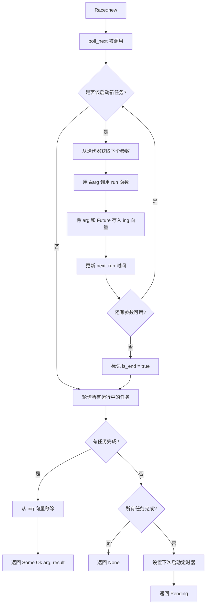

# race : 阶梯式异步任务执行器

## 目录

- [简介](#简介)
- [特性](#特性)
- [安装](#安装)
- [使用](#使用)
  - [基本用法](#基本用法)
  - [DNS 阶梯解析](#dns-阶梯解析)
  - [无限任务流](#无限任务流)
  - [非 Copy 类型](#非-copy-类型)
- [设计](#设计)
- [API 参考](#api-参考)
- [性能](#性能)
- [技术栈](#技术栈)
- [目录结构](#目录结构)
- [历史](#历史)

## 简介

`race` 是高性能 Rust 阶梯式异步任务执行器。任务按固定间隔启动并竞赛完成 - 最快完成者获胜，与启动顺序无关。

> **提示**："阶梯式"（Staggered）指任务按固定时间间隔依次启动，而非同时启动。例如，50ms 间隔表示：任务1在 0ms 启动，任务2在 50ms 启动，任务3在 100ms 启动，以此类推。这形成了任务启动的"阶梯"或"梯子"模式。

与 `Promise.race()` 的关键区别：不是同时启动所有任务，而是按可配置间隔依次启动，适用于：

- **限速 API 调用** - 遵守 API 配额，避免服务器过载
- **优雅降级** - 优先尝试主服务器，后备服务器延后启动
- **对冲请求** - 通过冗余请求降低尾延迟
- **无限任务流** - 高效处理无限迭代器

## 特性

- **阶梯式执行** - 任务按可配置间隔启动
- **竞赛语义** - 最快完成的任务先返回，与启动顺序无关
- **基于 Stream 的 API** - 实现 `futures::Stream` 用于异步迭代
- **支持无限迭代器** - 任务按需启动，不会一次性启动所有
- **非 Copy 类型支持** - 无需 Clone 约束即可支持 String、Vec、自定义结构体
- **高性能** - 零 `dyn` 分发，`coarsetime` 优化
- **内存高效** - 预分配向量，立即清理
- **无 `'static` 要求** - 生命周期与 Race 实例绑定

## 安装

```sh
cargo add race
```

或添加到 `Cargo.toml`：

```toml
[dependencies]
race = "0.1.3"
```

## 使用

### 基本用法

```rust
use futures::StreamExt;
use race::Race;

#[tokio::main]
async fn main() {
  let mut race = Race::new(
    std::time::Duration::from_millis(50),  // 每 50ms 启动新任务
    |url: &str| async move {
      // 模拟不同延迟的网络请求
      let latency = match url {
        "server1" => 100,
        "server2" => 20,  // 最快
        _ => 80,
      };
      tokio::time::sleep(std::time::Duration::from_millis(latency)).await;
      Ok::<(&str, String), &'static str>((url, format!("Response from {url}")))
    },
    vec!["server1", "server2", "server3"],
  );

  // 获取首个完成的结果（server2 虽然第二个启动但最先完成）
  if let Some((url, Ok(data))) = race.next().await {
    println!("首个响应来自 {url}: {data}");
  }
}
```

### DNS 阶梯解析

向多个主机发起解析，每 500ms 启动新请求，返回首个成功结果：

```rust
use std::net::IpAddr;
use futures::StreamExt;
use race::Race;
use tokio::net::lookup_host;

#[tokio::main]
async fn main() {
  let hosts = vec!["google.com:80", "cloudflare.com:80", "github.com:80"];

  let mut race = Race::new(
    std::time::Duration::from_millis(500),
    |host: &str| async move {
      let addr = lookup_host(host).await?.next().ok_or_else(|| {
        std::io::Error::new(std::io::ErrorKind::NotFound, "no address")
      })?;
      Ok::<(&str, IpAddr), std::io::Error>((host, addr.ip()))
    },
    hosts,
  );

  // 返回首个成功响应
  while let Some((host, result)) = race.next().await {
    if let Ok(ip) = result {
      println!("解析 {host}: {ip}");
      break;
    }
  }
}
```

时间线：

- 0ms: 开始解析 google.com
- 500ms: 开始解析 cloudflare.com（若无响应）
- 1000ms: 开始解析 github.com（若仍无响应）

首个完成的响应返回，剩余任务在后台继续运行直到 Race 被 drop。

### 无限任务流

高效处理无限迭代器 - 任务按需启动：

```rust
use futures::StreamExt;
use race::Race;

#[tokio::main]
async fn main() {
  // 无限迭代器 - 只按需启动任务
  let infinite_numbers = 0u64..;

  let mut race = Race::new(
    std::time::Duration::from_millis(50),
    |n: &u64| {
      let n = *n;
      async move {
        tokio::time::sleep(std::time::Duration::from_millis(100)).await;
        Ok::<(u64, u64), &'static str>((n, n * n))
      }
    },
    infinite_numbers,
  );

  // 只消费需要的部分 - 不会内存爆炸
  for i in 0..5 {
    if let Some((n, Ok((n_val, square)))) = race.next().await {
      println!("结果 {i}: {n_val}² = {square}");
    }
  }
  // Race 在此处被 drop，剩余任务被取消
}
```

### 非 Copy 类型

无缝支持非 Copy 类型，如 String、Vec 和自定义结构体：

```rust
use futures::StreamExt;
use race::Race;

#[derive(Debug, Clone)]
struct Task {
  id: u32,
  name: String,
  data: Vec<i32>,
}

#[tokio::main]
async fn main() {
  let tasks = vec![
    Task { id: 1, name: "process".to_string(), data: vec![1, 2, 3] },
    Task { id: 2, name: "analyze".to_string(), data: vec![4, 5, 6] },
  ];

  let mut race = Race::new(
    std::time::Duration::from_millis(100),
    |task: &Task| {
      let task = task.clone();
      async move {
        let sum: i32 = task.data.iter().sum();
        let result = format!("{}: sum={sum}", task.name);
        Ok::<String, &'static str>(result)
      }
    },
    tasks,
  );

  while let Some((original_task, Ok(result))) = race.next().await {
    println!("任务 {}: {result}", original_task.id);
  }
}
```

## 设计



### 执行流程

1. **初始化**: `Race::new` 存储任务生成器函数、步进间隔和参数迭代器
2. **任务调度**: 每次 `poll_next` 检查当前时间是否 >= `next_run` 来启动新任务
3. **任务创建**: 调用 `run(&arg)` 创建 Future，将参数和 Future 存储在 `ing` 向量中
4. **并发轮询**: 所有运行中的任务同时轮询，使用反向迭代安全移除
5. **结果处理**: 首个完成的任务立即返回 `(原始参数, 结果)` 元组
6. **定时器管理**: `tokio::time::Sleep` 确保下次任务启动的正确唤醒
7. **流完成**: 当所有任务完成且迭代器耗尽时流结束

### 关键设计决策

- **基于引用的 API**: 任务生成器接收 `&A` 避免不必要的移动
- **移动语义**: 参数从迭代器移动到任务存储，然后与结果一起返回
- **无 Clone 要求**: 适用于任何实现 `Send + Unpin` 的类型，包括不可克隆类型
- **反向轮询**: 任务按反向顺序轮询以安全移除已完成的任务
- **Coarsetime 优化**: 使用 `coarsetime` 进行高性能间隔计时
- **预分配存储**: `ing` 向量预分配以避免频繁重新分配

## API 参考

### `Race<'a, A, T, E, G, Fut, I>`

阶梯式竞赛执行器，实现 `futures::Stream`。

类型参数：

- `A` - 参数类型
- `T` - 成功结果类型
- `E` - 错误类型
- `G` - 任务生成函数 `Fn(A) -> Fut`
- `Fut` - Future 类型，返回 `Result<(A, T), E>`
- `I` - 迭代器类型，产生 `A`

#### `new(step: std::time::Duration, run: G, args_li: impl IntoIterator) -> Self`

创建执行器，传入步进间隔、任务生成器和参数。

**参数:**

- `step: std::time::Duration` - **阶梯式延时启动间隔**。每个任务按此间隔依次启动，而非同时启动所有任务。例如 `Duration::from_millis(50)` 表示每隔 50ms 启动下一个任务（转换为 `coarsetime::Duration`）
- `run: G` - 函数 `Fn(&A) -> Fut`，从参数引用创建 Future
- `args_li: impl IntoIterator<Item = A>` - 参数迭代器（可以是无限的）

**返回:** 实现 `futures::Stream<Item = Result<(A, T), E>>` 的 `Race` 实例

**约束:**

- `A: Send + Unpin + 'a` - 参数类型必须线程安全且可 unpin
- `T: Send + 'a` - 结果类型必须线程安全
- `E: Send + 'a` - 错误类型必须线程安全
- `G: Fn(&A) -> Fut + Send + Unpin + 'a` - 生成器函数必须线程安全
- `Fut: Future<Output = Result<T, E>> + Send + 'a` - Future 必须线程安全
- `I: Iterator<Item = A> + Send + Unpin + 'a` - 迭代器必须线程安全

#### `Stream::poll_next`

返回 `Poll<Option<(A, Result<T, E>)>>`：

- `Poll::Ready(Some((arg, Ok(result))))` - 任务成功完成，返回原始参数
- `Poll::Ready(Some((arg, Err(e))))` - 任务失败，仍返回原始参数
- `Poll::Ready(None)` - 所有任务完成且迭代器耗尽
- `Poll::Pending` - 暂无任务就绪，已注册唤醒器等待未来通知

## 性能

实现的优化：

- **零 `dyn` 分发** - 完全泛型，无虚拟调用
- **`coarsetime`** - 快速时间操作，减少系统调用
- **预分配向量** - 容量 8 避免小规模重新分配
- **高效轮询** - 反向迭代安全移除
- **立即清理** - 完成的任务立即 drop

基准测试显示相比基于 channel 的方法有显著性能提升。

## 技术栈

- [tokio](https://tokio.rs) - 异步运行时和睡眠定时器
- [futures](https://crates.io/crates/futures) - Stream trait 实现
- [coarsetime](https://crates.io/crates/coarsetime) - 高性能时间操作，减少系统调用

## 目录结构

```
race/
├── src/
│   └── lib.rs        # 核心实现
├── tests/
│   └── main.rs       # 集成测试
├── readme/
│   ├── en.md         # 英文文档
│   └── zh.md         # 中文文档
└── Cargo.toml
```

## 历史

异步编程中的 "race" 模式源于 JavaScript 的 `Promise.race()`，在 ES6 (2015) 中引入。与 `Promise.race()` 同时启动所有任务不同，本库实现了阶梯变体，灵感来自 Google 2015 年论文 《The Tail at Scale》 中描述的 gRPC 对冲请求模式。

对冲请求通过延迟发送冗余请求来降低尾延迟，使用最先到达的响应。该技术广泛应用于 Google、Amazon 等大规模分布式系统。
