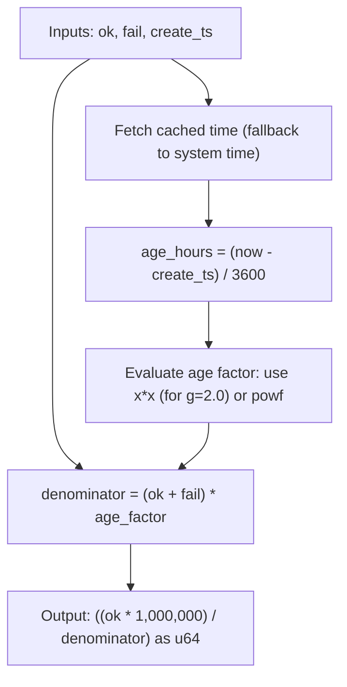
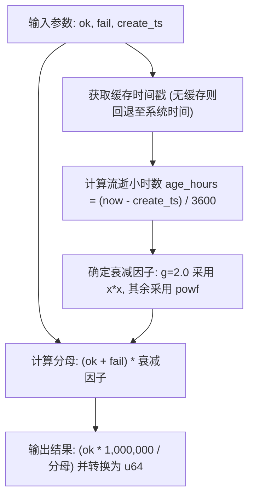

[English](#en) | [中文](#zh)

---

<a id="en"></a>

# rank : Hacker News style decay ranking algorithm

- [rank : Hacker News style decay ranking algorithm](#rank-hacker-news-style-decay-ranking-algorithm)
  - [Table of Contents](#table-of-contents)
  - [Introduction](#introduction)
  - [Usage](#usage)
    - [Basic Example](#basic-example)
  - [Features](#features)
  - [Design](#design)
  - [Tech Stack](#tech-stack)
  - [Directory Structure](#directory-structure)
  - [API](#api)
    - [Rank](#rank)
      - [Methods](#methods)
    - [RANK](#rank)
  - [History](#history)

## Table of Contents

- [Introduction](#introduction)
- [Usage](#usage)
- [Features](#features)
- [Design](#design)
- [Tech Stack](#tech-stack)
- [Directory Structure](#directory-structure)
- [API](#api)
- [History](#history)

## Introduction

rank balances success rate against time decay using Hacker News ranking formula. It scales floating-point scores to integer values, suited for sorting resources like proxy servers, news feeds, or search results.

## Usage

Add dependency to Cargo.toml:

```toml
[dependencies]
rank = "0.1"
```

Or add via cargo:

```bash
cargo add rank
```

### Basic Example

Compute ranking score:

```rust
use rank::{Rank, RANK};

// Custom Rank instance with base score 100 and gravity 1.8
let ranker = Rank::new(100, 1.8);
let score = ranker.rank(80, 20, 1781497590);

// Global static/const Rank instance (default parameters: base = 10000, g = 2.0)
#[cfg(feature = "const")]
let score_const = RANK.rank(80, 20, 1781497590);
```

## Features

- Hacker News decay formula implementation.
- Reduced division overhead (rearranged mathematically to utilize a single floating-point division).
- Specialized fast-path multiplications for gravity values `g = 2.0` and `g = 1.0` (completely bypassing expensive `powf` calls).
- Zero-syscall cached timestamp fetching using `coarsetime` (with automatic fallback to system time).
- Thread-safe predefined constant `RANK` (enabled by `const` feature).

## Design

Algorithm workflow:



## Tech Stack

- Rust (Edition 2024)
- `coarsetime` (fast time retrieval)

## Directory Structure

```text
.
├── Cargo.toml
├── src
│   ├── lib.rs
│   └── rank.rs
└── tests
    └── main.rs
```

## API

### Rank

Configuration struct.

```rust
pub struct Rank {
  pub base: u64,
  pub g: f64,
}
```

- `base`: base score when total attempts are zero.
- `g`: gravity factor.

#### Methods

- `pub const fn new(base: u64, g: f64) -> Self`: constructor.
- `pub fn rank(&self, ok: u64, fail: u64, create_ts: u64) -> u64`: computes ranking score.

### RANK

Static global default instance (available under `const` feature).

```rust
#[cfg(feature = "const")]
pub const RANK: Rank = Rank::new(10000, 2.0);
```

- `base` is `10000`.
- `g` is `2.0` (standard Hacker News gravity value).

## History

Hacker News ranking algorithm was designed by Paul Graham for Y Combinator's Hacker News. Originally implemented in Lisp dialect Arc, it balances vote count against time decay using gravity. Arc's default gravity was 1.8. This crate provides optimized Rust port with high-speed monotonic clock support.

---

## About

- [About](#about)

This library is developed by [WebC.site](https://webc.site).

[WebC.site](https://webc.site): A new paradigm of web development for AI


---

<a id="zh"></a>

# rank : 基于 Hacker News 公式的排序衰减算法

- [rank : 基于 Hacker News 公式的排序衰减算法](#rank-基于-hacker-news-公式的排序衰减算法)
  - [目录](#目录)
  - [项目功能介绍](#项目功能介绍)
  - [使用演示](#使用演示)
    - [基础示例](#基础示例)
  - [特性介绍](#特性介绍)
  - [设计思路](#设计思路)
  - [技术堆栈](#技术堆栈)
  - [目录结构](#目录结构)
  - [API 说明](#api-说明)
    - [Rank](#rank)
      - [方法](#方法)
    - [RANK](#rank)
  - [历史故事](#历史故事)

## 目录

- [项目功能介绍](#项目功能介绍)
- [使用演示](#使用演示)
- [特性介绍](#特性介绍)
- [设计思路](#设计思路)
- [技术堆栈](#技术堆栈)
- [目录结构](#目录结构)
- [API 说明](#api-说明)
- [历史故事](#历史故事)

## 项目功能介绍

rank 利用 Hacker News 排序公式平衡成功率与时间衰减。系统将浮点得分放大并转换为 `u64` 整数，适用于代理服务器、资讯流或搜索结果等资源的质量排序。

## 使用演示

将依赖添加到 Cargo.toml：

```toml
[dependencies]
rank = "0.1"
```

或通过 cargo 安装：

```bash
cargo add rank
```

### 基础示例

计算排序分数：

```rust
use rank::{Rank, RANK};

// 创建自定义 Rank 实例（基准分数 100，衰减重力 1.8）
let ranker = Rank::new(100, 1.8);
let score = ranker.rank(80, 20, 1781497590);

// 全局静态/常量 Rank 实例（默认参数：base = 10000, g = 2.0）
#[cfg(feature = "const")]
let score_const = RANK.rank(80, 20, 1781497590);
```

## 特性介绍

- 实现 Hacker News 衰减公式。
- 极低除法开销（公式经数学变形，单次得分计算仅需 1 次浮点除法）。
- 针对 `g = 2.0`（默认）与 `g = 1.0` 提供了乘法快速通道，彻底避免昂贵的 `powf` 幂运算调用。
- 优先读取 `coarsetime` 高性能缓存时钟以消除系统调用，并在无缓存时自动降级回退至系统时间。
- 线程安全全局常量 `RANK`（通过 `const` 特性启用）。

## 设计思路

计算流程如下：



## 技术堆栈

- Rust (Edition 2024)
- `coarsetime` (高吞吐时间获取)

## 目录结构

```text
.
├── Cargo.toml
├── src
│   ├── lib.rs
│   └── rank.rs
└── tests
    └── main.rs
```

## API 说明

### Rank

算法配置结构体。

```rust
pub struct Rank {
  pub base: u64,
  pub g: f64,
}
```

- `base`: 总尝试次数为零时的初始基准得分。
- `g`: 重力衰减因子。

#### 方法

- `pub const fn new(base: u64, g: f64) -> Self`: 构造函数。
- `pub fn rank(&self, ok: u64, fail: u64, create_ts: u64) -> u64`: 计算排序得分。

### RANK

默认全局静态实例（在启用 `const` 特性时可用）。

```rust
#[cfg(feature = "const")]
pub const RANK: Rank = Rank::new(10000, 2.0);
```

- `base` 初始基准值设为 `10000`。
- `g` 采用标准 Hacker News 衰减因子 `2.0`。

## 历史故事

Hacker News 排序算法由 Paul Graham 创制，用于 Y Combinator 旗下 Hacker News 论坛。算法最早运行于 Lisp 变体 Arc 语言中，核心思路是用重力因子使旧帖分数随时间呈幂律衰减。Arc 语言版本最初使用 1.8 做为默认衰减因子。本库将其移植为 Rust 语言版，并优化底层时钟调用效率。

---

## 关于

- [关于](#关于)

本库由 [WebC.site](https://webc.site) 开发。

[WebC.site](https://webc.site) : 面向人工智能的网站开发新范式

