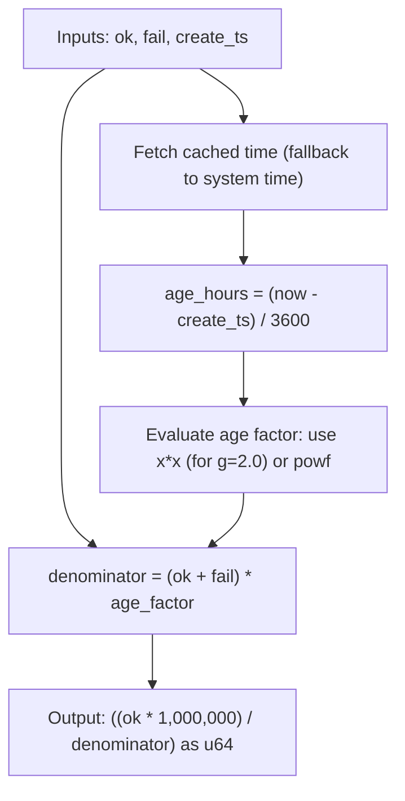

# rank : Hacker News style decay ranking algorithm

## Table of Contents

- [Introduction](#introduction)
- [Usage](#usage)
- [Features](#features)
- [Design](#design)
- [Tech Stack](#tech-stack)
- [Directory Structure](#directory-structure)
- [API](#api)
- [History](#history)

## Introduction

rank balances success rate against time decay using Hacker News ranking formula. It scales floating-point scores to integer values, suited for sorting resources like proxy servers, news feeds, or search results.

## Usage

Add dependency to Cargo.toml:

```toml
[dependencies]
rank = "0.1"
```

Or add via cargo:

```bash
cargo add rank
```

### Basic Example

Compute ranking score:

```rust
use rank::{Rank, RANK};

// Custom Rank instance with base score 100 and gravity 1.8
let ranker = Rank::new(100, 1.8);
let score = ranker.rank(80, 20, 1781497590);

// Global static/const Rank instance (default parameters: base = 10000, g = 2.0)
#[cfg(feature = "const")]
let score_const = RANK.rank(80, 20, 1781497590);
```

## Features

- Hacker News decay formula implementation.
- Reduced division overhead (rearranged mathematically to utilize a single floating-point division).
- Specialized fast-path multiplications for gravity values `g = 2.0` and `g = 1.0` (completely bypassing expensive `powf` calls).
- Zero-syscall cached timestamp fetching using `coarsetime` (with automatic fallback to system time).
- Thread-safe predefined constant `RANK` (enabled by `const` feature).

## Design

Algorithm workflow:



## Tech Stack

- Rust (Edition 2024)
- `coarsetime` (fast time retrieval)

## Directory Structure

```text
.
├── Cargo.toml
├── src
│   ├── lib.rs
│   └── rank.rs
└── tests
    └── main.rs
```

## API

### Rank

Configuration struct.

```rust
pub struct Rank {
  pub base: u64,
  pub g: f64,
}
```

- `base`: base score when total attempts are zero.
- `g`: gravity factor.

#### Methods

- `pub const fn new(base: u64, g: f64) -> Self`: constructor.
- `pub fn rank(&self, ok: u64, fail: u64, create_ts: u64) -> u64`: computes ranking score.

### RANK

Static global default instance (available under `const` feature).

```rust
#[cfg(feature = "const")]
pub const RANK: Rank = Rank::new(10000, 2.0);
```

- `base` is `10000`.
- `g` is `2.0` (standard Hacker News gravity value).

## History

Hacker News ranking algorithm was designed by Paul Graham for Y Combinator's Hacker News. Originally implemented in Lisp dialect Arc, it balances vote count against time decay using gravity. Arc's default gravity was 1.8. This crate provides optimized Rust port with high-speed monotonic clock support.