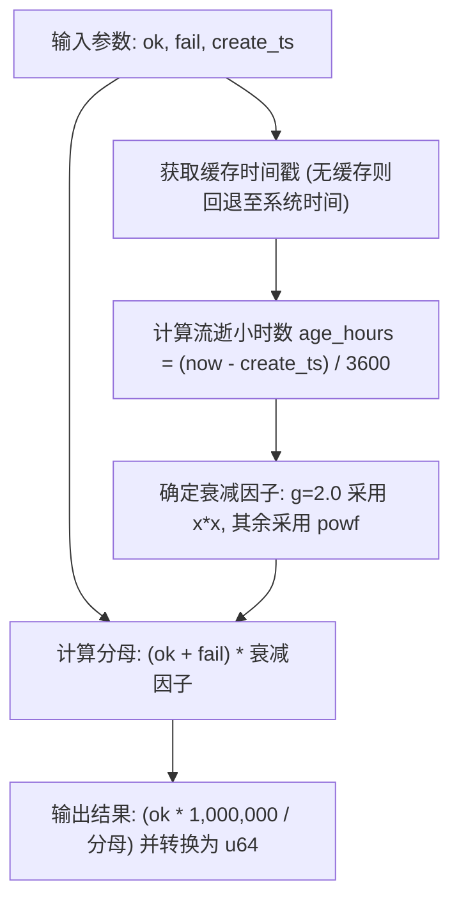

# rank : 基于 Hacker News 公式的排序衰减算法

## 目录

- [项目功能介绍](#项目功能介绍)
- [使用演示](#使用演示)
- [特性介绍](#特性介绍)
- [设计思路](#设计思路)
- [技术堆栈](#技术堆栈)
- [目录结构](#目录结构)
- [API 说明](#api-说明)
- [历史故事](#历史故事)

## 项目功能介绍

rank 利用 Hacker News 排序公式平衡成功率与时间衰减。系统将浮点得分放大并转换为 `u64` 整数，适用于代理服务器、资讯流或搜索结果等资源的质量排序。

## 使用演示

将依赖添加到 Cargo.toml：

```toml
[dependencies]
rank = "0.1"
```

或通过 cargo 安装：

```bash
cargo add rank
```

### 基础示例

计算排序分数：

```rust
use rank::{Rank, RANK};

// 创建自定义 Rank 实例（基准分数 100，衰减重力 1.8）
let ranker = Rank::new(100, 1.8);
let score = ranker.rank(80, 20, 1781497590);

// 全局静态/常量 Rank 实例（默认参数：base = 10000, g = 2.0）
#[cfg(feature = "const")]
let score_const = RANK.rank(80, 20, 1781497590);
```

## 特性介绍

- 实现 Hacker News 衰减公式。
- 极低除法开销（公式经数学变形，单次得分计算仅需 1 次浮点除法）。
- 针对 `g = 2.0`（默认）与 `g = 1.0` 提供了乘法快速通道，彻底避免昂贵的 `powf` 幂运算调用。
- 优先读取 `coarsetime` 高性能缓存时钟以消除系统调用，并在无缓存时自动降级回退至系统时间。
- 线程安全全局常量 `RANK`（通过 `const` 特性启用）。

## 设计思路

计算流程如下：



## 技术堆栈

- Rust (Edition 2024)
- `coarsetime` (高吞吐时间获取)

## 目录结构

```text
.
├── Cargo.toml
├── src
│   ├── lib.rs
│   └── rank.rs
└── tests
    └── main.rs
```

## API 说明

### Rank

算法配置结构体。

```rust
pub struct Rank {
  pub base: u64,
  pub g: f64,
}
```

- `base`: 总尝试次数为零时的初始基准得分。
- `g`: 重力衰减因子。

#### 方法

- `pub const fn new(base: u64, g: f64) -> Self`: 构造函数。
- `pub fn rank(&self, ok: u64, fail: u64, create_ts: u64) -> u64`: 计算排序得分。

### RANK

默认全局静态实例（在启用 `const` 特性时可用）。

```rust
#[cfg(feature = "const")]
pub const RANK: Rank = Rank::new(10000, 2.0);
```

- `base` 初始基准值设为 `10000`。
- `g` 采用标准 Hacker News 衰减因子 `2.0`。

## 历史故事

Hacker News 排序算法由 Paul Graham 创制，用于 Y Combinator 旗下 Hacker News 论坛。算法最早运行于 Lisp 变体 Arc 语言中，核心思路是用重力因子使旧帖分数随时间呈幂律衰减。Arc 语言版本最初使用 1.8 做为默认衰减因子。本库将其移植为 Rust 语言版，并优化底层时钟调用效率。