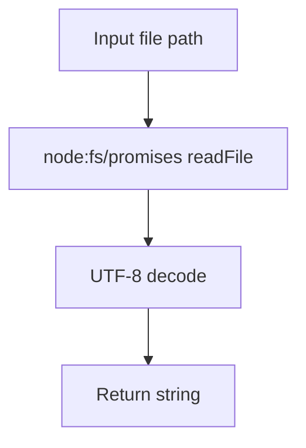
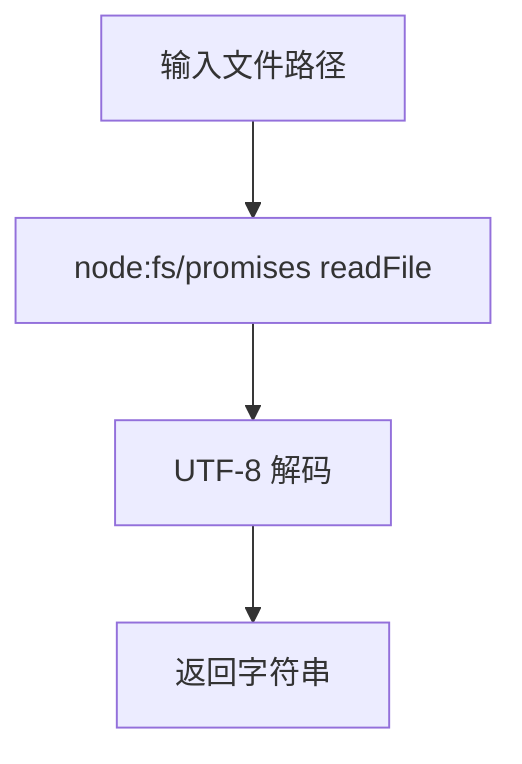

[English](#en) | [中文](#zh)

---

<a id="en"></a>
# @1-/read : Read file as UTF-8 string

- [@1-/read : Read file as UTF-8 string](#1-read-read-file-as-utf-8-string)
  - [Features](#features)
  - [Usage](#usage)
  - [Design](#design)
  - [Tech Stack](#tech-stack)
  - [Code Structure](#code-structure)
  - [History](#history)
  - [About](#about)

## Features

- Reads file content asynchronously
- Wraps Node.js `fs/promises.readFile` API
- Returns UTF-8 decoded string
- Minimal runtime overhead

## Usage

```javascript
import read from "@1-/read";

const content = await read("path/to/file.txt");
console.log(content);
```

## Design

Wraps native promise-based file system API with UTF-8 encoding as default. Input file path, output decoded string.



## Tech Stack

- Runtime: Node.js 18+ / Bun
- Language: JavaScript (ES Module)
- Package format: ESM

## Code Structure

- `src/_.js`: Main implementation exporting default function
- `package.json`: Package metadata and exports configuration
- `tests/_.test.js`: Test suite

## History

In 1992, Ken Thompson and Rob Pike designed UTF-8 encoding on a restaurant placemat. The encoding solved ASCII backward compatibility while enabling universal text representation. This library implements UTF-8 file reading as a minimal utility, reflecting the principle that simple interfaces enable robust systems.

## About

This library is developed by [WebC.site](https://webc.site).

[WebC.site](https://webc.site): A new paradigm of web development for AI


---

<a id="zh"></a>
# @1-/read : 读取文件为 UTF-8 字符串

- [@1-/read : 读取文件为 UTF-8 字符串](#1-read-读取文件为-utf-8-字符串)
  - [功能介绍](#功能介绍)
  - [使用演示](#使用演示)
  - [设计思路](#设计思路)
  - [技术栈](#技术栈)
  - [代码结构](#代码结构)
  - [历史故事](#历史故事)
  - [关于](#关于)

## 功能介绍

- 异步读取文件内容
- 封装 Node.js `fs/promises.readFile` API
- 返回 UTF-8 解码字符串
- 极小运行时开销

## 使用演示

```javascript
import read from "@1-/read";

const content = await read("path/to/file.txt");
console.log(content);
```

## 设计思路

封装原生 Promise 风格文件系统 API，默认使用 UTF-8 编码。输入文件路径，输出解码后字符串。



## 技术栈

- 运行环境：Node.js 18+ / Bun
- 语言：JavaScript (ES Module)
- 包格式：ESM

## 代码结构

- `src/_.js`: 主要实现，导出默认函数
- `package.json`: 包元数据与导出配置
- `tests/_.test.js`: 测试套件

## 历史故事

1992 年，Ken Thompson 与 Rob Pike 在餐厅餐巾纸上设计出 UTF-8 编码。该编码解决 ASCII 向后兼容性问题，同时支持统一文本表示。本库实现 UTF-8 文件读取作为轻量级工具，体现简单接口构建稳健系统的理念。

## 关于

本库由 [WebC.site](https://webc.site) 开发。

[WebC.site](https://webc.site) : 面向人工智能的网站开发新范式

