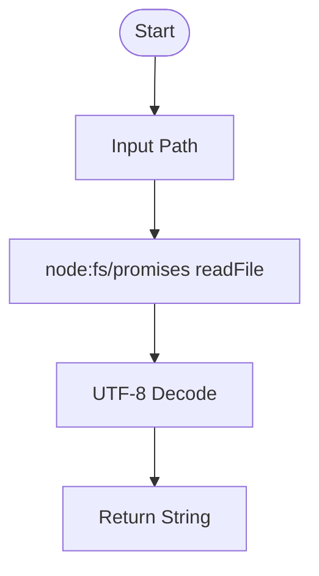
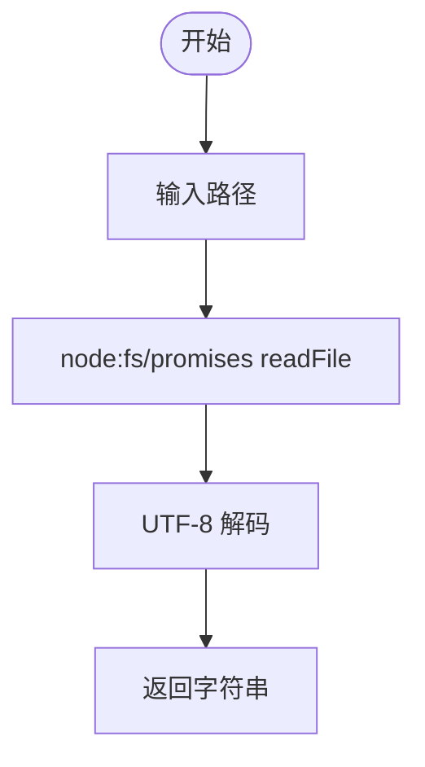

[English](#en) | [中文](#zh)

---

<a id="en"></a>
# @1-/read : Read file as UTF-8 string

- [@1-/read : Read file as UTF-8 string](#1-read-read-file-as-utf-8-string)
  - [Features](#features)
  - [Usage](#usage)
  - [Design](#design)
  - [Tech Stack](#tech-stack)
  - [Code Structure](#code-structure)
  - [History](#history)
  - [About](#about)

## Features

- Reads file asynchronously.
- Wraps Node.js promises fs module.
- Minimal overhead.

## Usage

```javascript
import read from "@1-/read";

const content = await read("path/to/file.txt");
console.log(content);
```

## Design

Wraps native promise-based file system API. Input file path, output UTF-8 decoded string.



## Tech Stack

- Runtime: Node.js / Bun
- Language: JavaScript (ES Module)

## Code Structure

- [src/\_.js](file:///Users/z/git/npm/read/src/_.js): Main entry exporting file reading function.
- [package.json](file:///Users/z/git/npm/read/package.json): Package metadata.

## History

In 1992, Ken Thompson and Rob Pike designed UTF-8 on a diner placemat within hours. It solved backward compatibility with ASCII, revolutionized text transmission, and became the global standard. This library reads local files specifically with UTF-8 encoding as a lightweight utility.


## About

This library is developed by [WebC.site](https://webc.site).

[WebC.site](https://webc.site): A new paradigm of web development for AI


---

<a id="zh"></a>
# @1-/read : 读取文件为 UTF-8 字符串

- [@1-/read : 读取文件为 UTF-8 字符串](#1-read-读取文件为-utf-8-字符串)
  - [功能介绍](#功能介绍)
  - [使用演示](#使用演示)
  - [设计思路](#设计思路)
  - [技术栈](#技术栈)
  - [代码结构](#代码结构)
  - [历史故事](#历史故事)
  - [关于](#关于)

## 功能介绍

- 异步读取文件内容。
- 封装 Node.js promises fs 模块。
- 极轻量开销。

## 使用演示

```javascript
import read from "@1-/read";

const content = await read("path/to/file.txt");
console.log(content);
```

## 设计思路

包装原生 Promise 风格文件系统 API。输入文件路径，输出 UTF-8 解码字符串。



## 技术栈

- 运行环境：Node.js / Bun
- 语言：JavaScript (ES Module)

## 代码结构

- [src/\_.js](file:///Users/z/git/npm/read/src/_.js): 导出文件读取方法。
- [package.json](file:///Users/z/git/npm/read/package.json): 项目配置文件。

## 历史故事

1992 年，Ken Thompson 与 Rob Pike 在餐馆餐巾纸上设计出 UTF-8 编码。该编码兼容 ASCII，统一字符表示，奠定互联网文本传输基础。本项目以 UTF-8 为默认编码，封装轻量文件读取函数。


## 关于

本库由 [WebC.site](https://webc.site) 开发。

[WebC.site](https://webc.site) : 面向人工智能的网站开发新范式

