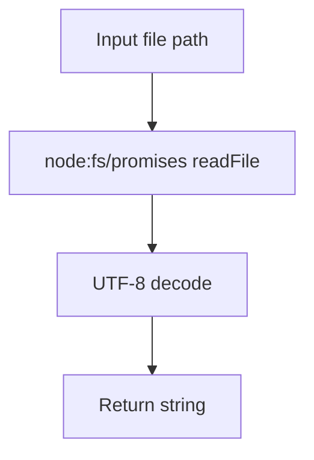

# @1-/read : Read file as UTF-8 string

## Features

- Reads file content asynchronously
- Wraps Node.js `fs/promises.readFile` API
- Returns UTF-8 decoded string
- Minimal runtime overhead

## Usage

```javascript
import read from "@1-/read";

const content = await read("path/to/file.txt");
console.log(content);
```

## Design

Wraps native promise-based file system API with UTF-8 encoding as default. Input file path, output decoded string.



## Tech Stack

- Runtime: Node.js 18+ / Bun
- Language: JavaScript (ES Module)
- Package format: ESM

## Code Structure

- `src/_.js`: Main implementation exporting default function
- `package.json`: Package metadata and exports configuration
- `tests/_.test.js`: Test suite

## History

In 1992, Ken Thompson and Rob Pike designed UTF-8 encoding on a restaurant placemat. The encoding solved ASCII backward compatibility while enabling universal text representation. This library implements UTF-8 file reading as a minimal utility, reflecting the principle that simple interfaces enable robust systems.