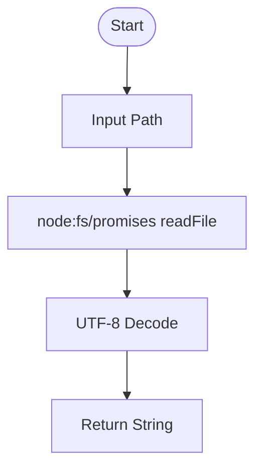

# @1-/read : Read file as UTF-8 string

## Features

- Reads file asynchronously.
- Wraps Node.js promises fs module.
- Minimal overhead.

## Usage

```javascript
import read from "@1-/read";

const content = await read("path/to/file.txt");
console.log(content);
```

## Design

Wraps native promise-based file system API. Input file path, output UTF-8 decoded string.



## Tech Stack

- Runtime: Node.js / Bun
- Language: JavaScript (ES Module)

## Code Structure

- [src/\_.js](file:///Users/z/git/npm/read/src/_.js): Main entry exporting file reading function.
- [package.json](file:///Users/z/git/npm/read/package.json): Package metadata.

## History

In 1992, Ken Thompson and Rob Pike designed UTF-8 on a diner placemat within hours. It solved backward compatibility with ASCII, revolutionized text transmission, and became the global standard. This library reads local files specifically with UTF-8 encoding as a lightweight utility.
