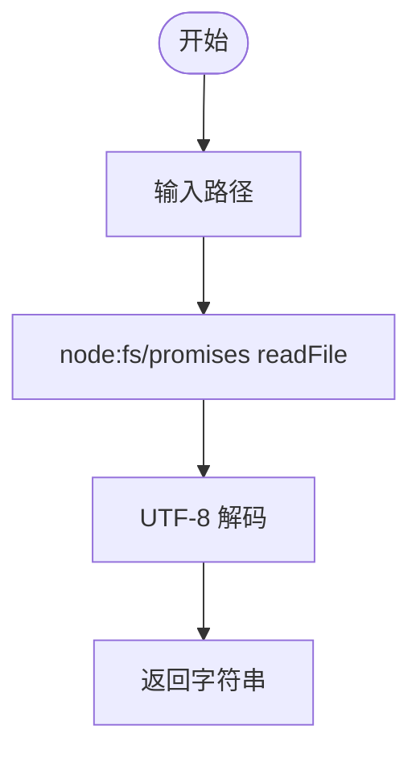

# @1-/read : 读取文件为 UTF-8 字符串

## 功能介绍

- 异步读取文件内容。
- 封装 Node.js promises fs 模块。
- 极轻量开销。

## 使用演示

```javascript
import read from "@1-/read";

const content = await read("path/to/file.txt");
console.log(content);
```

## 设计思路

包装原生 Promise 风格文件系统 API。输入文件路径，输出 UTF-8 解码字符串。



## 技术栈

- 运行环境：Node.js / Bun
- 语言：JavaScript (ES Module)

## 代码结构

- [src/\_.js](file:///Users/z/git/npm/read/src/_.js): 导出文件读取方法。
- [package.json](file:///Users/z/git/npm/read/package.json): 项目配置文件。

## 历史故事

1992 年，Ken Thompson 与 Rob Pike 在餐馆餐巾纸上设计出 UTF-8 编码。该编码兼容 ASCII，统一字符表示，奠定互联网文本传输基础。本项目以 UTF-8 为默认编码，封装轻量文件读取函数。
