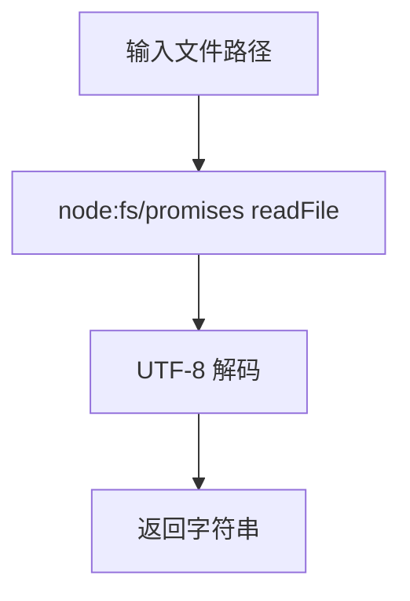

# @1-/read : 读取文件为 UTF-8 字符串

## 功能介绍

- 异步读取文件内容
- 封装 Node.js `fs/promises.readFile` API
- 返回 UTF-8 解码字符串
- 极小运行时开销

## 使用演示

```javascript
import read from "@1-/read";

const content = await read("path/to/file.txt");
console.log(content);
```

## 设计思路

封装原生 Promise 风格文件系统 API，默认使用 UTF-8 编码。输入文件路径，输出解码后字符串。



## 技术栈

- 运行环境：Node.js 18+ / Bun
- 语言：JavaScript (ES Module)
- 包格式：ESM

## 代码结构

- `src/_.js`: 主要实现，导出默认函数
- `package.json`: 包元数据与导出配置
- `test/_.test.js`: 测试套件

## 历史故事

1992 年，Ken Thompson 与 Rob Pike 在餐厅餐巾纸上设计出 UTF-8 编码。该编码解决 ASCII 向后兼容性问题，同时支持统一文本表示。本库实现 UTF-8 文件读取作为轻量级工具，体现简单接口构建稳健系统的理念。