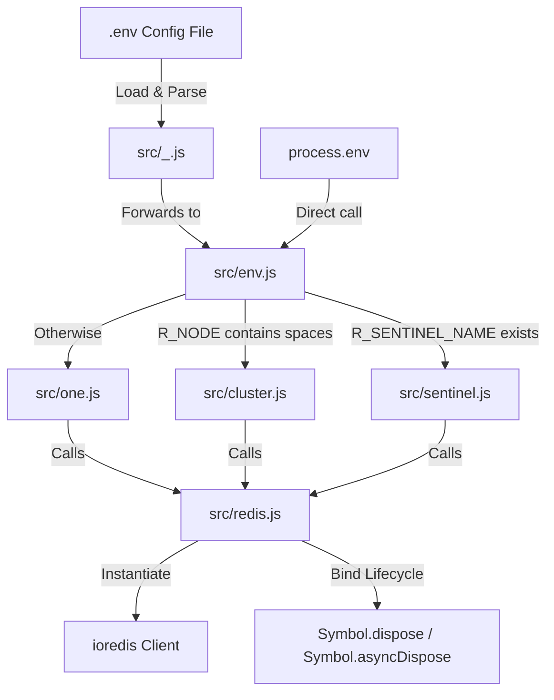
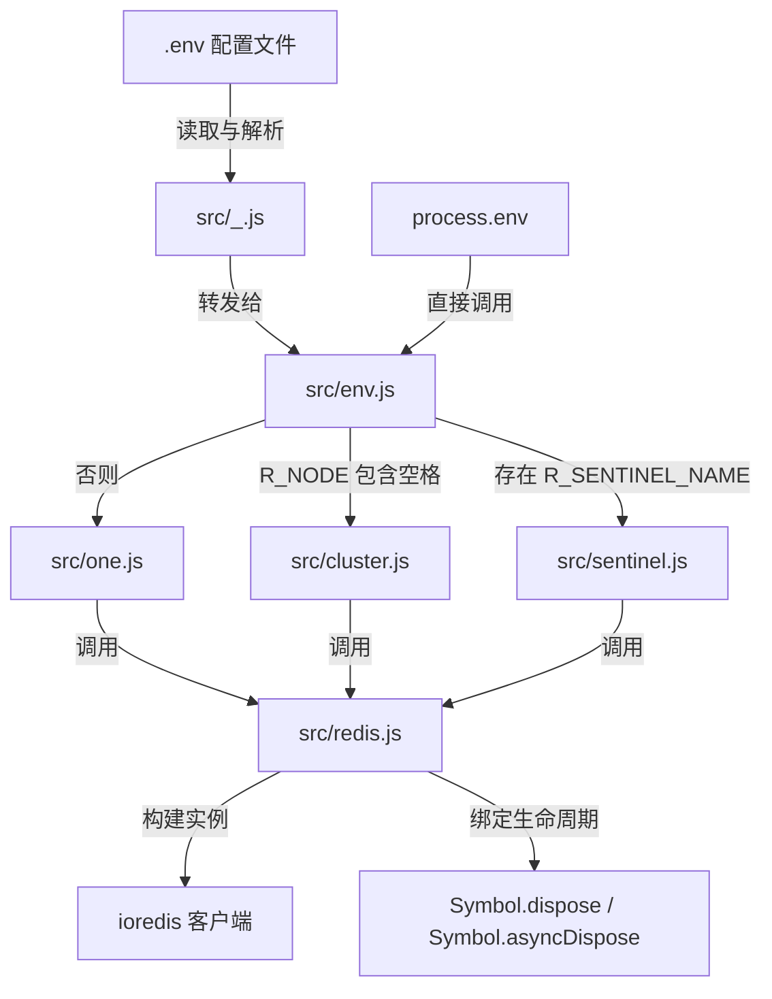

[English](#en) | [中文](#zh)

---

<a id="en"></a>
# @1-/redis : Low-coupling, high-cohesion Redis client wrapper with environment-driven configuration

- [@1-/redis : Low-coupling, high-cohesion Redis client wrapper with environment-driven configuration](#1-redis-low-coupling-high-cohesion-redis-client-wrapper-with-environment-driven-configuration)
  - [Functionality](#functionality)
  - [Usage Demo](#usage-demo)
    - [Installation](#installation)
    - [Single Node Mode](#single-node-mode)
    - [Cluster Mode](#cluster-mode)
    - [Sentinel Mode](#sentinel-mode)
    - [Environment-Driven Mode](#environment-driven-mode)
  - [Design Rationale](#design-rationale)
  - [Technical Stack](#technical-stack)
  - [Code Structure](#code-structure)
  - [Historical Context](#historical-context)
  - [About](#about)

- [Functionality](#functionality)
- [Usage Demo](#usage-demo)
- [Design Rationale](#design-rationale)
- [Technical Stack](#technical-stack)
- [Code Structure](#code-structure)
- [Historical Context](#historical-context)

## Functionality

This package provides a lightweight wrapper around `ioredis` for Redis connections in three modes: single node, sentinel, and cluster. It features automatic resource disposal via JavaScript's `Symbol.dispose` and `Symbol.asyncDispose`, enabling safe connection management with the `using` statement. Configuration is driven by environment variables or `.env` files, with automatic mode detection based on variable presence and format.

## Usage Demo

### Installation

```bash
npm install @1-/redis
```

### Single Node Mode

```javascript
import one from "@1-/redis/one.js";

// host, port, password, db
const client = one("127.0.0.1", 6379, "password", 0);
// Use client...
client.disconnect();
```

### Cluster Mode

```javascript
import cluster from "@1-/redis/cluster.js";

// Space-separated nodes, password
const client = cluster("127.0.0.1:7000 127.0.0.1:7001 127.0.0.1:7002", "password");
// Use client...
client.disconnect();
```

### Sentinel Mode

```javascript
import sentinel from "@1-/redis/sentinel.js";

// Space-separated sentinel nodes, master name, sentinel password, Redis password
const client = sentinel("127.0.0.1:26379 127.0.0.1:26380", "mymaster", "sentinel_pwd", "pwd");
// Use client...
client.disconnect();
```

### Environment-Driven Mode

Create a configuration file (e.g., `redis.env`):

```env
R_NODE='127.0.0.1:6379'
R_PASSWORD='password'
R_DB='0'
```

Or for sentinel:

```env
R_NODE='127.0.0.1:26379 127.0.0.1:26380'
R_PASSWORD='password'
R_SENTINEL_NAME='mymaster'
R_SENTINEL_PASSWORD='sentinel_password'
```

Or for cluster:

```env
R_NODE='127.0.0.1:7000 127.0.0.1:7001 127.0.0.1:7002'
R_PASSWORD='password'
```

Then initialize dynamically:

```javascript
import fromEnv from "@1-/redis";

// path, prefix (default: "R")
const client = fromEnv("./redis.env", "R");
// Use client...
client.disconnect();
```

Or using custom environment dictionary:

```javascript
import { env } from "@1-/redis";

const client = env(process.env, "R");
// Use client...
client.disconnect();
```

## Design Rationale



- **High Cohesion**: Configuration merging and client instantiation logic are centralized in `redis.js`
- **Automatic Resource Management**: Implements both `Symbol.dispose` and `Symbol.asyncDispose` for deterministic connection cleanup
- **Environment-Driven Routing**: Connection mode is automatically selected based on environment variable patterns
- **Low Coupling**: Individual modules handle only parameter transformation; core logic remains in `redis.js`

## Technical Stack

- **Runtime Environment**: Node.js >= 20.12.0 / Bun
- **Redis Client**: `ioredis` v5.11.1
- **Utility Libraries**: `@3-/int`, `@3-/read`
- **Development Tools**: `oxfmt`, `oxlint`

## Code Structure

```
src/
├── _.js           # Package entry point: reads env files and re-exports env.js
├── env.js         # Core routing module: selects connection mode based on environment variables
├── redis.js       # Core instantiation module: handles option merging and lifecycle binding
├── one.js         # Single node connection module
├── sentinel.js    # Sentinel connection module
├── cluster.js     # Cluster connection module
└── nodeSplit.js   # Node parsing utility: converts space-separated addresses to [host, port] arrays
```

## Historical Context

Redis (Remote Dictionary Server) was created by Salvatore Sanfilippo (antirez) in 2009 as a solution to scalability limitations in relational databases for his real-time web analytics service LLOOGG. Redis Sentinel was introduced in 2012 to provide high availability through automatic failover, and Redis Cluster was released in 2015 with Redis 3.0 to enable horizontal scaling without proxies.


## About

This library is developed by [WebC.site](https://webc.site).

[WebC.site](https://webc.site): A new paradigm of web development for AI


---

<a id="zh"></a>
# @1-/redis : 低耦合高内聚的 Redis 客户端封装及环境驱动配置方案

- [@1-/redis : 低耦合高内聚的 Redis 客户端封装及环境驱动配置方案](#1-redis-低耦合高内聚的-redis-客户端封装及环境驱动配置方案)
  - [功能介绍](#功能介绍)
  - [使用演示](#使用演示)
    - [安装](#安装)
    - [单节点模式](#单节点模式)
    - [集群模式](#集群模式)
    - [哨兵模式](#哨兵模式)
    - [环境驱动模式](#环境驱动模式)
  - [设计思路](#设计思路)
  - [技术栈](#技术栈)
  - [代码结构](#代码结构)
  - [历史故事](#历史故事)
  - [关于](#关于)

- [功能介绍](#功能介绍)
- [使用演示](#使用演示)
- [设计思路](#设计思路)
- [技术栈](#技术栈)
- [代码结构](#代码结构)
- [历史故事](#历史故事)

## 功能介绍

本项目提供 `ioredis` 的轻量级封装，支持单节点、哨兵和集群三种 Redis 连接模式。通过 JavaScript 的 `Symbol.dispose` 和 `Symbol.asyncDispose` 实现自动资源释放，支持 `using` 语句进行安全的连接管理。配置采用环境变量或 `.env` 文件驱动，根据变量存在状态和格式自动识别连接模式。

## 使用演示

### 安装

```bash
npm install @1-/redis
```

### 单节点模式

```javascript
import one from "@1-/redis/one.js";

// host, port, password, db
const client = one("127.0.0.1", 6379, "password", 0);
// 使用客户端...
client.disconnect();
```

### 集群模式

```javascript
import cluster from "@1-/redis/cluster.js";

// 空格分隔的节点地址，密码
const client = cluster("127.0.0.1:7000 127.0.0.1:7001 127.0.0.1:7002", "password");
// 使用客户端...
client.disconnect();
```

### 哨兵模式

```javascript
import sentinel from "@1-/redis/sentinel.js";

// 空格分隔的哨兵节点，主节点名，哨兵密码，Redis 密码
const client = sentinel("127.0.0.1:26379 127.0.0.1:26380", "mymaster", "sentinel_pwd", "pwd");
// 使用客户端...
client.disconnect();
```

### 环境驱动模式

创建配置文件（例如 `redis.env`）：

```env
R_NODE='127.0.0.1:6379'
R_PASSWORD='password'
R_DB='0'
```

哨兵配置示例：

```env
R_NODE='127.0.0.1:26379 127.0.0.1:26380'
R_PASSWORD='password'
R_SENTINEL_NAME='mymaster'
R_SENTINEL_PASSWORD='sentinel_password'
```

集群配置示例：

```env
R_NODE='127.0.0.1:7000 127.0.0.1:7001 127.0.0.1:7002'
R_PASSWORD='password'
```

动态初始化：

```javascript
import fromEnv from "@1-/redis";

// 路径，环境变量前缀（默认 "R"）
const client = fromEnv("./redis.env", "R");
// 使用客户端...
client.disconnect();
```

或直接使用环境变量字典：

```javascript
import { env } from "@1-/redis";

const client = env(process.env, "R");
// 使用客户端...
client.disconnect();
```

## 设计思路



- **高内聚**：配置合并与客户端实例化逻辑集中在 `redis.js` 中
- **自动资源管理**：实现 `Symbol.dispose` 和 `Symbol.asyncDispose`，确保连接确定性释放
- **环境驱动路由**：根据环境变量存在状态和格式自动选择连接模式
- **低耦合**：各模块仅负责参数转换，核心逻辑统一在 `redis.js` 中处理

## 技术栈

- **运行时环境**：Node.js >= 20.12.0 / Bun
- **Redis 客户端**：`ioredis` v5.11.1
- **辅助库**：`@3-/int`, `@3-/read`
- **开发工具**：`oxfmt`, `oxlint`

## 代码结构

```
src/
├── _.js           # 模块入口点：读取 env 文件并重新导出 env.js
├── env.js         # 核心路由模块：根据环境变量自动选择连接模式
├── redis.js       # 核心实例化模块：处理配置项合并及生命周期绑定
├── one.js         # 单节点连接模块
├── sentinel.js    # 哨兵连接模块
├── cluster.js     # 集群连接模块
└── nodeSplit.js   # 节点解析工具：将空格分隔的地址转为 [host, port] 数组
```

## 历史故事

Redis（远程字典服务器）由 Salvatore Sanfilippo（antirez）于 2009 年创建，旨在解决其实时网络分析服务 LLOOGG 在关系型数据库中遇到的可扩展性限制。Redis Sentinel 于 2012 年发布，通过自动故障转移提供高可用性；Redis Cluster 则于 2015 年随 Redis 3.0 正式发布，实现无需代理的水平扩展能力。


## 关于

本库由 [WebC.site](https://webc.site) 开发。

[WebC.site](https://webc.site) : 面向人工智能的网站开发新范式

