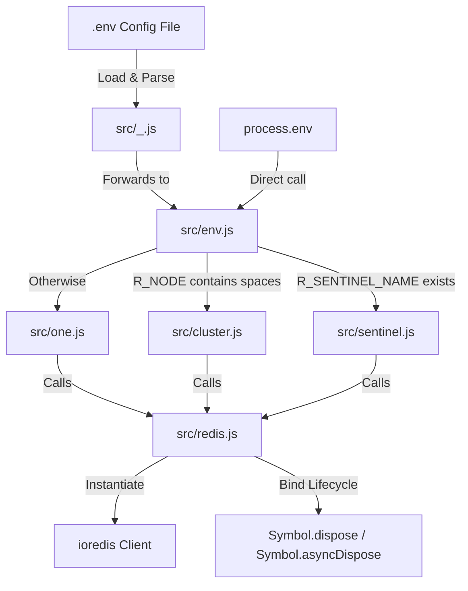

# @1-/redis : Low-coupling, high-cohesion Redis client wrapper with environment-driven configuration

- [Functionality](#functionality)
- [Usage Demo](#usage-demo)
- [Design Rationale](#design-rationale)
- [Technical Stack](#technical-stack)
- [Code Structure](#code-structure)
- [Historical Context](#historical-context)

## Functionality

This package provides a lightweight wrapper around `ioredis` for Redis connections in three modes: single node, sentinel, and cluster. It features automatic resource disposal via JavaScript's `Symbol.dispose` and `Symbol.asyncDispose`, enabling safe connection management with the `using` statement. Configuration is driven by environment variables or `.env` files, with automatic mode detection based on variable presence and format.

## Usage Demo

### Installation

```bash
npm install @1-/redis
```

### Single Node Mode

```javascript
import one from "@1-/redis/one.js";

// host, port, password, db
const client = one("127.0.0.1", 6379, "password", 0);
// Use client...
client.disconnect();
```

### Cluster Mode

```javascript
import cluster from "@1-/redis/cluster.js";

// Space-separated nodes, password
const client = cluster("127.0.0.1:7000 127.0.0.1:7001 127.0.0.1:7002", "password");
// Use client...
client.disconnect();
```

### Sentinel Mode

```javascript
import sentinel from "@1-/redis/sentinel.js";

// Space-separated sentinel nodes, master name, sentinel password, Redis password
const client = sentinel("127.0.0.1:26379 127.0.0.1:26380", "mymaster", "sentinel_pwd", "pwd");
// Use client...
client.disconnect();
```

### Environment-Driven Mode

Create a configuration file (e.g., `redis.env`):

```env
R_NODE='127.0.0.1:6379'
R_PASSWORD='password'
R_DB='0'
```

Or for sentinel:

```env
R_NODE='127.0.0.1:26379 127.0.0.1:26380'
R_PASSWORD='password'
R_SENTINEL_NAME='mymaster'
R_SENTINEL_PASSWORD='sentinel_password'
```

Or for cluster:

```env
R_NODE='127.0.0.1:7000 127.0.0.1:7001 127.0.0.1:7002'
R_PASSWORD='password'
```

Then initialize dynamically:

```javascript
import fromEnv from "@1-/redis";

// path, prefix (default: "R")
const client = fromEnv("./redis.env", "R");
// Use client...
client.disconnect();
```

Or using custom environment dictionary:

```javascript
import { env } from "@1-/redis";

const client = env(process.env, "R");
// Use client...
client.disconnect();
```

## Design Rationale



- **High Cohesion**: Configuration merging and client instantiation logic are centralized in `redis.js`
- **Automatic Resource Management**: Implements both `Symbol.dispose` and `Symbol.asyncDispose` for deterministic connection cleanup
- **Environment-Driven Routing**: Connection mode is automatically selected based on environment variable patterns
- **Low Coupling**: Individual modules handle only parameter transformation; core logic remains in `redis.js`

## Technical Stack

- **Runtime Environment**: Node.js >= 20.12.0 / Bun
- **Redis Client**: `ioredis` v5.11.1
- **Utility Libraries**: `@3-/int`, `@3-/read`
- **Development Tools**: `oxfmt`, `oxlint`

## Code Structure

```
src/
├── _.js           # Package entry point: reads env files and re-exports env.js
├── env.js         # Core routing module: selects connection mode based on environment variables
├── redis.js       # Core instantiation module: handles option merging and lifecycle binding
├── one.js         # Single node connection module
├── sentinel.js    # Sentinel connection module
├── cluster.js     # Cluster connection module
└── nodeSplit.js   # Node parsing utility: converts space-separated addresses to [host, port] arrays
```

## Historical Context

Redis (Remote Dictionary Server) was created by Salvatore Sanfilippo (antirez) in 2009 as a solution to scalability limitations in relational databases for his real-time web analytics service LLOOGG. Redis Sentinel was introduced in 2012 to provide high availability through automatic failover, and Redis Cluster was released in 2015 with Redis 3.0 to enable horizontal scaling without proxies.
