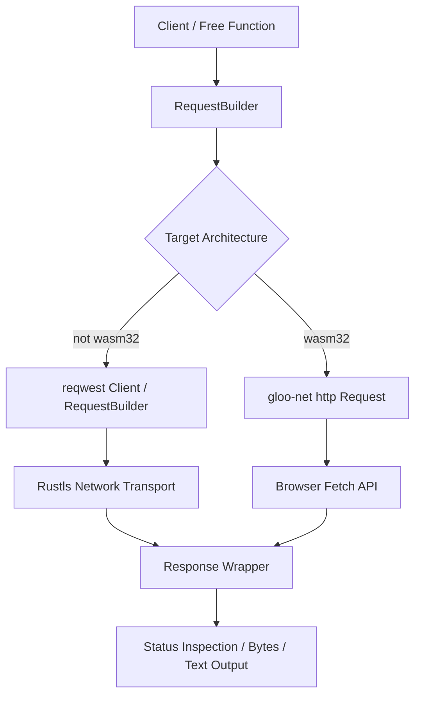

# reqer : Unified cross-platform HTTP client for native and WebAssembly

## Overview

reqer provides unified, asynchronous HTTP client interfaces across native targets and WebAssembly environments.

On native targets, reqer wraps reqwest with rustls support for high-throughput network operations.

On WebAssembly browser targets, reqer delegates network requests to the browser Fetch API via gloo-net.

## Features

- Cross-platform consistency: Uniform request construction and response parsing across native and WebAssembly targets.
- Zero-overhead abstraction: Conditional compilation eliminates runtime routing penalties.
- Ergonomic builder pattern: Method chaining for headers, body payloads, and HTTP verbs.
- Direct helper functions: Instant request execution via top-level functions without manual client instantiation.

## Usage

Add reqer to Cargo.toml:

```toml
[dependencies]
reqer = "0.1"
tokio = { version = "1", features = ["full"] }
```

Send GET request and inspect response:

```rust
use reqer::{Result, get};

#[tokio::main]
async fn main() -> Result<()> {
  let res = get("https://httpbin.org/get")
    .header("User-Agent", "reqer-demo")
    .send()
    .await?;

  if res.is_success() {
    let body = res.text().await?;
    println!("{body}");
  }

  Ok(())
}
```

Reuse Client instance for multiple requests:

```rust
use bytes::Bytes;
use reqer::{Client, Result};

#[tokio::main]
async fn main() -> Result<()> {
  let client = Client::new();

  let res = client
    .post("https://httpbin.org/post")
    .header("Content-Type", "application/json")
    .body(Bytes::from_static(b"{\"key\": \"value\"}"))
    .send()
    .await?;

  println!("Status: {}", res.status());
  let bytes = res.bytes().await?;
  println!("Received bytes: {}", bytes.len());

  Ok(())
}
```

## Design



## Tech Stack

- Language: Rust 2024
- Native HTTP Backend: `reqwest 0.13` (rustls)
- WebAssembly HTTP Backend: `gloo-net 0.7`, `js-sys 0.3`
- Data Buffer: `bytes 1.12`
- Error Definition: `thiserror 2.0`

## Directory Structure

```
.
├── Cargo.toml
├── README.md
├── README.mdt
├── readme
│   ├── en.md
│   └── zh.md
├── src
│   ├── client.rs
│   ├── error.rs
│   ├── lib.rs
│   ├── request.rs
│   └── response.rs
└── tests
    └── main.rs
```

## API Documentation

### Free Functions

- `get(url: impl AsRef<str>) -> RequestBuilder`: Initiates GET request builder.
- `post(url: impl AsRef<str>) -> RequestBuilder`: Initiates POST request builder.
- `put(url: impl AsRef<str>) -> RequestBuilder`: Initiates PUT request builder.
- `delete(url: impl AsRef<str>) -> RequestBuilder`: Initiates DELETE request builder.
- `patch(url: impl AsRef<str>) -> RequestBuilder`: Initiates PATCH request builder.
- `head(url: impl AsRef<str>) -> RequestBuilder`: Initiates HEAD request builder.

### `Client`

HTTP client struct managing reusable connections on native platforms.

- `Client::new() -> Self`: Creates client instance.
- `client.get(url: impl AsRef<str>) -> RequestBuilder`: Builds GET request.
- `client.post(url: impl AsRef<str>) -> RequestBuilder`: Builds POST request.
- `client.put(url: impl AsRef<str>) -> RequestBuilder`: Builds PUT request.
- `client.delete(url: impl AsRef<str>) -> RequestBuilder`: Builds DELETE request.
- `client.patch(url: impl AsRef<str>) -> RequestBuilder`: Builds PATCH request.
- `client.head(url: impl AsRef<str>) -> RequestBuilder`: Builds HEAD request.
- `client.req(method: Method, url: impl AsRef<str>) -> RequestBuilder`: Builds request with specified HTTP method.

### `RequestBuilder`

Request configuration builder.

- `header(key: impl AsRef<str>, val: impl AsRef<str>) -> Self`: Appends single HTTP header.
- `headers(iter: impl IntoIterator<Item = (K, V)>) -> Self`: Appends collection of HTTP headers.
- `body(body: impl Into<Bytes>) -> Self`: Sets request payload body.
- `async fn send(self) -> Result<Response>`: Dispatches HTTP request asynchronously.

### `Response`

Unified response wrapper across targets.

- `status(&self) -> u16`: Returns HTTP status code number.
- `is_success(&self) -> bool`: Checks if status code falls within 200..299.
- `is_client_error(&self) -> bool`: Checks if status code falls within 400..499.
- `is_server_error(&self) -> bool`: Checks if status code falls within 500..599.
- `error_for_status(self) -> Result<Self>`: Validates status code, returning `Error::Status` if client or server error.
- `async fn bytes(self) -> Result<Bytes>`: Reads response body as `Bytes`.
- `async fn text(self) -> Result<String>`: Reads response body as `String`.

### `Method`

Enum representing HTTP methods: `GET`, `POST`, `PUT`, `DELETE`, `PATCH`, `HEAD`.

### `Error` & `Result`

- `Result<T>`: Type alias for `std::result::Result<T, Error>`.
- `Error`: Enum covering `Http` (wrapped reqwest or gloo-net error), `Status(u16, String)`, and `Header`.

## Historical Trivia

**The Evolution from Line Protocol to WebAssembly Fetch**

In 1991, Tim Berners-Lee specified HTTP/0.9 as a single-line ASCII protocol: clients sent only `GET /path` followed by a newline, and servers returned raw hypertext before closing the connection. Headers, status codes, and body payloads did not exist.

Over three decades later, modern web computing spans server clusters and browser runtimes. Rust applications targeting WebAssembly cannot access raw TCP sockets directly due to browser sandbox constraints, relying instead on the asynchronous JavaScript Fetch API. Libraries like `reqer` bridge native socket-level networking and browser Fetch implementations, allowing identical client code to run across diverse target environments.