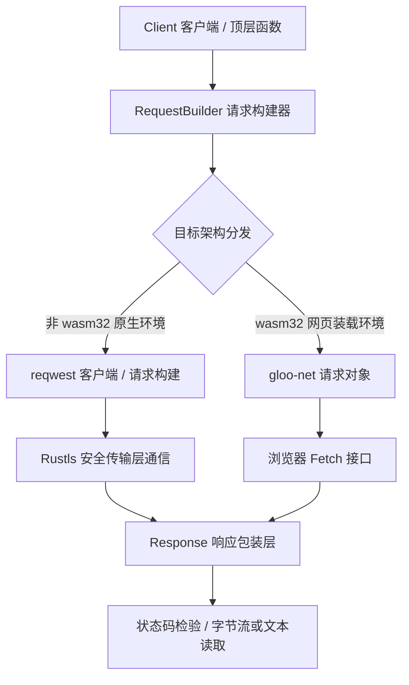

# reqer : 跨平台原生与 WebAssembly 统一 HTTP 客户端

## 项目功能介绍

reqer 提供跨平台统一异步 HTTP 客户端接口。

原生平台编译时，底层基于 reqwest 与 rustls 实现高吞吐网络通信。

WebAssembly 浏览器环境编译时，底层通过 gloo-net 桥接调用浏览器 Fetch 接口。

## 特性介绍

- 跨平台一致：原生平台与 WebAssembly 共享相同 API 设计。
- 零运行时损耗：借助编译期条件编译分发，无额外动态路由开销。
- 链式请求构建：支持链式配置请求头、请求体与请求方法。
- 快捷函数支持：提供顶层快捷函数，无需手动初始化客户端即可发起请求。

## 使用演示

在 Cargo.toml 中添加依赖：

```toml
[dependencies]
reqer = "0.1"
tokio = { version = "1", features = ["full"] }
```

发送 GET 请求并解析响应：

```rust
use reqer::{Result, get};

#[tokio::main]
async fn main() -> Result<()> {
  let res = get("https://httpbin.org/get")
    .header("User-Agent", "reqer-demo")
    .send()
    .await?;

  if res.is_success() {
    let body = res.text().await?;
    println!("{body}");
  }

  Ok(())
}
```

复用客户端实例发送 POST 请求：

```rust
use bytes::Bytes;
use reqer::{Client, Result};

#[tokio::main]
async fn main() -> Result<()> {
  let client = Client::new();

  let res = client
    .post("https://httpbin.org/post")
    .header("Content-Type", "application/json")
    .body(Bytes::from_static(b"{\"key\": \"value\"}"))
    .send()
    .await?;

  println!("Status: {}", res.status());
  let bytes = res.bytes().await?;
  println!("Received bytes: {}", bytes.len());

  Ok(())
}
```

## 设计思路



## 技术堆栈

- 编程语言：Rust 2024
- 原生端核心库：`reqwest 0.13` (rustls)
- WebAssembly 端核心库：`gloo-net 0.7`、`js-sys 0.3`
- 数据载荷：`bytes 1.12`
- 错误定义：`thiserror 2.0`

## 目录结构

```
.
├── Cargo.toml
├── README.md
├── README.mdt
├── readme
│   ├── en.md
│   └── zh.md
├── src
│   ├── client.rs
│   ├── error.rs
│   ├── lib.rs
│   ├── request.rs
│   └── response.rs
└── tests
    └── main.rs
```

## API 说明

### 顶层快捷函数

- `get(url: impl AsRef<str>) -> RequestBuilder`: 创建 GET 请求构建器。
- `post(url: impl AsRef<str>) -> RequestBuilder`: 创建 POST 请求构建器。
- `put(url: impl AsRef<str>) -> RequestBuilder`: 创建 PUT 请求构建器。
- `delete(url: impl AsRef<str>) -> RequestBuilder`: 创建 DELETE 请求构建器。
- `patch(url: impl AsRef<str>) -> RequestBuilder`: 创建 PATCH 请求构建器。
- `head(url: impl AsRef<str>) -> RequestBuilder`: 创建 HEAD 请求构建器。

### `Client` 结构体

HTTP 客户端结构体，原生端复用内部连接。

- `Client::new() -> Self`: 创建客户端实例。
- `client.get(url: impl AsRef<str>) -> RequestBuilder`: 创建 GET 请求构建器。
- `client.post(url: impl AsRef<str>) -> RequestBuilder`: 创建 POST 请求构建器。
- `client.put(url: impl AsRef<str>) -> RequestBuilder`: 创建 PUT 请求构建器。
- `client.delete(url: impl AsRef<str>) -> RequestBuilder`: 创建 DELETE 请求构建器。
- `client.patch(url: impl AsRef<str>) -> RequestBuilder`: 创建 PATCH 请求构建器。
- `client.head(url: impl AsRef<str>) -> RequestBuilder`: 创建 HEAD 请求构建器。
- `client.req(method: Method, url: impl AsRef<str>) -> RequestBuilder`: 根据指定方法创建请求构建器。

### `RequestBuilder` 结构体

请求参数构建结构体。

- `header(key: impl AsRef<str>, val: impl AsRef<str>) -> Self`: 设置键值对请求头。
- `headers(iter: impl IntoIterator<Item = (K, V)>) -> Self`: 批量设置请求头。
- `body(body: impl Into<Bytes>) -> Self`: 设置请求载荷内容。
- `async fn send(self) -> Result<Response>`: 异步发送网络请求。

### `Response` 结构体

跨平台统一响应结构体。

- `status(&self) -> u16`: 获取 HTTP 状态码。
- `is_success(&self) -> bool`: 判断状态码是否属于 200..299 成功区间。
- `is_client_error(&self) -> bool`: 判断状态码是否属于 400..499 客户端错误区间。
- `is_server_error(&self) -> bool`: 判断状态码是否属于 500..599 服务端错误区间。
- `error_for_status(self) -> Result<Self>`: 校验状态码，若为客户端或服务端错误返回 `Error::Status`。
- `async fn bytes(self) -> Result<Bytes>`: 读取响应体原始字节。
- `async fn text(self) -> Result<String>`: 读取响应体文本字符串。

### `Method` 枚举

HTTP 请求方法枚举，包含 `GET`、`POST`、`PUT`、`DELETE`、`PATCH`、`HEAD`。

### `Error` 枚举与 `Result` 类型别名

- `Result<T>`: `std::result::Result<T, Error>` 的类型别名。
- `Error`: 错误枚举，包含 `Http`（底层网络错误）、`Status(u16, String)`（状态码异常）、`Header`（请求头格式错误）。

## 历史小故事

**从单行协议到浏览器沙箱网络**

1991 年 Tim Berners-Lee 提出 HTTP/0.9 规范，设计极其简约，仅包含单行 ASCII 指令：客户端发出 `GET /路径` 并回车换行，服务端即直接返回超文本数据并关闭连接，当时尚无状态码、请求头与多媒体载荷机制。

三十余年后，现代计算环境扩展至浏览器端 WebAssembly 沙箱。浏览器环境出于安全考量限制底层 TCP 套接字直连，强制经由异步 Fetch 接口收发请求。`reqer` 统一原生网络调用与浏览器环境接口，使 Rust 应用在不同运行平台具备统一的 HTTP 请求体验。