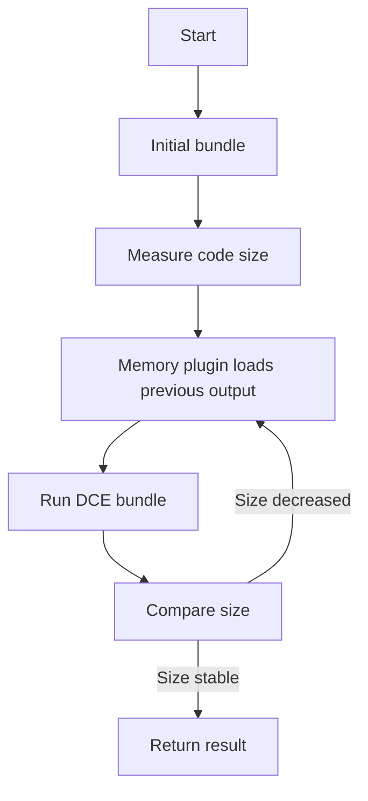
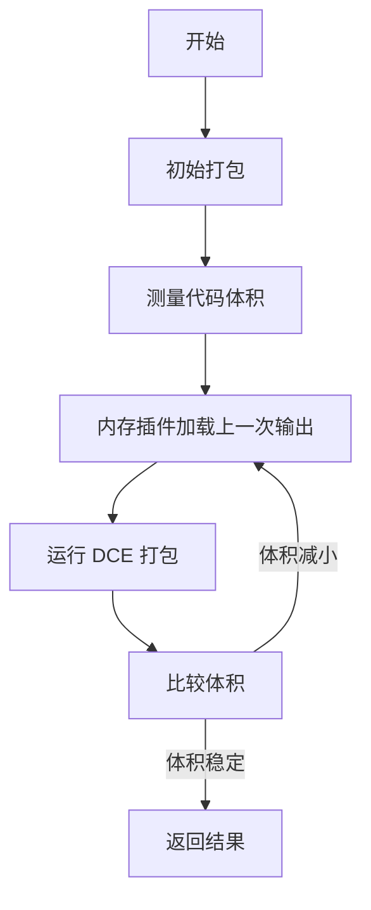

[English](#en) | [中文](#zh)

---

<a id="en"></a>

# @1-/rolldown : High-performance JavaScript bundler with iterative DCE optimization

- [@1-/rolldown : High-performance JavaScript bundler with iterative DCE optimization](#1-rolldown-high-performance-javascript-bundler-with-iterative-dce-optimization)
  - [Functionality](#functionality)
  - [Usage demonstration](#usage-demonstration)
  - [Design rationale](#design-rationale)
  - [Technology stack](#technology-stack)
  - [Code structure](#code-structure)
  - [Historical context](#historical-context)
  - [About](#about)

## Functionality

This package provides a wrapper around the rolldown bundler that implements automatic iterative Dead Code Elimination (DCE). It repeatedly runs the bundling process until output code size stabilizes, achieving optimal DCE without manual configuration. Leveraging rolldown's native DCE capabilities, it delivers maximum dead code removal efficiency out of the box while preserving ESM output format.

## Usage demonstration

Install the package:

```bash
npm install @1-/rolldown
```

Use in JavaScript:

```javascript
import rolldown from "@1-/rolldown";

// Basic usage (no DCE)
const [code, map] = await rolldown("./src/index.js");

// With iterative DCE optimization
const [minifiedCode, minifiedMap] = await rolldown("./src/index.js", {}, true);

// Write to file
import { minifyTo } from "@1-/rolldown";
await minifyTo("./src/index.js", "./dist/bundle.js");

// Support for multiple files
await minifyTo(["./src/a.js", "./src/b.js"], ["./dist/a.js", "./dist/b.js"]);
```

## Design rationale

The core design implements iterative DCE using a memory plugin that loads the previous bundle output as a virtual entry point. The bundler runs repeatedly until code size no longer decreases. This approach leverages rolldown's native DCE capabilities to ensure optimal dead code elimination across different code structures.



## Technology stack

- rolldown: Fast Rust-based JavaScript/TypeScript bundler
- @3-/merge: Configuration merging utility
- @3-/write: File writing utility
- Node.js: Runtime environment

## Code structure

```
src/
├── _.js          # Main entry point with iterative DCE logic and memory plugin implementation
```

## Historical context

JavaScript bundlers evolved from Browserify's simple concatenation to Webpack and Rollup's modular systems. Rolldown represents the next generation, leveraging Rust's performance for sub-second builds while maintaining Rollup's API compatibility. This wrapper enhances rolldown with compiler-inspired iterative DCE optimization techniques.

## About

This library is developed by [WebC.site](https://webc.site).

[WebC.site](https://webc.site): A new paradigm of web development for AI

---

<a id="zh"></a>

# @1-/rolldown : 高性能 JavaScript 打包器与迭代压缩工具

- [@1-/rolldown : 高性能 JavaScript 打包器与迭代压缩工具](#1-rolldown-高性能-javascript-打包器与迭代压缩工具)
  - [功能介绍](#功能介绍)
  - [使用演示](#使用演示)
  - [设计思路](#设计思路)
  - [技术栈](#技术栈)
  - [代码结构](#代码结构)
  - [历史故事](#历史故事)
  - [关于](#关于)

## 功能介绍

此包提供 rolldown 打包器的封装，实现自动迭代 Dead Code Elimination（DCE）优化。通过重复运行打包过程直至输出代码体积稳定，达到最优代码消除效果。基于 rolldown 的原生 DCE 能力，无需手动配置即可移除未使用代码，同时保持 ESM 输出格式。

## 使用演示

安装包：

```bash
npm install @1-/rolldown
```

在 JavaScript 中使用：

```javascript
import rolldown from "@1-/rolldown";

// 基础用法（无压缩）
const [code, map] = await rolldown("./src/index.js");

// 启用迭代 DCE 压缩
const [minifiedCode, minifiedMap] = await rolldown("./src/index.js", {}, true);

// 写入文件
import { minifyTo } from "@1-/rolldown";
await minifyTo("./src/index.js", "./dist/bundle.js");

// 支持多文件打包
await minifyTo(["./src/a.js", "./src/b.js"], ["./dist/a.js", "./dist/b.js"]);
```

## 设计思路

核心设计采用迭代 DCE 机制，通过内存插件将前一次打包输出作为虚拟入口，重复运行打包过程直至代码体积不再减小。该方法利用 rolldown 的原生 DCE 能力，确保在不同代码结构下都能达到最优 Dead Code Elimination 效果。



## 技术栈

- rolldown：基于 Rust 的高性能 JavaScript/TypeScript 打包器
- @3-/merge：配置合并工具
- @3-/write：文件写入工具
- Node.js：运行时环境

## 代码结构

```
src/
├── _.js          # 主入口文件，包含迭代 DCE 逻辑与内存插件实现
```

## 历史故事

JavaScript 打包工具从 Browserify 的简单连接演变为 Webpack 和 Rollup 的模块化系统。Rolldown 代表新一代打包器，利用 Rust 性能实现亚秒级构建，同时保持 Rollup 的 API 兼容性。此封装通过受编译器优化启发的迭代 DCE 技术，将 Dead Code Elimination 效果提升到新水平。

## 关于

本库由 [WebC.site](https://webc.site) 开发。

[WebC.site](https://webc.site) : 面向人工智能的网站开发新范式
