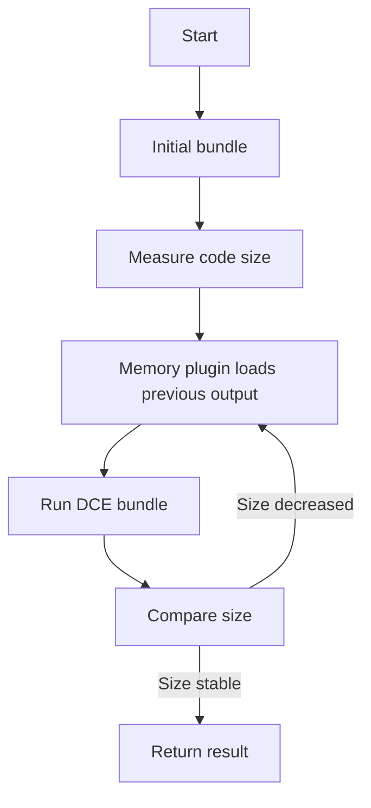

# @1-/rolldown : High-performance JavaScript bundler with iterative DCE optimization

## Functionality

This package provides a wrapper around the rolldown bundler that implements automatic iterative Dead Code Elimination (DCE). It repeatedly runs the bundling process until output code size stabilizes, achieving optimal DCE without manual configuration. Leveraging rolldown's native DCE capabilities, it delivers maximum dead code removal efficiency out of the box while preserving ESM output format.

## Usage demonstration

Install the package:

```bash
npm install @1-/rolldown
```

Use in JavaScript:

```javascript
import rolldown from "@1-/rolldown";

// Basic usage (no DCE)
const [code, map] = await rolldown("./src/index.js");

// With iterative DCE optimization
const [minifiedCode, minifiedMap] = await rolldown("./src/index.js", {}, true);

// Write to file
import { minifyTo } from "@1-/rolldown";
await minifyTo("./src/index.js", "./dist/bundle.js");

// Support for multiple files
await minifyTo(["./src/a.js", "./src/b.js"], ["./dist/a.js", "./dist/b.js"]);
```

## Design rationale

The core design implements iterative DCE using a memory plugin that loads the previous bundle output as a virtual entry point. The bundler runs repeatedly until code size no longer decreases. This approach leverages rolldown's native DCE capabilities to ensure optimal dead code elimination across different code structures.



## Technology stack

- rolldown: Fast Rust-based JavaScript/TypeScript bundler
- @3-/merge: Configuration merging utility
- @3-/write: File writing utility
- Node.js: Runtime environment

## Code structure

```
src/
├── _.js          # Main entry point with iterative DCE logic and memory plugin implementation
```

## Historical context

JavaScript bundlers evolved from Browserify's simple concatenation to Webpack and Rollup's modular systems. Rolldown represents the next generation, leveraging Rust's performance for sub-second builds while maintaining Rollup's API compatibility. This wrapper enhances rolldown with compiler-inspired iterative DCE optimization techniques.