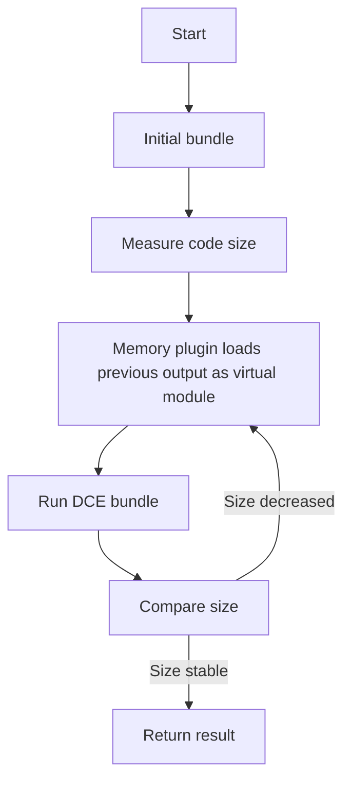

# @1-/rolldown : High-performance JavaScript bundler with iterative DCE optimization

## Functionality

This package provides a wrapper around the rolldown bundler that implements automatic iterative Dead Code Elimination (DCE). It repeatedly runs the bundling process until output code size stabilizes, achieving optimal dead code removal without manual configuration. Leveraging rolldown's native `dce-only` minification mode, it delivers maximum dead code elimination efficiency out of the box while preserving ESM output format.

## Usage demonstration

Install the package:

```bash
npm install @1-/rolldown
```

Use in JavaScript:

```javascript
import rolldown from "@1-/rolldown";

// Basic usage (no DCE optimization)
const [code, map] = await rolldown("./src/index.js");

// With iterative DCE optimization
const [minifiedCode, minifiedMap] = await rolldown("./src/index.js", {}, true);

// Write to file
import { minifyTo } from "@1-/rolldown";
await minifyTo("./src/index.js", "./dist/bundle.js");

// Support for multiple files (array form)
await minifyTo(["./src/a.js", "./src/b.js"], ["./dist/a.js", "./dist/b.js"]);

// Support for multiple files (object mapping form)
await minifyTo(
  {
    main: "./src/main.js",
    utils: "./src/utils.js",
  },
  {
    main: "./dist/main.js",
    utils: "./dist/utils.js",
  },
);
```

## Design rationale

The core design implements iterative DCE using a memory plugin that loads previous bundle outputs as virtual modules. The memory plugin supports both direct module ID resolution and relative path imports (`.js`, `./`, `../`), ensuring virtual modules resolve correctly in different contexts. The bundler runs repeatedly until code size no longer decreases.



## Technology stack

- rolldown: Fast Rust-based JavaScript/TypeScript bundler
- @3-/merge: Configuration merging utility
- @3-/write: File writing utility
- Node.js: Runtime environment

## Code structure

```
src/
├── _.js          # Main entry point with iterative DCE logic, memory plugin implementation, and bundling coordinator
```

## Historical context

JavaScript bundlers evolved from Browserify's simple concatenation to Webpack and Rollup's modular systems. Rolldown represents the next generation, leveraging Rust's performance for sub-second builds while maintaining Rollup's API compatibility. This wrapper enhances rolldown with compiler-inspired iterative DCE optimization techniques.
