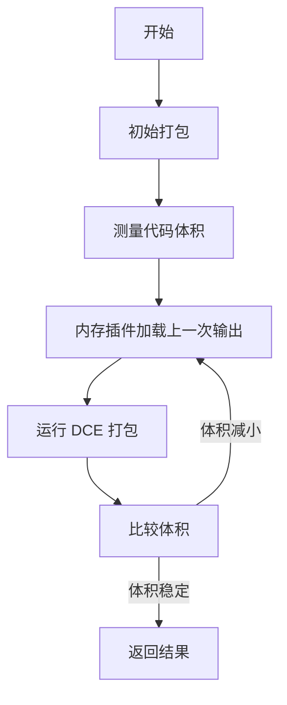

# @1-/rolldown : 高性能 JavaScript 打包器与迭代压缩工具

## 功能介绍

此包提供 rolldown 打包器的封装，实现自动迭代 Dead Code Elimination（DCE）优化。通过重复运行打包过程直至输出代码体积稳定，达到最优代码消除效果。基于 rolldown 的原生 DCE 能力，无需手动配置即可移除未使用代码，同时保持 ESM 输出格式。

## 使用演示

安装包：

```bash
npm install @1-/rolldown
```

在 JavaScript 中使用：

```javascript
import rolldown from "@1-/rolldown";

// 基础用法（无压缩）
const [code, map] = await rolldown("./src/index.js");

// 启用迭代 DCE 压缩
const [minifiedCode, minifiedMap] = await rolldown("./src/index.js", {}, true);

// 写入文件
import { minifyTo } from "@1-/rolldown";
await minifyTo("./src/index.js", "./dist/bundle.js");

// 支持多文件打包
await minifyTo(["./src/a.js", "./src/b.js"], ["./dist/a.js", "./dist/b.js"]);
```

## 设计思路

核心设计采用迭代 DCE 机制，通过内存插件将前一次打包输出作为虚拟入口，重复运行打包过程直至代码体积不再减小。该方法利用 rolldown 的原生 DCE 能力，确保在不同代码结构下都能达到最优 Dead Code Elimination 效果。



## 技术栈

- rolldown：基于 Rust 的高性能 JavaScript/TypeScript 打包器
- @3-/merge：配置合并工具
- @3-/write：文件写入工具
- Node.js：运行时环境

## 代码结构

```
src/
├── _.js          # 主入口文件，包含迭代 DCE 逻辑与内存插件实现
```

## 历史故事

JavaScript 打包工具从 Browserify 的简单连接演变为 Webpack 和 Rollup 的模块化系统。Rolldown 代表新一代打包器，利用 Rust 性能实现亚秒级构建，同时保持 Rollup 的 API 兼容性。此封装通过受编译器优化启发的迭代 DCE 技术，将 Dead Code Elimination 效果提升到新水平。