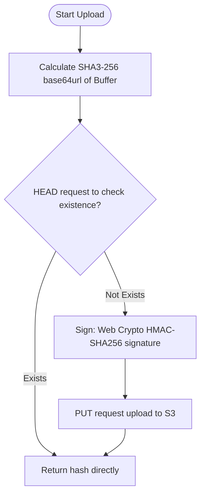

# @1-/s3 : Minimalist S3 uploader with SHA3-256 deduplication

## Features

- Hash deduplication: Verifies file existence via HEAD request before upload, reducing bandwidth and storage.
- Native cryptography: Computes HMAC-SHA256 signature using Web Crypto API to generate AWS Signature Version 4, eliminating external cryptography library dependencies.
- Zero SDK: Implements direct HTTP requests without AWS SDK, minimizing package size.
- Automatic MIME identification: Resolves MIME types automatically based on file extensions.
- Long-term caching: Adds immutable Cache-Control headers to optimize CDN distribution.

## Usage

```javascript
import uploadInit from "@1-/s3/upload.js";

const upload = uploadInit(
  process.env.S3_ID,
  process.env.S3_SK,
  process.env.S3_HOST,
  process.env.S3_BUCKET,
  process.env.S3_REGION
);

const buf = Buffer.from("data");
const sha3_b64 = await upload(buf, "test.txt");

console.log(sha3_b64);
```

## Design



## Tech Stack

- Runtime: Bun / Node.js
- Cryptography: Web Crypto API (HMAC-SHA256)
- Hash: Node.js / Bun crypto module (SHA3-256)
- Network: `@3-/req` (Fetch API wrapper)

## Code Structure

- `src/upload.js`: Orchestrates check and upload flow.
- `src/sign.js`: Generates AWS Signature Version 4.
- `src/sha3b64.js`: Computes SHA3-256 base64url hash.
- `src/extMime.js`: Resolves MIME from file extension.
- `src/mime.js`: Dictionary of extension-to-MIME mappings.
- `src/amzDate.js`: Formats UTC timestamps required by AWS.
- `src/const.js`: Constant definitions including Cache-Control headers.

## History

AWS S3 (Simple Storage Service) was launched by Amazon in 2006, introducing cloud object storage with simple HTTP methods (GET, PUT, DELETE) to manage internet-scale data.

Content-Addressable Storage (CAS) trace back to the Venti backup system of Bell Labs in 2002, and Git version control system later.

This library combines both ideas, calculating SHA3-256 hashes on client-side to achieve cost-effective S3 upload deduplication with minimal code size.
