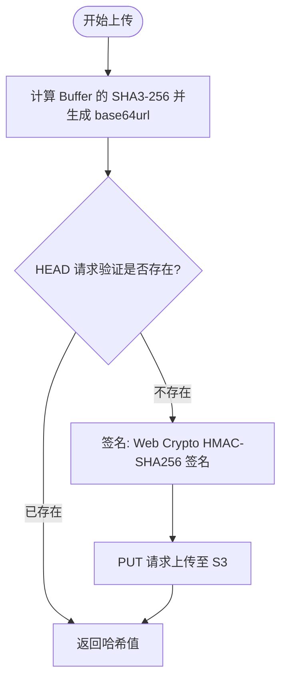

# @1-/s3 : 基于 SHA3-256 哈希去重的极简 S3 上传工具

## 功能介绍

- 哈希去重：上传前发送 HEAD 请求验证文件是否存在，节省带宽与存储。
- 原生加密：调用 Web Crypto API 计算 HMAC-SHA256 生成 AWS Signature Version 4 签名，无第三方加密库依赖。
- 零 SDK：无需 AWS SDK，缩减依赖体积。
- 自动识别 MIME：根据文件后缀自动映射 MIME 类型。
- 长期缓存：注入 Cache-Control 头，优化 CDN 缓存效率。

## 使用演示

```javascript
import uploadInit from "@1-/s3/upload.js";

const upload = uploadInit(
  process.env.S3_ID,
  process.env.S3_SK,
  process.env.S3_HOST,
  process.env.S3_BUCKET,
  process.env.S3_REGION,
);

const buf = Buffer.from("data");
const sha3_b64 = await upload(buf, "test.txt");

console.log(sha3_b64);
```

## 设计思路



## 技术栈

- 运行环境：Bun / Node.js
- 加密算法：Web Crypto API (HMAC-SHA256)
- 哈希计算：Node.js / Bun crypto 模块 (SHA3-256)
- 网络请求：`@3-/req` (基于 Fetch API 的封装)

## 代码结构

- `src/upload.js`: 编排检测与上传流程。
- `src/sign.js`: 实现 AWS Signature Version 4 签名。
- `src/sha3b64.js`: 计算 Buffer 的 SHA3-256 值并转为 base64url 格式。
- `src/extMime.js`: 文件后缀获取及 MIME 映射。
- `src/mime.js`: 常用 MIME 类型字典与匹配逻辑。
- `src/amzDate.js`: 格式化 AWS 要求的 UTC 时间戳。
- `src/const.js`: 定义默认的 Cache-Control 响应头常量。

## 历史故事

AWS S3 于 2006 年由亚马逊推出，开启了云计算对象存储时代，使用简单的 HTTP 方法（GET、PUT、DELETE）解决大规模文件存储扩展性难题。

内容寻址存储（CAS）设计理念最早可追溯至 2002 年贝尔实验室的 Venti 备份系统，后被 Git 等版本控制系统广泛采用。

本工具将内容寻址与 S3 存储结合，在客户端完成 SHA3-256 计算，以精简的代码实现存储去重。
